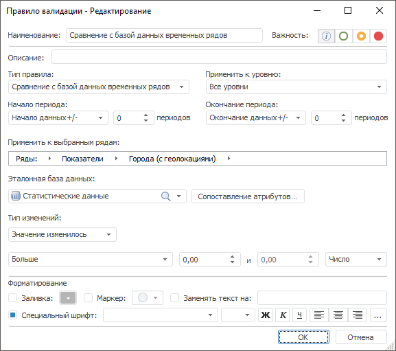

# Сравнение с базой данных временных рядов: Правило валидации

Сравнение с базой данных временных рядов: Правило валидации
-

# Сравнение с базой данных временных
 рядов

Правило сравнивает значения временных рядов со значениями в указанной
 БД временных рядов.

Примечание.
 Правило валидации доступно, если источником данных является база данных
 временных рядов.

Для настройки правила:

	- Задайте [общие параметры](../Data_Validation_Types.htm)
	 правила.

	- Укажите БД временных рядов, со значениями которой будет выполняться
	 сравнение. Используйте раскрывающийся список «Эталонная
	 база данных».

	- Сопоставьте атрибуты баз данных временных рядов, т.е. укажите
	 соответствие атрибутов исходной БД атрибутам эталонной БД. Нажмите
	 кнопку «Сопоставление атрибутов».
	 Будет открыт диалог «[Сопоставление
	 атрибутов](../CrossDatabaseMappings.htm)», в котором задайте требуемые настройки.

	- Задайте параметры сравнения значений временных рядов. Используйте
	 группу параметров «Тип изменений»:

	-

		- Укажите, каким образом изменились
		 значения наблюдений:

		-

			- Значение изменилось;

			- Значение увеличилось;

			- Значение уменьшилось;

			- Добавление значения;

			- Удаление значения;

			- Значение не изменилось;

		- Задайте параметры сравнения.
		 Используйте оператор и операнды сравнения. Количество доступных
		 операндов зависит от выбранного оператора. Доступные операторы:

		-

			- Больше;

			- Меньше;

			- Все значения в диапазоне;

			- Все значения, не входящие в диапазон;

			- Больше или равно;

			- Меньше или равно;

			- Равно;

			- Не равно;

		- Задайте шкалу для операндов
		 в условии сравнения:

		-

			- Число.
			 Абсолютная шкала;

			- Процент. Процентная
			 шкала.

См. также:

[Настройка правила валидации](../Data_Validation_Types.htm)

		Справочная
		 система на версию 10.9
		 от 18/08/2025,
		 © ООО «ФОРСАЙТ»,
