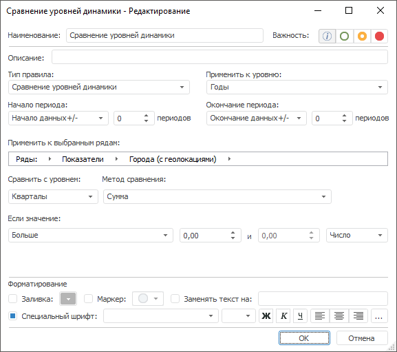

# Сравнение уровней динамики: Правило валидации

Сравнение уровней динамики: Правило валидации
-

# Сравнение уровней динамики

Правило сравнивает значения по уровням календарной динамики, если источником
 данных является [стандартный
 куб](UiNavObj.chm::/Cube/CreateCube/Master_Standart/UiMd_Cube_CreateCube_Master_Standart.htm) с календарным измерением или база данных временных
 рядов с несколькими [уровнями
 календарной динамики](UiNavObj.chm::/TimeSeriesDatabase/TS_Calendar.htm).

Примечание.
 Сравнение двух и более временных рядов по различным уровням календарной
 динамики доступно, если значения всех обязательных атрибутов временных
 рядов совпадают, а календарная динамика различается.

Для настройки правила:

	- Задайте [общие параметры](../Data_Validation_Types.htm)
	 правила.

	- Задайте исходный календарный уровень и уровень, с которым будет
	 выполняться сравнение. Используйте раскрывающиеся списки «Применить
	 к уровню» и «Сравнить с уровнем».

Примечание.
 Календарная динамика сравниваемого уровня должна быть выше, чем динамика
 уровня, с которым будет выполняться сравнение.

[Особенности
 работы с раскрывающимися списками](javascript:TextPopup(this))

		-

			- Применить к уровню.
			 Содержит все [уровни
			 календаря](UiNavObj.chm::/TimeSeriesDatabase/TS_Calendar.htm), присутствующие в БД временных
			 рядов, кроме минимального и выбранного в списке «Сравнить
			 с уровнем»;

			- Сравнить с уровнем.
			 Содержит все [уровни
			 календаря](UiNavObj.chm::/TimeSeriesDatabase/TS_Calendar.htm), присутствующие в БД временных
			 рядов, кроме максимального и выбранного в списке «Применить
			 к уровню».

	Например, в БД временных рядов присутствуют
	 уровни «Годы», «Кварталы»,
	 «Месяцы» и «Дни».
	 Таким образом, в списке «Применить
	 к уровню» будут доступны уровни «Годы»,
	 «Кварталы» и «Месяцы»,
	 а в списке «Сравнить с уровнем»
	 - «Кварталы», «Месяцы»
	 и «Дни».

	Если в списке «Применить
	 к уровню» выбран элемент «Кварталы»,
	 то в списке «Сравнить с уровнем»
	 доступны только элементы «Месяцы»
	 и «Дни».

	- Задайте метод агрегации данных в раскрывающемся списке «Метод сравнения».

	Агрегация данных выполняется с уровня, заданного в списке «Сравнить
	 с уровнем», на уровень, заданный в списке «Применить
	 к уровню».

	Доступные методы агрегации:

		- Сумма;

		- Среднее;

		- Минимальное значение;

		- Максимальное значение;

		- Первое значение;

		- Последнее значение;

		- Разность между максимальным и минимальным значением;

		- Стандартное отклонение.

	- Задайте динамику изменения наблюдений временных рядов между
	 различными уровнями. Используйте группу параметров «Если
	 значение»:

		- задайте параметры сравнения. Используйте оператор и операнды
		 сравнения. Количество доступных операндов зависит от выбранного
		 оператора. Доступные операторы:

		-

			- Больше;

			- Меньше;

			- Все значения в диапазоне;

			- Все значения, не входящие в диапазон;

			- Больше или равно;

			- Меньше или равно;

			- Равно;

			- Не равно;

		- задайте шкалу для операндов
		 в условии сравнения:

		-

			- Число.
			 Абсолютная шкала;

			- Процент. Процентная
			 шкала.

См. также:

[Настройка
 правила валидации](../Data_Validation_Types.htm)

		Справочная
		 система на версию 10.9
		 от 18/08/2025,
		 © ООО «ФОРСАЙТ»,
