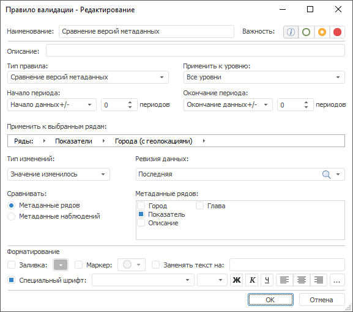

# Сравнение версий метаданных: Правило валидации

Сравнение версий метаданных: Правило валидации
-

# Сравнение версий метаданных

Правило сравнивает текущую и указанную версии метаданных, т.е. сравнивает
 различные версии значений атрибутов временных рядов или наблюдений.

Примечание.
 Правило валидации доступно, если источником данных является база данных
 временных рядов.

Применение правила имеет смысл, если ряды хранятся в [версионной](UiNavObj.chm::/TimeSeriesDatabase/TS_Attributes.htm)
 БД временных рядов.

Для настройки правила:

	- Задайте [общие параметры](../Data_Validation_Types.htm)
	 правила.

	- Задайте динамику изменения значений атрибутов между ревизиями.
	 Используйте раскрывающийся список «Тип
	 изменений» и укажите, каким образом изменились значения атрибутов:

	-

		- Значение изменилось;

		- Значение увеличилось;

		- Значение уменьшилось;

		- Добавление значения;

		- Удаление значения;

		- Значение не изменилось.

	- Укажите ревизию, со значениями которой будут сравниваться текущие
	 значения атрибутов. Используйте раскрывающийся список «Ревизия
	 данных», содержащий все ревизии в текущей БД временных рядов.

	- Укажите тип сравниваемых метаданных: метаданные временных рядов
	 или метаданные наблюдений. Установите соответствующий переключатель
	 в группе «Сравнивать».

	- Укажите сравниваемые атрибуты. Используйте список «Метаданные
	 рядов»/«Метаданные атрибутов»,
	 содержащий все доступные атрибуты. Если флажок атрибута установлен,
	 то его значения участвуют в сравнении.

См. также:

[Настройка
 правила валидации](../Data_Validation_Types.htm)

		Справочная
		 система на версию 10.9
		 от 18/08/2025,
		 © ООО «ФОРСАЙТ»,
