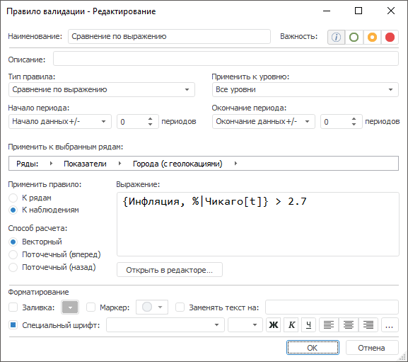

# Сравнение по выражению: Правило валидации

Сравнение по выражению: Правило валидации
-

# Сравнение по выражению

Правило сравнивает ряды с выражением, заданным пользователем.

Примечание.
 Правило валидации доступно, если источником данных является база данных
 временных рядов или [стандартный
 куб](UiNavObj.chm::/Cube/CreateCube/Master_Standart/UiMd_Cube_CreateCube_Master_Standart.htm) с календарным измерением.

Для настройки правила:

	- Задайте [общие параметры](../Data_Validation_Types.htm)
	 правила.

	- Укажите область применения правила: ряды или наблюдения. Установите
	 соответствующий переключатель в группе «Применить
	 правило».

	- Задайте выражение, с которым будет выполняться сравнение. Нажмите
	 кнопку «Открыть в редакторе».
	 Будет открыт [редактор выражения](UiNav.chm::/GUI/ExpressionEditor.htm), в котором составьте требуемое выражение.
	 Готовое выражение будет отображено в поле «Выражение».

	- Укажите способ расчёта выражения. В группе «Способ
	 расчёта» установите соответствующий переключатель:

		- Векторный. Используется
		 по умолчанию. Выражение рассчитывается одновременно по всем точкам
		 ряда;

		- Поточечный (вперед).
		 Расчёт ведется последовательно в каждой точке ряда: сначала выражение
		 рассчитывается по первой точке, затем - по второй точке и т.д.;

		- Поточечный (назад).
		 Расчёт ведется последовательно в каждой точке ряда: сначала выражение
		 рассчитывается по последней точке, затем - по предпоследней точке
		 и т.д.

См. также:

[Настройка
 правила валидации](../Data_Validation_Types.htm)

		Справочная
		 система на версию 10.9
		 от 18/08/2025,
		 © ООО «ФОРСАЙТ»,
