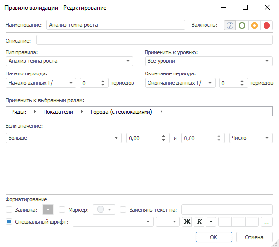

# Анализ темпа роста: Правило валидации

Анализ темпа роста: Правило валидации
-

# Анализ темпа роста

Правило анализирует темп роста значений.

Примечание.
 Правило валидации доступно, если источником данных является база данных
 временных рядов или [стандартный
 куб](UiNavObj.chm::/Cube/CreateCube/Master_Standart/UiMd_Cube_CreateCube_Master_Standart.htm) с календарным измерением.

Для настройки правила:

	- Задайте [общие параметры](../Data_Validation_Types.htm)
	 правила.

	- Задайте условие темпа роста значений временных рядов. Используйте
	 группу параметров «Если значение»:

	-

		- задайте параметры сравнения.
		 Используйте оператор и операнды сравнения. Количество доступных
		 операндов зависит от выбранного оператора. Доступные операторы:

		-

			- Больше;

			- Меньше;

			- Все значения в диапазоне;

			- Все значения, не входящие в диапазон;

			- Больше или равно;

			- Меньше или равно;

			- Равно;

			- Не равно;

		- задайте шкалу для операндов
		 в условии сравнения:

		-

			- Число.
			 Абсолютная шкала;

			- Процент. Процентная
			 шкала.

См. также:

[Настройка
 правила валидации](../Data_Validation_Types.htm)

		Справочная
		 система на версию 10.9
		 от 18/08/2025,
		 © ООО «ФОРСАЙТ»,
