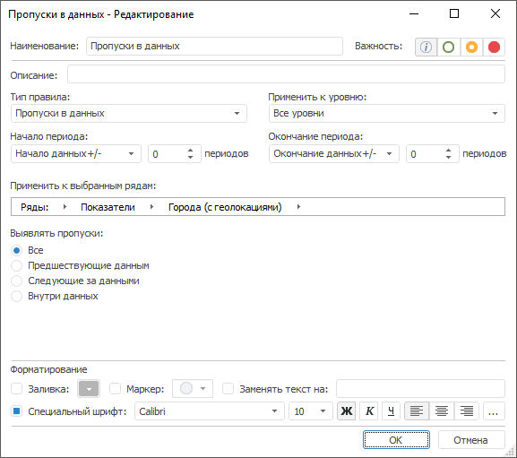

# Пропуски в данных: Правило валидации

Пропуски в данных: Правило валидации
-

# Пропуски в данных

Правило выявляет пропущенные значения в данных.

Примечание.
 Правило валидации доступно, если источником данных является база данных
 временных рядов или [стандартный
 куб](UiNavObj.chm::/Cube/CreateCube/Master_Standart/UiMd_Cube_CreateCube_Master_Standart.htm) с календарным измерением.

Для настройки правила:

	- Задайте [общие параметры](../Data_Validation_Types.htm)
	 правила.

	- Задайте область выявления пропусков в данных на периоде расчёта
	 валидации. В группе «Выявлять пропуски»
	 установите соответствующий переключатель:

		- Все. Пропуски по
		 всему ряду;

		- Предшествующие данным.
		 Пропуски, предшествующие данным ряда в начале периода расчёта
		 валидации;

		- Следующие за данными.
		 Пропуски, следующие за данными ряда в конце периода расчёта валидации;

		- Внутри данных. Пропуски
		 внутри ряда данных.

См. также:

[Настройка
 правила валидации](../Data_Validation_Types.htm)

		Справочная
		 система на версию 10.9
		 от 18/08/2025,
		 © ООО «ФОРСАЙТ»,
