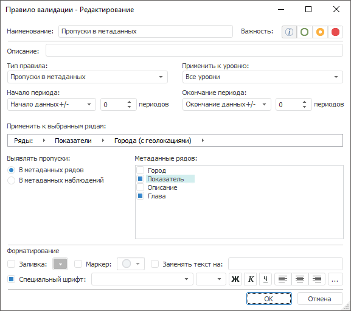

# Пропуски в метаданных: Правило валидации

Пропуски в метаданных: Правило валидации
-

# Пропуски в метаданных

Правило выявляет пропущенные значения в метаданных, т.е. в значениях
 атрибутов временных рядов или наблюдений.

Примечание.
 Правило валидации доступно, если источником данных является база данных
 временных рядов.

Для настройки правила:

	- Задайте [общие параметры](../Data_Validation_Types.htm)
	 правила.

	- Укажите тип метаданных, в которых выявляются пропуски: метаданные
	 временных рядов или метаданные наблюдений. Установите соответствующий
	 переключатель в группе «Выявлять
	 пропуски».

	- Укажите атрибуты, проверяемые на наличие пропусков. Используйте
	 список «Метаданные рядов»/«Метаданные атрибутов», содержащий
	 все доступные атрибуты. Если флажок атрибута установлен, то его значения
	 проверяются на наличие пропусков.

См. также:

[Настройка
 правила валидации](../Data_Validation_Types.htm)

		Справочная
		 система на версию 10.9
		 от 18/08/2025,
		 © ООО «ФОРСАЙТ»,
