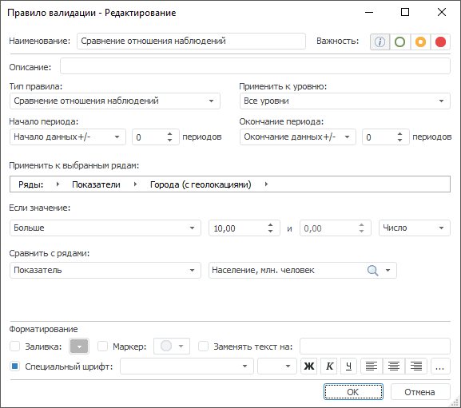

# Сравнение отношения наблюдений: Правило валидации

Сравнение отношения наблюдений: Правило валидации
-

# Сравнение отношения наблюдений

Правило сравнивает отношение значений рядов из источника и значений
 указанного ряда по заданным параметрам.

Примечание.
 Правило валидации доступно, если источником данных является база данных
 временных рядов или [стандартный
 куб](UiNavObj.chm::/Cube/CreateCube/Master_Standart/UiMd_Cube_CreateCube_Master_Standart.htm) с календарным измерением.

Для настройки правила:

	- Задайте [общие параметры](../Data_Validation_Types.htm)
	 правила.

	- Укажите сравниваемые ряды. Используйте цепочку навигации «Применить к выбранным рядам». Принципы
	 работы с цепочкой навигации аналогичны принципам работы с цепочкой
	 навигации в [дереве
	 рядов](UiDw.chm::/Purpose/UiDw_Purpose_Object.htm).

	- Задайте значение атрибута, по которому будет рассчитываться
	 отношение рядов. Для выбора атрибута используйте раскрывающийся список
	 «Сравнить с рядами». В списке
	 доступны только те атрибуты, которые присутствуют в цепочке навигации
	 «Применить к выбранным рядам».

	- Задайте условие для сравнения отношения наблюдений. Используйте
	 группу параметров «Если значение»:

	-

		- задайте параметры сравнения.
		 Используйте оператор и операнды сравнения. Количество доступных
		 операндов зависит от выбранного оператора. Доступные операторы:

		-

			- Больше;

			- Меньше;

			- Все значения в диапазоне;

			- Все значения, не входящие в диапазон;

			- Больше или равно;

			- Меньше или равно;

			- Равно;

			- Не равно;

		- задайте шкалу для операндов
		 в условии сравнения:

		-

			- Число.
			 Абсолютная шкала;

			- Процент. Процентная
			 шкала.

Таким образом, отношение двух рядов будет сравниваться, если:

	- Совпадает календарная динамика временных рядов.

	- Совпадают значения всех обязательных атрибутов временных рядов,
	 кроме значения атрибута, указанного в списке «Сравнить
	 с рядами».

См. также:

[Настройка
 правила валидации](../Data_Validation_Types.htm)

		Справочная
		 система на версию 10.9
		 от 18/08/2025,
		 © ООО «ФОРСАЙТ»,
