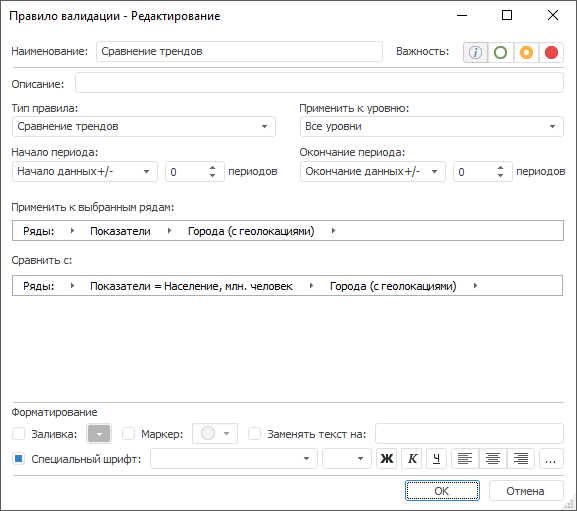

# Сравнение трендов: Правило валидации

Сравнение трендов: Правило валидации
-

# Сравнение трендов

Правило сравнивает тренд рядов из источника с трендом указанного ряда.

Примечание.
 Правило валидации доступно, если источником данных является база данных
 временных рядов или [стандартный
 куб](UiNavObj.chm::/Cube/CreateCube/Master_Standart/UiMd_Cube_CreateCube_Master_Standart.htm) с календарным измерением.

Для настройки правила:

	- Задайте [общие параметры](../Data_Validation_Types.htm)
	 правила.

	- Задайте значения атрибутов, по которым будет рассчитываться
	 тренд для сравнения. Используйте цепочку навигации «Сравнить
	 с». Принципы работы с цепочкой навигации аналогичны принципам
	 работы с цепочкой навигации в [дереве рядов](UiDw.chm::/Purpose/UiDw_Purpose_Object.htm).

Таким образом, тренды двух рядов будут сравниваться, если:

	- Совпадает календарная динамика временных рядов.

	- Совпадают значения всех обязательных атрибутов временных рядов,
	 кроме значений всех атрибутов, указанных в цепочке навигации «Сравнить с».

См. также:

[Настройка
 правила валидации](../Data_Validation_Types.htm)

		Справочная
		 система на версию 10.9
		 от 18/08/2025,
		 © ООО «ФОРСАЙТ»,
