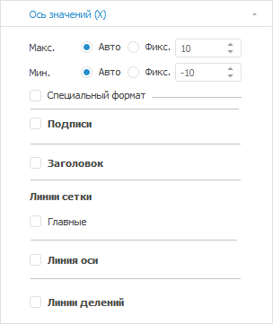
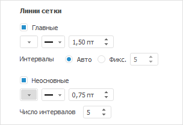

# Настройка осей пузырьковой диаграммы

Настройка осей пузырьковой диаграммы
-

# Настройка осей пузырьковой диаграммы

Оси - компоненты диаграммы,
 служащие для упорядочивания данных на диаграмме.

Заголовки столбцов и строк таблицы образуют координатную сетку, позволяющую
 определить адрес каждой ячейки. На диаграмме аналогичную роль играют ось
 категорий (X) и ось значений (Y). На пузырьковой диаграмме оси категорий
 и значений совпадают. Горизонтальная и вертикальная оси являются
 осями значений.

Для настройки параметров осей диаграммы используйте вкладки «Ось
 Х» и «Ось Y» на боковой
 панели. Набор параметров на вкладках совпадает.

[Для отображения
 вкладок](javascript:TextPopup(this))

		- Убедитесь, что [боковая
		 панель](GetStarted.chm::/Interface/Interface_Description.htm#side_panel) отображается.

		- В рабочей области выделите пузырьковую диаграмму.

		- Установите на боковой панели переключатель «Формат»
		 и перейдите на вкладку «Ось Х»
		 или «Ось Y».

Задайте на вкладке следующие настройки оси пузырьковой диаграммы:

[Максимальное/минимальное
 значение оси](javascript:TextPopup(this))

	Задайте максимальное и минимальное значения оси, установив один
	 из переключателей:

		- Авто. По умолчанию.
		 Максимальное/минимальное значение будет рассчитано автоматически,
		 исходя из данных источника. Для округления значений и автоматического
		 расчёта интервалов между главными линиями сетки установите переключатель
		 «[Авто](#gridlines)»
		 при настройке линий сетки;

		- Фикс. Задайте максимальное/минимальное
		 значение с помощью редактора чисел или клавиатуры.

[Специальный
 формат](javascript:TextPopup(this))

	Для настройки формата данных, отображаемых на осях:

		- В настольном приложении установите флажок «Специальный
		 формат», в веб-приложении перейдите к группе настроек «Формат числа».

		- В раскрывающемся списке выберите один из поддерживаемых
		 форматов данных:

			- Общий;

			- Числовой;

			- Денежный;

			- Дата;

			- Время;

			- Процентный;

			- Экспоненциальный;

			- Текстовый;

			- Дополнительный;

			- Пользовательский.

	Подробное описание специальных форматов
	 вы можете получить в разделе «[Настройка
	 формата данных](UiAnalyticalArea.chm::/TableView/Formatting/Data_format.htm)».

		- Если на оси требуется отобразить большие значения, то их
		 можно масштабировать. Таким образом, они будут занимать меньше
		 пространства. Масштабирование выполняется по формуле: X = A * B, где A - исходное значение, B - коэффициент масштабирования.

	В раскрывающемся списке «Масштаб»
	 выберите коэффициент масштабирования данных:

			- Нет. B
			 = 1;

			- Сотни. B = 0.01;

			- Тысячи. B = 0.001;

			- Миллионы. B = 0.000001;

			- Миллиарды. B = 0.000000001;

			- Триллионы. B = 0.000000000001.

	Например, на оси отображаются значения:
	 45000, 46000 и так далее. После применения масштаба «Тысячи»
	 на оси будут отображаться следующие значения: 45, 46 и так далее.

[Подписи](javascript:TextPopup(this))

	Для отображения подписей деления оси установите флажок «Подписи».
	 Станет доступна настройка шрифта подписей:

	- Тип шрифта. В раскрывающемся
	 списке выберите один из шрифтов, доступных в операционной системе;

	- Размер. В раскрывающемся
	 списке выберите размер шрифта или введите его с помощью клавиатуры;

	- Способ начертания шрифта.
	 Нажмите кнопки, задающие начертание шрифта:

		- Ж. Полужирное начертание
		 шрифта;

		- К.
		 Курсивное начертание шрифта;

		- Ч.
		 Подчёркнутое начертание шрифта.

При нажатой кнопке начертания будет использоваться
 соответствующий стиль начертания.

	- Цвет шрифта. В раскрывающейся
	 палитре выберите цвет шрифта. Для установки нового цвета шрифта нажмите
	 кнопку «Спектр», расположенную
	 в стандартной палитре цветов, и выберите цвет в расширенной палитре
	 цветов.

[Заголовок](javascript:TextPopup(this))

	Для отображения заголовка оси установите флажок «Заголовок».
	 Станет доступна настройка заголовка оси:

		- Специальный текст.
		 Для ввода специального заголовка установите флажок и введите текст,
		 который будет отображаться в области заголовка оси;

	Примечание.
	 По умолчанию заголовок осей пузырьковой диаграммы совпадает с наименованием
	 элемента измерения, которое является метрикой по осям X и Y.

	- Тип шрифта. В раскрывающемся
	 списке выберите один из шрифтов, доступных в операционной системе;

	- Размер. В раскрывающемся
	 списке выберите размер шрифта или введите его с помощью клавиатуры;

	- Способ начертания шрифта.
	 Нажмите кнопки, задающие начертание шрифта:

		- Ж. Полужирное начертание
		 шрифта;

		- К.
		 Курсивное начертание шрифта;

		- Ч.
		 Подчёркнутое начертание шрифта.

При нажатой кнопке начертания будет использоваться
 соответствующий стиль начертания.

	- Цвет шрифта. В раскрывающейся
	 палитре выберите цвет шрифта. Для установки нового цвета шрифта нажмите
	 кнопку «Спектр», расположенную
	 в стандартной палитре цветов, и выберите цвет в расширенной палитре
	 цветов.

[Линии
 сетки](javascript:TextPopup(this))

	Сетка - набор линий,
	 перпендикулярных оси. Главные линии сетки проходят от каждого
	 основного деления оси через всю область построения диаграммы, неосновные -
	 от каждого промежуточного деления.

	Для отображения линий сетки установите флажок «Главные»:

	

	После установки флажка будет доступна настройка параметров главных
	 и неосновных линий сетки. По умолчанию неосновные линии сетки отображаются
	 вместе с главными. При необходимости для скрытия неосновных линий
	 сетки снимите флажок «Неосновные».

	Для настройки линий сетки задайте параметры:

		- Цвет. В раскрывающейся
		 палитре выберите цвет главных/неосновных линий сетки, либо выберите
		 новый цвет в расширенной палитре цветов;

		- Тип. В раскрывающемся
		 списке выберите тип главных/неосновных линий сетки: сплошная,
		 штриховая, пунктирная, штрихпунктирная с одной точной, штрихпунктирная
		 с двумя точками;

		- Толщина. Задайте
		 толщину главных/неосновных линий сетки;

	Примечание.
	 Толщина линий может задаваться в разных [единицах измерения](uinav.chm::/GUI/format/different_units.htm),
	 однако значение в поле ввода будет всегда отображаться в единицах
	 point (1/72 дюйма).

		- Интервалы. Задайте
		 количество интервалов между главными линиями сетки, установив
		 один из переключателей:

			- Авто. По умолчанию.
			 Количество интервалов будет рассчитано автоматически, исходя
			 из данных источника. Для округления значений рассчитанных
			 интервалов установите переключатель «[Авто](#minmax_axisvalues)» при настройке максимального
			 и минимального значения оси;

			- Фикс. Задайте
			 количество интервалов с помощью редактора чисел или клавиатуры;

		- Число интервалов.
		 Задайте количество интервалов между неосновными линиями сетки
		 с помощью редактора чисел или клавиатуры.

	После выполнения действий в пузырьковой диаграмме будут отображены
	 главные и неосновные линии сетки в соответствии с заданными параметрами.

[Линия
 оси](javascript:TextPopup(this))

	Для отображения линий оси установите флажок «Линия
	 оси».

	После установки флажка становится доступной настройка линии оси:
	 цвет и толщина линии.

[Линии
 делений](javascript:TextPopup(this))

	Для отображения линий делений установите флажок «Линии
	 делений».

	Основные деления -
	 перпендикулярные штрихи на линии оси, содержащие подписи; промежуточные деления - штрихи
	 без подписей, расположенные на линии оси между основными делениями.

	После установки флажка становится доступной настройка параметров
	 линий делений: цвет и толщина линий.

См. также:

[Пузырьковая
 диаграмма](BubbleChart.htm)

		Справочная
		 система на версию 10.9
		 от 18/08/2025,
		 © ООО «ФОРСАЙТ»,
