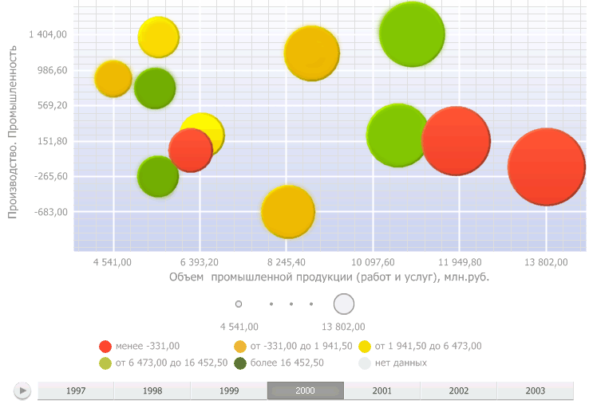

# Пузырьковая диаграмма

Пузырьковая диаграмма
-

# Пузырьковая диаграмма

Пузырьковая диаграмма - это точечная диаграмма, в которой точки данных
 заменены пузырьками, причем их цвет и размер служат дополнительными измерениями
 данных. На пузырьковой диаграмме нет оси категорий. Горизонтальная и вертикальная
 оси являются осями значений. Дополнительно пузырьковая диаграмма содержит
 анимированную временную шкалу, отображающую динамику значений.

Важно. Перед
 работой с визуализатором убедитесь в соблюдении системных требований к
 [клиентскому
 компьютеру](Setup.chm::/03_DB_Server_Config/Setup_DB_ServerSysReq.htm#client) для настольного приложения и к [BI-серверу](Setup.chm::/03_DB_Server_Config/Setup_DB_ServerSysReq.htm#bi)
 для веб-приложения. В веб-приложении поддержка визуализаторов осуществляется,
 если BI-сервер установлен на ОС Windows 7 и выше. Внешний вид визуализатора
 может отличаться в зависимости от используемых графических библиотек DirectX
 11 или OpenGL 3.1.

Для отображения данных экспресс-отчета в виде пузырьковой диаграммы
 нажмите кнопку  «Пузырьковая
 диаграмма» на вкладке «Вид»
 ленты инструментов. В правом верхнем углу рабочей области появится кнопка
  «Пузырьковая
 диаграмма», при нажатии на которую данные отчета будут представлены
 в виде пузырьковой диаграммы.

Для скрытия пузырьковой диаграммы переведите кнопку  «Пузырьковая диаграмма» в рабочей
 области в ненажатое состояние.

Пример пузырьковой диаграммы:

Для запуска анимации на временной шкале нажмите кнопку ,
 для приостановки анимации нажмите кнопку . Для перемещения
 по временной шкале используйте ползунок .

Для увеличения масштаба пузырьковой диаграммы прокручивайте колесико
 мыши вверх, для уменьшения - вниз.

Перемещения по области построения пузырьковой диаграммы при увеличенном
 масштабе осуществляется левой кнопкой мыши при зажатой клавише CTRL.

Начните работу с пузырьковой диаграммой с [настройки измерений](UiSelection.chm::/Selection/Dimension_type.htm).

## Операции с пузырьковой диаграммой

[Настройка
 области построения](javascript:TextPopup(this))

	Для настройки границ и заливки области построения пузырьковой диаграммы
	 используйте вкладку «[Область
	 построения](BubbleChart_area_settings.htm)» боковой панели.

[Настройка
 заливки пузырьков](javascript:TextPopup(this))

	Примечание.
	 Возможность доступна, если для измерения [метрик](UiSelection.chm::/Selection/Dimension_type.htm#metric)
	 задан элемент, определяющий цвет заливки пузырьков.

	Для настройки заливки пузырьков используйте вкладку боковой панели
	 «[Цвет](UiAdhoc_Panel_ColorInd.htm)».

[Настройка
 размера пузырьков](javascript:TextPopup(this))

	Примечание.
	 Возможность доступна, если в [измерении метрик](UiSelection.chm::/Selection/Dimension_type.htm)
	 задан элемент, определяющий размер пузырьков.

	Для настройки размера пузырьков используйте вкладку «[Размер](UiAdhoc_Panel_size.htm)» из группы вкладок
	 «Формат» боковой панели. Если
	 на вкладке «[Размер](UiAdhoc_Panel_size.htm)»
	 не установлен флажок «По шкале»,
	 размер пузырьков рассчитывается автоматически по значению элементов
	 [измерения
	 метрики](UiSelection.chm::/Selection/Dimension_type.htm) «Размер».

[Настройка
 осей пузырьковой диаграммы](javascript:TextPopup(this))

	Для настройки параметров осей пузырьковой диаграммы используйте
	 вкладки «[Ось X/Y](Axis.htm)»
	 на боковой панели.

[Настройка
 линии тренда](javascript:TextPopup(this))

	Для настройки линии тренда используйте вкладку «[Линия тренда](TrendLine.htm)» на боковой панели.

[Настройка
 всплывающих подсказок](javascript:TextPopup(this))

	Для настройки всплывающих подсказок используйте вкладку «[Подсказки](Tooltip.htm)» на боковой панели.

[Настройка
 легенды цвета и размера](javascript:TextPopup(this))

	Для настройки оформления легенд пузырьковой диаграммы используйте
	 вкладки боковой панели «[Легенд
	 цвета» / «Легенда размера](Legend.htm)».

[Детализация/обобщение
 данных](javascript:TextPopup(this))

	Детализация данных - операция, позволяющая переходить по уровням
	 данных: от общих до детализированных. Доступная глубина детализации
	 определяется иерархией измерений источника данных.

	Если для пузырька доступна детализация, то в его контекстном меню
	 присутствует команда «Детализировать».

	Для детализации данных:

		- выполните команду «Детализировать»
		 в контекстном меню пузырька;

		- дважды щёлкните по пузырьку.

	Обобщение - операция обратная детализации, позволяющая переходить
	 от детализированных данных к общим.

	Для обобщения данных:

		- выполните команду «Обобщить»
		 в контекстном меню пузырька;

		- зажмите клавишу SHIFT и дважды щёлкните по обобщаемому пузырьку.

	При выполнении детализации/обобщения данных отмечаются родительские/дочерние
	 элементы соответствующего уровня измерения.

	Для отображения исходной отметки, заданной на вкладке «Отметка»
	 боковой панели или, например, с помощью элементов управления, после
	 применении детализации/обобщения данных выполните команду «Вернуться
	 в исходное состояние» в контекстном меню пузырька.

	Если детализация/обобщение данных выполняется несколько раз и на
	 одной из итераций меняется отметка измерения, то при выполнении команды
	 «Вернуться в исходное состояние»,
	 после очередной детализации/обобщения данных, будет отображена не
	 исходная, а последняя заданная отметка.

	Если при детализации/обобщении попали на уровень, на котором нет
	 данных, необходимо выполнить команду «Вернуться
	 в исходное состояние» в контекстном меню пузырька.

	Примечание.
	 Команда «Вернуться в исходное состояние»
	 доступна в инструментах «[Аналитические
	 запросы (OLAP)](UiExpress.chm::/purpose/UiExpress_Purpose.htm)», «[Аналитические
	 панели](UiAdhoc.chm::/UiAdhoc_Purpose.htm)» при изменении отметки и последующей
	 детализации/обобщения данных. Если детализация/обобщение данных не
	 выполняется после изменения отметки, то команда будет недоступна.

[Исключение
 данных](javascript:TextPopup(this))

	Для исключения данных выполните команду «Исключить»
	 в контекстном меню пузырька.

	Для исключения всех данных, кроме данных выбранного пузырька, выполните
	 команду «Исключить остальные»
	 в контекстном меню пузырька.

[Отображение/скрытие
 временной шкалы](javascript:TextPopup(this))

	Примечание.
	 Возможность доступна, если для календарного измерения используется
	 [роль](UiSelection.chm::/Selection/Dimension_type.htm)
	 «Шкала времени».

	Для управления отображением шкалы используйте флажок в заголовке
	 вкладки «[Временная
	 шкала](Bubbles_time_scale_panel.htm)» на боковой панели:

		- для отображения шкалы установите флажок;

		- для скрытия шкалы снимите флажок.

	По умолчанию временная шкала отображается на пузырьковой диаграмме.

[Отображение/скрытие
 следов пузырьков](javascript:TextPopup(this))

	Для отображения следа пузырька используйте вкладку «[Временная шкала](Bubbles_time_scale_panel.htm)» на
	 боковой панели.

[Настройка
 стиля пузырьковой диаграммы](javascript:TextPopup(this))

	Для настройки стиля пузырьковой диаграммы используйте вкладку «[Пузырьковая
	 диаграмма](BubbleChart_Style.htm)» ленты инструментов.

См. также:

[Работа
 с представлениями данных](UIExpress.chm::/Setup_express_report/UiExpress_control.htm)

		Справочная
		 система на версию 10.9
		 от 18/08/2025,
		 © ООО «ФОРСАЙТ»,
