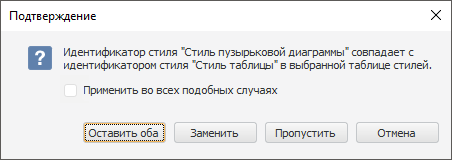

# Настройка стиля пузырьковой диаграммы

Настройка стиля пузырьковой диаграммы
-

# Настройка стиля пузырьковой диаграммы

Для быстрой настройки оформления используйте стили пузырьковых диаграмм.

Доступные стили поделены на следующие категории:

	- Стандартные. Предустановленные
	 стили без возможности редактирования;

	- Стили документа. Стили,
	 созданные в текущем отчете;

	- Подключенная таблица стилей.
	 Стили из подключенной [таблицы стилей](UiNav.chm::/StylesTable/StylesTablePurpose.htm).

[Применение стиля](javascript:TextPopup(this))

	Для применения стиля к пузырьковой диаграмме:

		- Выберите пузырьковую диаграмму.

		- Перейдите на вкладку «Пузырьковая
		 диаграмма» ленты инструментов. Затем:

			- щёлкните по стилю в группе «Стиль пузырьковой диаграммы»;

			- выполните команду «Применить»
			 в контекстном меню стиля.

	Выбранный стиль будет применён к оформлению
	 пузырьковой диаграммы.

[Создание стиля](javascript:TextPopup(this))

	Для создания стиля пузырьковой диаграммы:

		- Выделите пузырьковую диаграмму.

		- Перейдите на вкладку «Пузырьковая
		 диаграмма» ленты инструментов.

		- Нажмите кнопку , расположенную в группе
		 «Стиль пузырьковой диаграммы».

		- Выберите пункт «Создать
		 новый стиль».

		- В открывшемся окне введите наименование стиля.

	Созданный стиль будет добавлен в категорию стилей документа.

[Работа с созданным
 стилем](javascript:TextPopup(this))

	Работа со стилем пузырьковой диаграммы выполняется с помощью контекстного
	 меню стиля в группе «Стиль пузырьковой
	 диаграммы», расположенной на вкладке «Пузырьковая
	 диаграмма» ленты инструментов.

	Доступны следующие действия:

		- переименование стиля;

		- удаление стиля;

		- экспорт во внешние стили.

	Примечание.
	 При работе в веб-приложении доступен только экспорт во внешние стили.

[Экспорт
 созданного стиля](javascript:TextPopup(this))

	Для экспорта стиля пузырьковой диаграммы во внешние стили:

		- Выделите пузырьковую диаграмму.

		- Перейдите на вкладку «Пузырьковая
		 диаграмма» ленты инструментов.

		- Выберите стиль в группе «Стиль
		 пузырьковой диаграммы», затем:

			- нажмите кнопку  и выберите пункт
			 «Экспорт во внешние стили»;

			- выполните команду «Экспорт
			 во внешние стили» в контекстном меню стиля.

		- В открывшемся окне выберите [таблицу
		 стилей](UiNav.chm::/StylesTable/StylesTablePurpose.htm).

	Выбранный стиль будет экспортирован в заданную [таблицу стилей](UiNav.chm::/StylesTable/StylesTablePurpose.htm).

	Если идентификатор экспортируемого стиля совпадает с идентификатором
	 стиля из [таблицы
	 стилей](UiNav.chm::/StylesTable/StylesTablePurpose.htm),
	 будет выдано сообщение для выбора действия:

	

	Установите флажок «Применить во
	 всех подобных случаях», чтобы выбранное действие применялось
	 во всех подобных ситуациях.

	Выберите действие со стилем:

		- Оставить оба. Экспортируемый
		 стиль будет добавлен в таблицу стилей с новым уникальным идентификатором;

		- Заменить. Стиль
		 в текущей таблице стилей будет заменён на экспортируемый;

		- Пропустить. Стиль
		 не будет экспортирован в таблицу стилей;

		- Отмена. Операция
		 экспорта стиля будет отменена.

[Подключение
 и отключение таблицы стилей](javascript:TextPopup(this))

	Примечание.
	 Подключение [таблицы
	 стилей](UiNav.chm::/StylesTable/StylesTablePurpose.htm)
	 доступно только в настольном приложении. Стили из подключенной
	 таблицы стилей доступны из веб-приложения и настольного приложения.

	Для оформления пузырьковой диаграммы можно использовать внешние
	 стили, сохранённые в [таблице
	 стилей](UiNav.chm::/StylesTable/StylesTablePurpose.htm):

		- Выберите пузырьковую диаграмму.

		- Перейдите на вкладку «Пузырьковая
		 диаграмма» ленты инструментов.

		- Нажмите кнопку , расположенную в группе
		 «Стиль пузырьковой диаграммы».

		- Выполните команду «Настроить
		 внешние стили».

		- Будет открыт диалог «[Параметры](UIExpress.chm::/purpose/UiExpress_Organizational_Starting.htm#params)».
		 На вкладке «Общее» в раскрывающемся
		 списке «Набор стилей оформления»
		 выберите необходимую [таблицу
		 стилей](UiNav.chm::/StylesTable/StylesTablePurpose.htm).

	Таблица стилей будет подключена. Стили из таблицы стилей, которые
	 можно применить для оформления пузырьковой диаграммы, будут добавлены
	 в отдельную категорию.

	Примечание.
	 К одному экспресс-отчету можно подключить только одну таблицу стилей.

	Для отключения таблицы стилей выберите пункт «Отключить
	 внешние стили». Перед отключением будет предложено скопировать
	 используемые стили в стили документа.

См. также:

[Пузырьковая диаграмма](BubbleChart.htm)

		Справочная
		 система на версию 10.9
		 от 18/08/2025,
		 © ООО «ФОРСАЙТ»,
