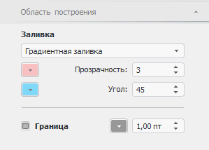

# Настройка области построения пузырьковой диаграммы

Настройка области построения пузырьковой диаграммы
-

# Настройка области построения пузырьковой диаграммы

Настройка области построения пузырьковой диаграммы осуществляется на
 вкладке боковой панели «Область построения»
 из группы «Формат». Данная вкладка
 доступна, если открыта пузырьковая диаграмма:

На вкладке доступна настройка границ и заливки области построения пузырьковой
 диаграммы:

	- Заливка. В раскрывающемся
	 списке выберите способ заливки:

§  Нет. Заливка отсутствует;

§  Сплошная заливка. Используется заливка
 области построения одним цветом. Выберите цвет из раскрывающейся палитры.
 В числовом редакторе «Прозрачность»
 установите значение прозрачности для заливки;

§  Градиентная заливка. Из раскрывающихся
 палитр выберите начальный и конечный цвета градиента. В числовых редакторах
 «Прозрачность» и «Угол»
 установите соответственно значение прозрачности заливки и угол градиента;

	- Границы. Установите флажок
	 для отображения границ области построения. В раскрывающейся палитре
	 выберите цвет границы. В числовом редакторе установите толщину границы.

См. также:

[Пузырьковая
 диаграмма](BubbleChart.htm)

		Справочная
		 система на версию 10.9
		 от 18/08/2025,
		 © ООО «ФОРСАЙТ»,
