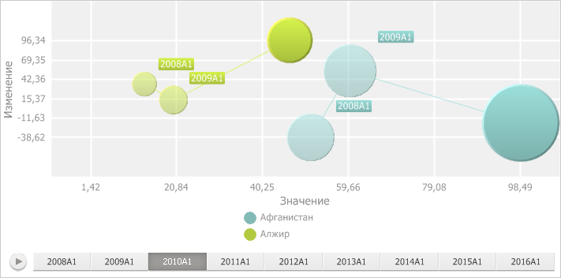
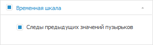

# Настройка следов пузырьков

Настройка следов пузырьков
-

# Настройка следов пузырьков

След позволяет проследить перемещение пузырьков во времени. След рисуется
 от начала временной шкалы до текущего значения времени, предыдущие значения
 пузырька рисуются более бледными по сравнению с текущим значением, например:

По умолчанию отображение следов пузырьков выключено.

Для управления отображением следов пузырьков используйте вкладку «Временная шкала» на боковой панели.

[Для отображения
 вкладки](javascript:TextPopup(this))

		- Убедитесь, что [боковая
		 панель](GetStarted.chm::/Interface/Interface_Description.htm#side_panel) отображается.

		- В рабочей области выделите пузырьковую диаграмму.

		- Установите на боковой панели переключатель «Формат»
		 и перейдите на вкладку «Временная
		 шкала».

		- Убедитесь, что в заголовке вкладки установлен флажок, то
		 есть [временная шкала](BubbleChart.htm#time_scale)
		 отображается.

Для отображения следов пузырьков установите флажок «Следы
 предыдущих значений пузырьков», для скрытия - снимите.

См. также:

[Пузырьковая
 диаграмма](BubbleChart.htm)

		Справочная
		 система на версию 10.9
		 от 18/08/2025,
		 © ООО «ФОРСАЙТ»,
