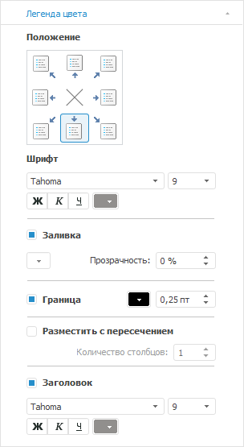

# Настройка легенды цвета и размера

Настройка легенды цвета и размера
-

# Настройка легенды цвета и размера

Для настройки легенды цвета/размера пузырьковой диаграммы перейдите
 на вкладку «Легенда цвета»/«Легенда размера» боковой панели
 соответственно.

[Для отображения
 вкладки](javascript:TextPopup(this))

		- Убедитесь, что [боковая
		 панель](GetStarted.chm::/Interface/Interface_Description.htm#side_panel) отображается.

		- В рабочей области выделите пузырьковую диаграмму.

		- Установите на боковой панели переключатель «Формат»
		 и перейдите на вкладку «Легенда
		 цвета» или «Легенда размера».

На вкладке доступны следующие настройки легенды пузырьковой диаграммы:

[Расположение
 легенды](javascript:TextPopup(this))

	В группе элементов «Положение»
	 выберите вариант расположения легенды:

		- . В левом верхнем
		 углу;

		- . По центру верхней
		 границы;

		- . В правом верхнем
		 углу;

		- . По центру правой
		 границы;

		- . В правом нижнем
		 углу;

		- . По центру нижней
		 границы;

		- . В левом нижнем
		 углу;

		- . По центру левой
		 границы;

		- . Легенда не отображается.

	По умолчанию легенда размещается по центру нижней границы пузырьковой
	 диаграммы.

[Настройка параметров
 шрифта](javascript:TextPopup(this))

	Настройте параметры шрифта, используемого в легенде:

	- Тип шрифта. В раскрывающемся
	 списке выберите один из шрифтов, доступных в операционной системе;

	- Размер. В раскрывающемся
	 списке выберите размер шрифта или введите его с помощью клавиатуры;

	- Способ начертания шрифта.
	 Нажмите кнопки, задающие начертание шрифта:

		- Ж. Полужирное начертание
		 шрифта;

		- К.
		 Курсивное начертание шрифта;

		- Ч.
		 Подчёркнутое начертание шрифта.

При нажатой кнопке начертания будет использоваться
 соответствующий стиль начертания.

	- Цвет шрифта. В раскрывающейся
	 палитре выберите цвет шрифта. Для установки нового цвета шрифта нажмите
	 кнопку «Спектр», расположенную
	 в стандартной палитре цветов, и выберите цвет в расширенной палитре
	 цветов.

[Настройка заливки
 легенды](javascript:TextPopup(this))

	Для отображения заливки легенды установите флажок «Заливка».
	 Укажите цвет однотонной заливки фона в раскрывающейся палитре и задайте
	 процент прозрачности заливки в поле «Прозрачность».

[Настройка границы
 легенды](javascript:TextPopup(this))

	Для отображения границы легенды установите флажок «Граница».
	 В соответствующих полях укажите цвет и толщину линии границы.

[Настройка размещения
 легенды](javascript:TextPopup(this))

	Для размещения легенды с пересечением области построения пузырьковой
	 диаграммы установите флажок «Размещать
	 с пересечением». После установки флажка укажите количество
	 столбцов в легенде.

	Примечание.
	 Настройка доступна только для легенды цвета.

	При снятом флажке пузырьковая диаграмма не пересекается с легендой,
	 количество столбцов в легенде определяется автоматически.

[Настройка заголовка
 легенды](javascript:TextPopup(this))

	Заголовок легенды - наименование
	 элемента измерения фактов, которое используется для построения пузырьковой
	 диаграммы.

	Для отображения заголовка легенды установите флажок «Заголовок».
	 В раскрывающихся списках выберите шрифт и его размер, укажите способ
	 начертания шрифта и его цвет.

	Примечание.
	 В веб-приложении заголовок отображается в виде гиперссылки, при нажатии
	 на которую открывается вкладка с измерением фактов, элемент которого
	 отмечен.

См. также:

[Пузырьковая
 диаграмма](BubbleChart.htm)

		Справочная
		 система на версию 10.9
		 от 18/08/2025,
		 © ООО «ФОРСАЙТ»,
