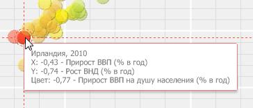
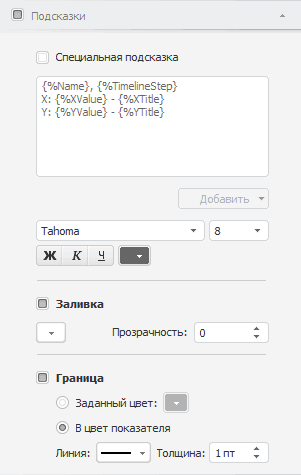

# Настройка всплывающих подсказок

Настройка всплывающих подсказок
-

# Настройка всплывающих подсказок

Всплывающие подсказки предназначены для отображения дополнительных сведений
 элемента. Настройки всплывающих подсказок одинаковы для визуализаторов:
 «[Пузырьковая
 диаграмма](BubbleChart.htm)», «[Пузырьковое
 дерево](../BubbleTree/BubbleTree.htm)» и «[Плоское
 дерево](../TreeMap/TreeMap.htm)». Пример отображения всплывающей подсказки:

По умолчанию отображение подсказок включено. Для настройки видимости
 подсказок установите флажок в заголовке вкладки «Подсказки»
 на боковой панели. Для настройки подсказок используйте эту же вкладку
 на боковой панели.

[Для отображения
 вкладки](javascript:TextPopup(this))

		- Убедитесь, что [боковая
		 панель](GetStarted.chm::/Interface/Interface_Description.htm#side_panel) отображается.

		- В рабочей области выделите визуализатор.

		- Установите на боковой панели переключатель «Формат»
		 и перейдите на вкладку «Подсказки».

После установки флажка «Подсказки»
 доступны следующие настройки:

[Текст подсказки](javascript:TextPopup(this))

	По умолчанию текст всплывающей подсказки формируется из наименований
	 элементов, отмеченных в измерениях источника данных визуализатора.

	Для изменения текста подсказки:

		- Установите флажок «Специальная
		 подсказка».

		- Сформируйте текст подсказки в соответствующем поле. Текст
		 может быть произвольным.

	Заданный текст подсказки будет отображаться при наведении указателя
	 мыши на элемент визуализатора.

	Для вставки в текст подсказки значений различных шаблонов:

		- Установите курсор в место вставки значения шаблона.

		- Нажмите кнопку «Добавить»
		 и в отобразившемся меню выберите шаблон или метрику, значение
		 которой должно быть вставлено в подсказку. Доступны следующие
		 группы:

			- Шаблоны. Готовые
			 шаблоны подсказок на основе значений метрик;

			- Метрики. Названия
			 метрик, значения которых могут быть вставлены в текст подсказки.
			 Набор метрик, доступных для вставки в текст подсказки, зависит
			 от настройки [измерения
			 метрик](UiSelection.chm::/Selection/Dimension_type.htm#metric).

	Значение шаблона или метрики будет вставлено в текущее положение
	 курсора.

[Шрифт подсказки](javascript:TextPopup(this))

	Задайте параметры шрифта подсказок:

		- Шрифт. Выберите
		 один из шрифтов, установленных в операционной системе;

		- Размер шрифта. Установите
		 требуемый размер шрифта. Размер задаётся в пунктах, и его можно
		 выбрать из раскрывающегося списка или ввести вручную. Диапазон
		 допустимых значений: [1, 72];

		- Начертание текста.
		 Нажмите кнопки, задающие начертание шрифта:

			- Ж. Полужирное
			 начертание;

			- К.
			 Курсивное начертание;

			- Ч.
			 Подчеркивание текста.

	При нажатой кнопке будет использоваться
	 соответствующий стиль начертания. Доступно использование нескольких
	 стилей одновременно, например, нажатие кнопок «Ж»
	 и «К»
	 даёт полужирное курсивное начертание;

		- Цвет шрифта. Выберите
		 цвет шрифта в раскрывающейся палитре цветов.

[Заливка подсказки](javascript:TextPopup(this))

	Для настройки параметров заливки фона подсказки используйте группу
	 «Заливка». Если флажок установлен,
	 то используется сплошная заливка фона подсказки. Параметры заливки:

		- Цвет. В раскрывающейся
		 палитре выберите цвет фона подсказки;

		- Прозрачность. Задайте
		 степень прозрачности заливки фона подсказки. 100% соответствует
		 полной прозрачности (заливка фона станет невидимой),
		 0% соответствует полной непрозрачности.

[Граница подсказки](javascript:TextPopup(this))

	Для оформления границы подсказки используйте группу «Граница».
	 Если флажок установлен, то отображается граница подсказки и доступна
	 её настройка. Выберите способ определения цвета границы:

		- Заданный цвет. Выберите
		 цвет границы подсказки;

		- В цвет показателя.
		 Цвет границы подсказки совпадает с цветом элемента, для которого
		 отображается подсказка.

	Для настройки типа и ширины линии для границы подсказки используйте
	 соответствующие поля.

См. также:

[Пузырьковая диаграмма](BubbleChart.htm)

		Справочная
		 система на версию 10.9
		 от 18/08/2025,
		 © ООО «ФОРСАЙТ»,
