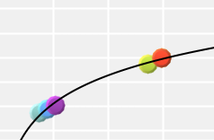
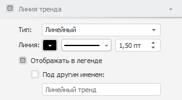

# Настройка линии тренда

Настройка линии тренда
-

# Настройка линии тренда

Линия тренда позволяет графически
 отображать тенденции данных. Подобный анализ называется регрессионным.
 Используя регрессионный анализ, можно продлить линию тренда в пузырьковой
 диаграмме за пределы реальных данных для предсказания будущих значений.

По умолчанию отображение линии тренда отключено. Для настройки видимости
 и параметров подсказок установите флажок в заголовке вкладки «Линия
 тренда» на боковой панели.

[Для отображения
 вкладки](javascript:TextPopup(this))

		- Убедитесь, что [боковая
		 панель](GetStarted.chm::/Interface/Interface_Description.htm#side_panel) отображается.

		- В рабочей области выделите пузырьковую диаграмму.

		- Установите на боковой панели переключатель «Формат»
		 и перейдите на вкладку «Линия
		 тренда».

После установки флажка «Линия тренда»
 становятся доступны следующие настройки:

[Выбор типа линии
 тренда](javascript:TextPopup(this))

	В раскрывающемся списке «Тип»
	 выберите тип линии тренда:

		- линейный. Применяется
		 в самых простых случаях, когда точки ряда данных расположены близко
		 к прямой. Линейный тип линии тренда применим для величины, которая
		 увеличивается или убывает с постоянной скоростью;

		- степенной. Степенная
		 линия тренда дает хорошие результаты, если зависимость, которая
		 содержится в данных, характеризуется постоянной скоростью роста.
		 Примером такой зависимости может служить ускорение гоночного автомобиля
		 за каждый интервал времени, равный одной секунде. Если в данных
		 есть нулевые или отрицательные значения, использование степенной
		 линии тренда невозможно;

		- экспоненциальный.
		 Экспоненциальная линия тренда -кривая линия, которую следует использовать,
		 если скорость изменения данных непрерывно возрастает. Однако для
		 данных, которые содержат нулевые или отрицательные значения, этот
		 тип линии тренда неприменим;

		- логарифмический.
		 Логарифмическая линия тренда хорошо описывает величину, которая
		 вначале быстро растет или убывает, а затем постепенно стабилизируется.
		 Логарифмическая линия тренда может использоваться как для отрицательных,
		 так и для положительных значений данных;

		- среднее. Линия тренда
		 проходит через среднее значение ряда данных. Такая линия тренда
		 позволяет просмотреть динамику изменения рассматриваемой величины
		 в зависимости от среднего значения.

	Линия тренда получается наиболее точной, когда значение [коэффициента
	 детерминации](Lib.chm::/05_Statistics/UiModellind_DetermCoeff_R2.htm) (r2) близко к
	 единице.

	При необходимости настройте параметры линии тренда: цвет, тип и
	 толщину линии тренда.

[Настройка отображения
 в легенде](javascript:TextPopup(this))

	Для отображения значка и наименования линии тренда в легенде пузырьковой
	 диаграммы установите флажок «Отображать
	 в легенде».

	После установки флажка станет доступна настройка дополнительных
	 параметров линии тренда:

		- Под другим именем.
		 При установленном флажке будет доступно изменение наименования
		 элемента легенды, соответствующего тренду. По умолчанию в наименовании
		 отображается тип тренда. Например: «Линейный
		 тренд».

См. также:

[Пузырьковая диаграмма](BubbleChart.htm)

		Справочная
		 система на версию 10.9
		 от 18/08/2025,
		 © ООО «ФОРСАЙТ»,
