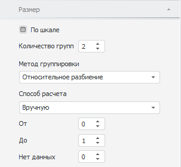

# Настройка шкалы размера: Боковая панель

Настройка шкалы размера: Боковая панель
-

# Настройка шкалы размера

Для настройки шкалы размера пузырьков диаграммы перейдите на вкладку
 «Размер» боковой панели.

Примечание.
 При настройке шкалы учитывайте следующую особенность: граничные значения
 всегда входят в меньший интервал шкалы. Например, есть шкала с тремя интервалами:
 меньше 25, от 25 до 50, больше 50. Значение 25 будет входить в интервал
 «меньше 25», а значение 50 - в интервал «от 25 до 50».

[Для отображения
 вкладки](javascript:TextPopup(this))

		- Убедитесь, что [боковая
		 панель](GetStarted.chm::/Interface/Interface_Description.htm#side_panel) отображается.

		- В рабочей области выделите пузырьковую диаграмму.

		- Установите на боковой панели переключатель «Отметка»
		 и в измерении выберите [метрику](UiSelection.chm::/Selection/Dimension_type.htm#metric)
		 «Размер».

		- Установите на боковой панели переключатель «Формат»
		 и перейдите на вкладку «Размер».

Для задания пользовательских настроек шкалы размера установите флажок
 «По шкале». После установки флажка
 определите следующие настройки:

[Количество групп](javascript:TextPopup(this))

	С помощью редактора чисел или клавиатуры задайте количество интервалов
	 шкалы.

[Метод группировки](javascript:TextPopup(this))

	В раскрывающемся списке «Метод
	 группировки» выберите метод расчёта интервалов шкалы:

		- Относительное разбиение.
		 Весь диапазон данных разбивается на заданное количество групп,
		 содержащих одинаковое число единиц, которые при этом получаются
		 разными по длине;

		- Равные интервалы.
		 Весь диапазон данных разбивается на заданное количество равных
		 по длине групп.

[Способ расчета](javascript:TextPopup(this))

	В раскрывающемся списке «Способ
	 расчета» укажите способ определения минимальной и максимальной
	 высот. На основании этих значений будут рассчитаны интервалы шкалы
	 методом, указанным в раскрывающемся списке «Метод
	 группировки»:

		- Вручную. В редакторах
		 чисел «От» и «До»
		 задайте значения минимальной и максимальной высот;

		- Авто. Значения минимальной
		 и максимальной высот определяются автоматически.

См. также:

[Пузырьковая
 диаграмма](BubbleChart.htm)

		Справочная
		 система на версию 10.9
		 от 18/08/2025,
		 © ООО «ФОРСАЙТ»,
