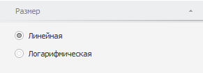

# Настройка шкалы размера: Боковая панель

Настройка шкалы размера: Боковая панель
-

# Настройка шкалы размера

Для настройки размера элементов дерева перейдите на вкладку «Размер»
 боковой панели.

[Для отображения
 вкладки](javascript:TextPopup(this))

		- Убедитесь, что [боковая
		 панель](GetStarted.chm::/Interface/Interface_Description.htm#side_panel) отображается.

		- В рабочей области выделите пузырьковую диаграмму.

		- Установите на боковой панели переключатель «Отметка»
		 и в измерении выберите [метрику](UiSelection.chm::/Selection/Dimension_type.htm#metric)
		 «Размер».

		- Установите на боковой панели переключатель «Формат»
		 и перейдите на вкладку «Размер».

Выберите тип шкалы, установив один из переключателей:

	- Линейная. Весь диапазон
	 данных разбивается на заданное количество равных по длине групп;

	- Логарифмическая. Весь
	 диапазон данных разбивается на заданное количество групп, содержащих
	 одинаковое число единиц, которые при этом получаются разными по длине.

См. также:

[Пузырьковое
 дерево](BubbleTree.htm) | [Плоское дерево](../TreeMap/TreeMap.htm)

		Справочная
		 система на версию 10.9
		 от 18/08/2025,
		 © ООО «ФОРСАЙТ»,
