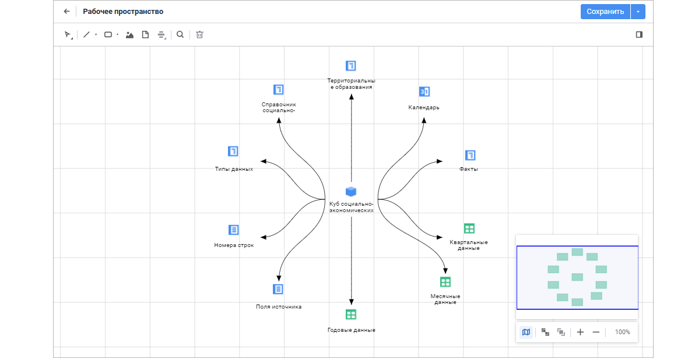
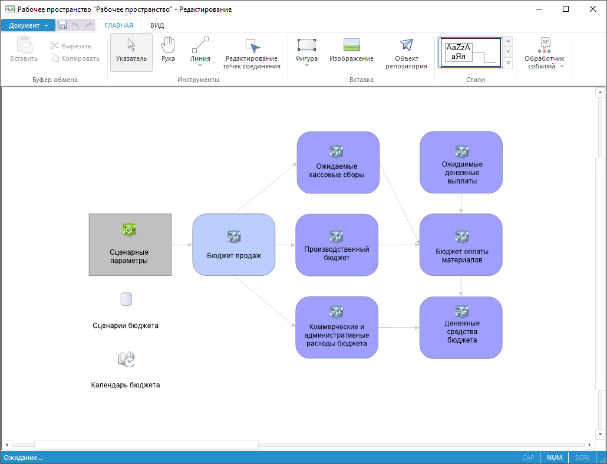

# Рабочее пространство

Рабочее пространство
-

# Рабочее пространство

Для визуального размещения объектов системы и организации доступа к
 ним используйте инструмент «Рабочее
 пространство»:

	 Веб-приложение Настольное приложение

		

		

Ключевые возможности:

	- визуальное размещение объектов системы на едином рабочем
	 поле;

	- организация доступа к функциям и свойствам объектов
	 системы;

	- отображение связей между объектами и структуры их
	 зависимостей.

Для начала работы смотрите статью
 «[Начало
 работы с инструментом «Рабочее пространство](../2_WorkSpace/UiWsp_WorkSpace_Starting.htm)».

Для построения рабочего пространства
 смотрите статью «[Построение
 рабочего пространства](../2_WorkSpace/UiWsp_WorkSpace_Create.htm)».

Для работы с готовым рабочим пространством
 смотрите статью «[Работа
 с готовым рабочим пространством](../3_Settings/Work_with_UiWsp.htm)».

		Справочная
		 система на версию 10.9
		 от 18/08/2025,
		 © ООО «ФОРСАЙТ»,
