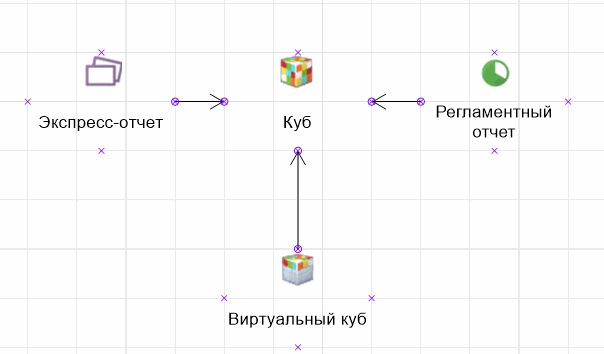
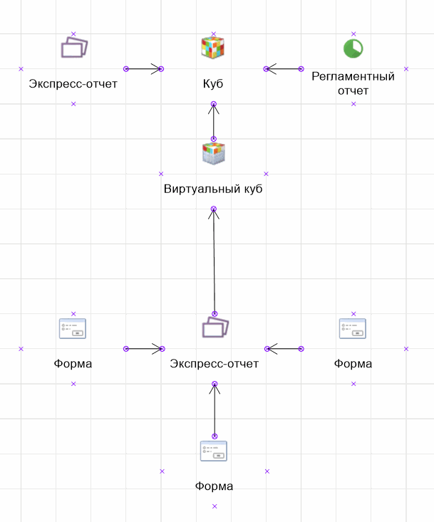
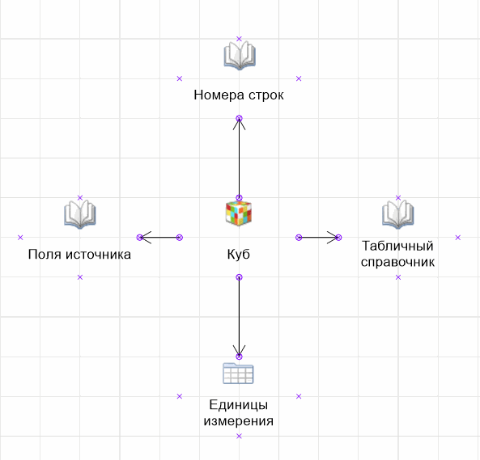
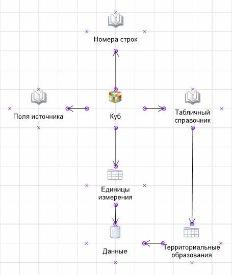
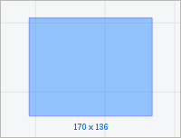
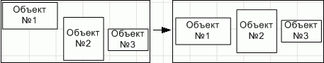
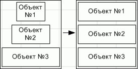
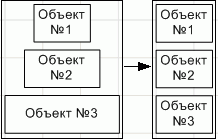
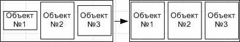
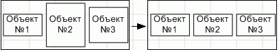

# Добавление и настройка объектов рабочего пространства

Добавление и настройка объектов рабочего пространства
-

# Добавление и настройка объектов рабочего пространства

Инструмент «Рабочее пространство»
 поддерживает вставку объектов репозитория, предназначенных для визуализации
 объектов системы.

Для визуального структурирования объектов репозитория на рабочей области
 используйте следующие объекты:

	- Линия. Предназначена
	 для создания визуальных связей между объектами;

	- Фигура. Предназначена
	 для создания визуальных блоков;

	- Изображение. Предназначено
	 для создания визуальных объектов.

При работе с объектами доступны следующие операции:

	- [операции над объектами
	 репозитория](UiWsp_Objects.htm#objects_repo);

	- [добавление объектов
	 для оформления рабочего пространства](UiWsp_Objects.htm#add_del_objects);

	- [управление объектами
	 на рабочей области](UiWsp_Objects.htm#object_control).

## Операции над объектами репозитория

[Добавление объекта
 репозитория](javascript:TextPopup(this))

	Для добавления объекта репозитория:

		- в веб-приложении:

			- Нажмите кнопку  «Объект
			 репозитория» на [панели
			 инструментов](../UiWsp_WorkSpace_Starting.htm).

			- Выберите объект репозитория на боковой панели.

	Для быстрого поиска объекта репозитория
	 используйте строку поиска, расположенную в верхней части боковой панели.
	 В зависимости от настроек отображения объектов введите в строку поиска
	 наименование, идентификатор или ключ объекта, который необходимо найти.
	 Поиск будет выполняться автоматически по мере ввода искомого текста.
	 В списке будут только те объекты, наименования/идентификаторы/ключи
	 которых содержат вводимый текст. Для очистки строки нажмите кнопку
	 
	 «Очистить» или используйте
	 клавишу BACKSPACE.

	Для настройки отображения объектов репозитория
	 на боковой панели нажмите кнопку 
	 «Отображение объекта» и выберите
	 в раскрывающемся меню вариант отображения:

			- Наименование.
			 Объекты отображаются под своими наименованиями. Вариант по
			 умолчанию;

			- Идентификатор.
			 Объекты отображаются под своими идентификаторами;

			- Ключ. Объекты
			 отображаются под своими ключами.

	Выбрать можно несколько вариантов. Идентификатор
	 и ключ будут указаны в скобках.

		- в настольном приложении:

			- Нажмите кнопку «Объект
			 репозитория» на вкладке «Главная»
			 ленты инструментов. Откроется окно «Выберите
			 объект».

			- Выберите объект репозитория.

[Просмотр
 объектов, в которые входит объект](javascript:TextPopup(this))

	Для просмотра объектов, в которые входит объект, и [связей](../Objects_Work/UiWsp_Objects_CreateLinks.htm#links)
	 между ними выполните следующие действия:

		- Выделите объект мышью на рабочем пространстве.

		- Выполните:

			- команду «Входит
			 в > Показать объекты»:

				- в контекстном меню объекта;

				- на вкладке «Конструктор»
				 ленты инструментов (доступно только в настольном приложении);

	Например, объект «Куб»
	 входит в экспресс-отчёт, регламентный отчёт и виртуальный куб:

	

			- команду «Входит
			 в > Показать объекты (рекурсивно)»:

				- в контекстном меню объекта;

				- на вкладке «Конструктор» ленты
				 инструментов (доступно только в настольном приложении).

	Например, «Куб»
	 входит в экспресс-отчёт, регламентный отчёт и виртуальный куб. В свою
	 очередь виртуальный куб входит в экспресс-отчёт, входящий в 3 разные
	 формы Fore:

	

[Просмотр
 объектов, из которых состоит объект](javascript:TextPopup(this))

	Для просмотра объектов, из которых состоит объект, и [связей](../Objects_Work/UiWsp_Objects_CreateLinks.htm#links)
	 между ними выполните следующие действия:

		- Выделите объект мышью на рабочем пространстве.

		-  Выполните:

			- команду «Состоит из
			 > Показать объекты»:

				- в контекстном меню объекта;

				- на вкладке «Конструктор» ленты
				 инструментов (доступно только в настольном приложении).

	Например, объект «Куб»
	 состоит из таблицы и справочников:

	

			- команду «Состоит из
			 > Показать объекты (рекурсивно)»:

				- в контекстном меню объекта;

				- на вкладке «Конструктор» ленты
				 инструментов (доступно только в настольном приложении).

	Например, объект «Куб»
	 состоит из таблицы и справочников. Справочник «Табличный
	 справочник» состоит из таблицы «Территориальные
	 образования», а таблицы «Единицы
	 измерения» и «Территориальные
	 образования» из базы данных «Данные»:

	

При работе с объектами репозитория также доступны [операции
 их управления](UiWsp_Objects.htm#object_control) на рабочей области и [операции
 над группой объектов](UiWsp_Objects.htm#groups).

В настольном приложении в зависимости от выбранного типа объекта репозитория
 контекстное меню может содержать другие команды. Например, для справочников
 будут отображены команды «Группы элементов»,
 «Схемы отметки» и «Альтернативные
 иерархии», для куба - «Сохранить
 в файл», для документа - «Сохранить
 в файл» и «Загрузить в документ».

## Добавление объектов для оформления рабочего
 пространства

[Добавление
 линии](javascript:TextPopup(this))

	Для добавления линии:

		- Выберите требуемый тип линии:

			- в веб-приложении в раскрывающемся меню кнопки, содержащей
			 набор линий, на [панели
			 инструментов](../UiWsp_WorkSpace_Starting.htm). Кнопка выбора линии имеет вид последней
			 выбранной линии;

			- в настольном приложении в раскрывающемся меню кнопки
			 «Линия» на вкладке
			 «Главная» ленты инструментов.

		- Переместите курсор к предполагаемому месту начала линии
		 и, удерживая кнопку мыши, переместите курсор к месту предполагаемого
		 окончания линии. Отпустите кнопку мыши.

	Для получения подробной информации по созданию линий между объектами
	 обратитесь к разделу «[Создание
	 линий между объектами и точек соединения](../Objects_Work/UiWsp_Objects_CreateLinks.htm)».

	Доступные линии для выбора:

		- в веб-приложении:

			- . Прямая линия;

			- . Стрелка;

			- . Угловая линия;

			- . Изогнутая линия;

		- в настольном приложении:

			- линия;

			- связь;

			- соединительная линия;

			- кривая линия.

[Добавление фигуры](javascript:TextPopup(this))

	Для добавления фигуры:

		- в веб-приложении выберите требуемый тип фигуры в раскрывающемся
		 меню в раскрывающемся меню кнопки, содержащей набор фигур, на
		 [панели инструментов](../UiWsp_WorkSpace_Starting.htm).
		 Кнопка выбора фигуры имеет вид последней выбранной фигуры;

		- в настольном приложении нажмите кнопку «Фигура»
		 на вкладке «Главная» ленты
		 инструментов и в раскрывающемся списке выберите тип фигуры.

	Доступные фигуры для выбора:

		- в веб-приложении:

			- .
			 Скруглённый прямоугольник;

			- . Прямоугольник;

			- . Эллипс;

			- . Треугольник;

			- . Четырёхугольник;

			- . Пятиугольник;

			- . Шестиугольник;

			- . Восьмиугольник;

		- в настольном приложении:

			- прямоугольники;

			- правильные многоугольники;

			- фигурные стрелки;

			- выноски.

[Добавление
 изображения](javascript:TextPopup(this))

	Поддерживаемые форматы изображения: BMP, JPEG, JPG, JFIF, JPE, GIF,
	 PNG.

	Для добавления изображения:

		- Выполните одно из действий:

			- в веб-приложении нажмите кнопку 
			 «Изображение» на [панели инструментов](../UiWsp_WorkSpace_Starting.htm);

			- в настольном приложении нажмите кнопку «Изображение» на
			 вкладке «Главная»
			 ленты инструментов.

	Откроется окно выбора файла.

		- Выберите файл изображения и нажмите кнопку «Открыть».

Для настройки оформления объектов обратитесь к разделу «[Оформление
 объектов](../Objects_Work/UiWsp_Object_Format.htm)».

## Управление объектами на рабочей области

[Выделение
 объекта](javascript:TextPopup(this))

	Для выделения одного объекта на [рабочей
	 области](../UiWsp_WorkSpace_Starting.htm#elements)[:](../../../CalculationAlgorithm/Web/Work/Beginning_of_work.htm)

		- щёлкните по объекту мышью;

		- в настольном приложении:

			- используйте клавишу TAB для выделения объекта в порядке
			 слева направо, сверху вниз;

			- используйте сочетание клавиш SHIFT+TAB для выделения
			 объекта в порядке снизу вверх, справа налево.

	Примечание.
	 Выделение будет осуществляться в пределах видимой рабочей области.

	Для выделения всех объектов на рабочей области используйте сочетание
	 клавиш CTRL+А.

	Для выделения нескольких объетов на рабочей области:

		- зажмите клавишу CTRL и последовательно
		 щёлкните по каждому выделяемому элементу;

		- выберите режим 
		 «Курсор» на [панели
		 инструментов](../UiWsp_WorkSpace_Starting.htm#elements) в веб-приложении или  «Указатель» на ленте инструментов
		 в настольном приложении и используйте рамку для выделения элементов:

			- Определите группу объектов, которые требуется выделить.

			- Щёлкните и зажмите кнопку мыши за пределами группы выделяемых
			 объектов.

			- Начните перемещать указатель мыши. Будет отображена
			 прямоугольная рамка:

	

			- Перемещайте указатель до тех пор, пока все требуемые
			 объекты не будут помещены в рамку.

			- Отпустите указатель мыши. Все объекты, полностью или
			 частично помещенные в рамку, будут выделены.

[Копирование,
 вставка и вырезание объекта](javascript:TextPopup(this))

	При работе с объектами доступна стандартная работа с [буфером
	 обмена](uinav.chm::/02_Navigator/UiNav_ObjectsOperations.htm).

	Относительное позиционирование объектов в копируемой группе при
	 вставке сохраняется.

[Удаление объекта](javascript:TextPopup(this))

	Для удаления выделенного объекта:

	- выполните команду «Удалить»
	 в контекстном меню объекта;

	- нажмите клавишу DELETE;

	- нажмите кнопку  «Удалить» на панели инструментов
	 в веб-приложении или  «Удалить»
	 на вкладке «Формат» ленты
	 инструментов в настольном приложении.

[Перемещение
 объекта](javascript:TextPopup(this))

	Для перемещения одного или нескольких выделенных объектов на рабочей
	 области:

		- используйте клавиши UP, LEFT, DOWN, RIGHT для перемещения
		 объектов на 1 пиксель;

		- используйте сочетание клавиш SHIFT+UP, SHIFT+LEFT, SHIFT+DOWN,
		 SHIFT+RIGHT для перемещения объектов на 10 пикселей;

		- используйте сочетание клавиш CTRL+UP, CTRL+LEFT, CTRL+DOWN,
		 CTRL+RIGHT для перемещения объектов на 100 пикселей.

[Изменение
 размера объекта](javascript:TextPopup(this))

	Для изменения размера объекта на [рабочей
	 области](../UiWsp_WorkSpace_Starting.htm):

		- с помощью мыши:

			- Наведите курсор мыши
			 на точку, расположенную на границе объекта. Указатель мыши
			 примет вид двунаправленной стрелки.

			- Зажмите кнопку мыши
			 и растяните/сожмите объект до необходимого размера.

		- с помощью клавиатуры:

			- Зажмите сочетание клавиш
			 CTRL+SHIFT.

			- Измените размер объекта
			 с помощью клавиш UP, DOWN, LEFT, RIGHT на 1 пиксель.

	После выполнения действий будет изменён размер объекта.

[Поворот объекта](javascript:TextPopup(this))

	Для поворота одного или нескольких выделенных объектов на рабочей
	 области:

		- выполните команду «Поворот»
		 в контекстном меню объекта и выберите один из способов:

			- Повернуть на 90o по часовой стрелке;

			- Повернуть на 90o против часовой стрелки;

		- вручную (не доступно при выделении группы объектов);

		- в настольном приложении нажмите кнопку 
		 «Повернуть/отразить» на
		 вкладке «Формат» ленты
		 инструментов и выберите один из способов из раскрывающегося меню:

			- Повернуть влево.
			 К объекту будет применен поворот на 90° против часовой стрелки;

			- Повернуть вправо.
			 К объекту будет применен поворот на 90° по часовой стрелке.

[Изменение порядка
 расположения](javascript:TextPopup(this))

	Для изменения порядка расположения объектов на рабочей области:

		- в веб-приложении используйте команды «На
		 передний план»/«На задний
		 план» в контекстном меню объектов;

		- в настольном приложении:

			- выполните команду «Порядок
			 > На передний план/На задний план» в контекстном
			 меню объекта.

			- выполните команду «Формат
			 > Порядок >
			 На передний план/На задний план» в главном меню.

[Отражение объекта](javascript:TextPopup(this))

	Доступно только в настольном приложении.

	Для отражения выделенного объекта нажмите кнопку 
	 «Отразить/повернуть» на вкладке
	 «Формат» ленты инструментов
	 и выберите способ отражения:

		- Отразить по горизонтали;

		- Отразить по вертикали.

## Операции над группой объектов

[Создание
 группы объектов](javascript:TextPopup(this))

	Доступно только в настольном приложении.

	Объекты, расположенные на рабочем поле,
	 можно группировать. Для группы объектов можно задать единое форматирование
	 и порядок расположения, изменять размер. При изменении размеров группы
	 происходит пропорциональное изменение размеров объектов, входящих
	 в группу.

	Для группировки выделенных объектов:

		- выполните команду «Группировка
		 > Сгруппировать» в контекстном меню выделенных объектов;

		- нажмите кнопку  на вкладке «Формат» ленты инструментов;

		- нажмите сочетание клавиш CTRL+G.

[Разгруппировка
 объектов](javascript:TextPopup(this))

	Доступно
	 только в настольном приложении.

	Для разгруппировки выделенной группы объектов:

		- выполните команду «Группировка
		 > Разгруппировать» в контекстном меню группы объектов;

		- нажмите кнопку  на вкладке «Формат» ленты инструментов;

		- нажмите сочетание клавиш CTRL+U.

[Выравнивание
 объектов](javascript:TextPopup(this))

	Для выравнивания объектов относительно
	 друг друга:

		- [Выделите](UiWsp_Objects.htm#selection)
		 несколько объектов.

		- Выполните одно из действий:

			- в веб-приложении:

				- выполните команду «Выровнять»
				 контекстного меню объекта;

				- нажмите кнопку  «Выровнять»
				 на панели инструментов;

			- в настольном приложении:

				- выполните команду «Выровнять/Распределить> контекстного меню объекта;

				- нажмите кнопку  «Выровнять»
				 на вкладке «Формат»
				 ленты инструментов.

		- Выберите один из вариантов выравнивания объектов в раскрывающемся
		 меню команды/кнопки:

			- Выровнять
			 по левому краю. Выделенные объекты будут выровнены
			 по левому краю относительно крайнего левого объекта:

	

			- Выровнять
			 по центру. Выделенные объекты будут выровнены по центру.
			 Центр рассчитывается исходя из положения крайнего левого объекта
			 и крайнего правого среди выделенных и размеров самих объектов:

	

			- Выровнять
			 по правому краю. Выделенные объекты будут выровнены
			 по правому краю относительно крайнего правого объекта:

	

			- Выровнять
			 по верхнему краю. Выделенные объекты будут выровнены
			 по верхнему краю относительно крайнего верхнего объекта:

	

			- Выровнять
			 по середине. Выделенные объекты будут выровнены по
			 середине. Середина рассчитывается исходя из положения крайнего
			 верхнего объекта и крайнего нижнего среди выделенных и размеров
			 самих объектов:

	

			- Выровнять
			 по нижнему краю. Выделенные объекты будут выровнены
			 по нижнему краю относительно крайнего нижнего объекта:

	

[Распределение
 объектов](javascript:TextPopup(this))

	Доступно
	 только в настольном приложении.

	Для распределения объектов относительно
	 друг друга:

		- Выделите три или более объекта,
		 последовательно щелкая по ним с зажатой клавишей SHIFT.

		- Выполните команду:

			- «Выровнять>
			 <вариант действия>» на вкладке «Формат»
			 ленты инструментов;

			- «Выровнять/Распределить> <вариант действия>» контекстного
			 меню.

	Доступны следующие варианты распределения
	 объектов:

		- 
		 Распределить по горизонтали. Выделенные объекты будут находиться
		 друг от друга на одинаковом расстоянии. Расстояние рассчитывается
		 исходя из положения крайнего левого объекта и крайнего правого
		 среди выделенных и размеров самих объектов:

	

		- 
		 Распределить по вертикали. Выделенные объекты будут находиться
		 друг от друга на одинаковом расстоянии. Расстояние рассчитывается
		 аналогично предыдущему пункту:

	

[Изменение
 размеров объектов](javascript:TextPopup(this))

	Доступно
	 только в настольном приложении.

	Для изменения размеров выделенных объектов
	 в настольном приложении:

		- выполните команду «Размер > <вариант действия>»
		 в контекстном меню группы объектов;

		- выполните команду «Одинаковые
		 размеры > <вариант действия>» на вкладке «Формат» главного меню панели
		 инструментов.

	Доступны
	 следующие варианты изменения размеров объектов:

		- 
		 Выровнять по самому широкому. Ширина всех выделенных объектов
		 будет изменена на ширину самого широкого объекта в группе:

	

		- 
		 Выровнять по самому узкому. Ширина всех выделенных объектов
		 будет изменена на ширину самого узкого объекта в группе:

	

		- 
		 Выровнять по самому высокому. Высота всех выделенных объектов
		 будет изменена на высоту самого высокого объекта в группе:

	

		- 
		 Выровнять по самому низкому. Высота всех выделенных объектов
		 будет изменена на высоту самого низкого объекта в группе:

	

[Разрешение/запрет
 выделения объекта в группе](javascript:TextPopup(this))

	Доступно
	 только в настольном приложении.

	Для запрета или разрешения редактирования
	 отдельного объекта в группе установите/снимите флажок «Группировка
	 > Выделять объекты в группе» в контекстном меню объекта.

	Запрет или разрешение редактирования
	 отдельного объекта в группе позволяет ограничить просмотр и редактирование
	 объекта в режиме редактирования рабочего пространства.

	Установка флажка возможна только
	 после создания группы объектов.

См. также:

[Построение рабочего пространства](../UiWsp_WorkSpace_Create.htm)

		Справочная
		 система на версию 10.9
		 от 18/08/2025,
		 © ООО «ФОРСАЙТ»,
