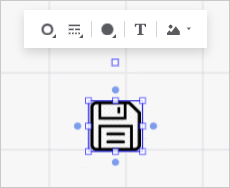

# Добавление изображения в фигуру

Добавление изображения в фигуру
-

# Добавление и настройка изображения в фигуре

При работе с фигурами в рабочем пространстве доступно добавление, удаление
 и настройка изображения в фигуре. Для этого используйте:

	- в веб-приложении раскрывающееся меню кнопки 
	 «Изображение в фигуре» на
	 всплывающей панели, содержащей настройки оформления:

	- в настольном приложении вкладки «Изображение»
	 и «Блок изображения» окна
	 «[Формат объектов](UiNav.chm::/GUI/Format.htm)».
	 Для его открытия выполните команду «Формат» в
	 контекстном меню объекта.

## Добавление изображения в фигуре

	- Выделите фигуру.

	- Выполните одно из действий:

		- в веб-приложении выполните команду «Выбрать
		 изображение» в раскрывающемся меню кнопки  «Изображение
		 в фигуре» на всплывающей панели. После выбора файла изображение
		 будет добавлено в фигуру с ограничением границ объекта;

		- в настольном приложении:

			- Выполните команду «Формат» в
			 контекстном меню объекта. Откроется окно «[Формат объектов](UiNav.chm::/GUI/Format.htm)».

			- Нажмите кнопку «Выбрать»
			 на вкладке «Изображение»
			 открывшегося окна.

			- После выбора файла изображение задайте [параметры
			 изображения](uinav.chm::/GUI/Format/UiWsp_Object_Format_Img.htm) при необходимости.

## Удаление изображения

Для удаления изображения:

	- Выделите изображение на рабочей области или фигуру, содержащую
	 изображение.

	- Выполните одно из действий:

		- в веб-приложении выполните команду «Удалить
		 изображение» в раскрывающемся меню кнопки  «Изображение
		 в фигуре» на всплывающей панели;

		- в настольном приложении:

			- Выполните команду «Формат» в
			 контекстном меню объекта. Откроется окно «[Формат объектов](UiNav.chm::/GUI/Format.htm)».

			- Нажмите кнопку «Удалить»
			 на вкладке «Изображение»
			 открывшегося окна.

После выполнения действий изображение будет удалено с рабочей области
 или из фигуры.

## Настройка изображения

Для настройки изображения, расположенного на рабочей области:

	 Веб-приложение

	 Настольное
	 приложение

		Выполните
		 команду «Настроить изображение»
		 в раскрывающемся меню кнопки  «Изображение
		 в фигуре» на всплывающей панели. Будет открыта боковая
		 панель «Настройки изображения»:

		

		Задайте параметры:

			- Выравнивание.
			 Задайте в группе ориентацию изображения внутри фигуры. По
			 умолчанию изображение располагается по центру относительно
			 вертикальных и горизонтальных границ фигуры;

			- Отступы от границ,
			 мм. Задайте в группе дополнительные отступы для изображения
			 внутри фигуры;

			- Параметры изображения.
			 Задайте в группе настройки:

				- Режим масштабирования.
				 Выберите режим изменения размеров изображения относительно
				 размеров фигуры:

					- Не изменять
					 размер. Изображение будет отображаться с теми
					 размерами, которое оно имеет. Если изображение больше
					 фигуры, то оно выйдет за его границы;

					- Сохранять пропорции.
					 Размер изображения подгоняется пропорционально соотношению
					 ширины и высоты фигуры;

					- Растягивать.
					 Изображение растягивается таким образом, чтобы заполнить
					 пространство фигуры с учётом установленных отступов;

				- Прозрачность.
				 Задайте степень прозрачности изображения. Допустимые значения
				 находятся в диапазоне [0, 80].

			- Выполните команду «Формат» в
			 контекстном меню объекта. Откроется окно «[Формат объектов](UiNav.chm::/GUI/Format.htm)».

			- Задайте параметры изображения на вкладках «[Изображение](uinav.chm::/GUI/Format/UiWsp_Object_Format_Img.htm)»
			 и/или «[Блок
			 изображения](uinav.chm::/GUI/Format/UiEtl_ObjProp_Image.htm)» открывшегося окна.

См. также:

[Настройка
 оформления рабочего пространства](../../3_Settings/UiWsp_WorkSpace_SettingsView.htm)

		Справочная
		 система на версию 10.9
		 от 18/08/2025,
		 © ООО «ФОРСАЙТ»,
