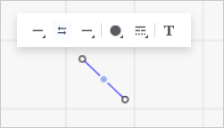
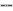
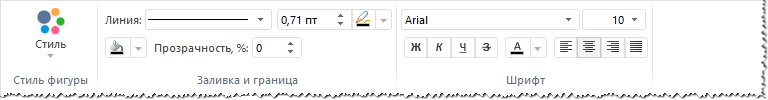
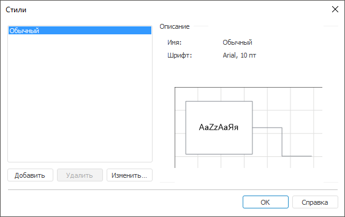

# Оформление объектов

Оформление объектов
-

# Оформление объектов

По умолчанию все объекты рабочего пространства имеют одинаковое оформление.
 Для настройки оформления объектов задайте их параметры оформления:

	- для [каждого объекта](UiWsp_Object_Format.htm#object)
	 индивидуально;

	- для [группы объектов](UiWsp_Object_Format.htm#group).
	 Доступно только в настольном приложении.

## Оформления выделенного объекта

Для оформления выделенного объекта:

	 Веб-приложение

	 Настольное
	 приложение

		Используйте
		 всплывающую панель с настройками оформления.

			- для линии:

		

			- для фигуры/изображения:

		

		Задайте:

		[Параметры
		 линии](javascript:TextPopup(this))

				- Тип начальной/конечной
				 стрелки. Выберите требуемый тип начальной/конечной
				 стрелки в раскрывающемся меню кнопки 
				 «Начало»/  «Конец»:

			

			Кнопка выбора типа начальной/конечной
			 стрелки имеет вид последнего выбранного типа начальной/конечной
			 стрелки.

			При необходимости изменения выбранных
			 типов начальной и конечной стрелки между собой нажмите кнопку
			  «Поменять
			 местами»;

				- Цвет линии.
				 Выберите цвет линии в раскрывающейся палитре цветов кнопки
				  «Цвет
				 линии».

Для выбора доступны стандартные и пользовательские цвета. По умолчанию
 палитра содержит только стандартные цвета.

Для создания пользовательского цвета:

	- Нажмите кнопку  «Добавить цвет». Откроется расширенная
	 палитра цветов.

	- Выберите цвет в расширенной палитре цветов, на странице браузера
	 с помощью пипетки или задайте код цвета в формате RGB/HEX.

После выполнения действий пользовательский цвет будет создан и добавлен
 в палитру.

Примечание.
 Максимально возможное количество пользовательских цветов в палитре равно
 23.

Для удаления пользовательского цвета из палитры выполните команду «Удалить» контекстного меню выбранного
 цвета.

Для изменения непрозрачности цвета используйте бегунок или введите значение
 в процентах при необходимости.

Для сброса настроек цвета нажмите кнопку  «Без
 цвета».

				- Тип линии.
				 Выберите тип линии в раскрывающемся меню кнопки  «Настройка линии»:

	- . Сплошная линия;

	- . Квадратные точки;

	- . Штрих;

	- . Штрих-точка-точка-штрих;

	- . Штрих-точка-штрих.

Толщина границы задаётся в пунктах.

				- Текст линии.
				 Добавьте/настройте текст линии. Для получения подробной
				 информации по добавлению и настройке текста линии обратитесь
				 к разделу «[Ввод
				 и редактирование текста](UiWsp_ObjectsWork_AddEditText.htm)».

		[Параметры
		 фигуры/изображения](javascript:TextPopup(this))

				- Цвет границы.
				 Выберите цвет линии в раскрывающейся палитре цветов кнопки
				  «Цвет
				 границы».

Для выбора доступны стандартные и пользовательские цвета. По умолчанию
 палитра содержит только стандартные цвета.

Для создания пользовательского цвета:

	- Нажмите кнопку  «Добавить цвет». Откроется расширенная
	 палитра цветов.

	- Выберите цвет в расширенной палитре цветов, на странице браузера
	 с помощью пипетки или задайте код цвета в формате RGB/HEX.

После выполнения действий пользовательский цвет будет создан и добавлен
 в палитру.

Примечание.
 Максимально возможное количество пользовательских цветов в палитре равно
 23.

Для удаления пользовательского цвета из палитры выполните команду «Удалить» контекстного меню выбранного
 цвета.

Для изменения непрозрачности цвета используйте бегунок или введите значение
 в процентах при необходимости.

Для сброса настроек цвета нажмите кнопку  «Без
 цвета».

				- Тип границы.
				 Выберите тип границы в раскрывающемся меню кнопки  «Настройка
				 границ»:

	- . Сплошная линия;

	- . Квадратные точки;

	- . Штрих;

	- . Штрих-точка-точка-штрих;

	- . Штрих-точка-штрих.

Толщина границы задаётся в пунктах.

				- Цвет заливки.
				 Выберите цвет заливки в раскрывающейся палитре цветов
				 кнопки  «Цвет
				 заливки»:

Для выбора доступны стандартные и пользовательские цвета. По умолчанию
 палитра содержит только стандартные цвета.

Для создания пользовательского цвета:

	- Нажмите кнопку  «Добавить цвет». Откроется расширенная
	 палитра цветов.

	- Выберите цвет в расширенной палитре цветов, на странице браузера
	 с помощью пипетки или задайте код цвета в формате RGB/HEX.

После выполнения действий пользовательский цвет будет создан и добавлен
 в палитру.

Примечание.
 Максимально возможное количество пользовательских цветов в палитре равно
 23.

Для удаления пользовательского цвета из палитры выполните команду «Удалить» контекстного меню выбранного
 цвета.

Для изменения непрозрачности цвета используйте бегунок или введите значение
 в процентах при необходимости.

Для сброса настроек цвета нажмите кнопку  «Без
 цвета».

				- Текст линии.
				 Добавьте/настройте текст линии. Для получения подробной
				 информации по добавлению и настройке текста линии обратитесь
				 к разделу «[Ввод
				 и редактирование текста](UiWsp_ObjectsWork_AddEditText.htm)».

				- Изображение в фигуре.
				 Выберите/настройте изображение. Для получения подробной
				 информации по выбору и настройке изображения обратитесь
				 к разделу «[Добавление изображения
				 в фигуру](Adding_an_image.htm)».

			- выполните команду «Формат» в
			 контекстном меню объекта. В открывшемся окне «[Формат объектов](UiNav.chm::/GUI/Format.htm)»
			 настройте оформление объекта;

			- перейдите на вкладку «Формат»
			 ленты инструментов:

		

		На вкладке «Формат»
		 доступны следующие настройки оформления:

			- Стиль. Содержит
			 стили для настройки оформления объектов;

			- Заливка и граница.
			 В группе содержится набор параметров для настройки типа линии,
			 толщины линии и её цвета, а также настройка цвета заливки;

			- Шрифт. В группе
			 содержатся стандартные настройки для шрифтов: размер, семейство
			 шрифтов, начертание, выравнивание и цвет шрифта.

## Оформление группы объектов

Доступно только в настольном приложении.

Для визуального выделения объектов можно изменить [стиль](UiNav.chm::/GUI/UiETL_Objects_Styles.htm)
 их оформления.

Для редактирования стилей выделите объект и нажмите кнопку «Стиль
 > Редактировать стиль» на вкладке «Формат»
 ленты инструментов:

В открывшемся окне будет выведен список стилей с кратким описание. Для
 изменения стиля выделите стиль и нажмите кнопку «Изменить»
 после чего будет открыт диалог «[Формат объектов](UiNav.chm::/GUI/Format.htm)»,
 содержащий вкладки:

	- [Шрифт](UiNav.chm::/GUI/Format/UiReport_Table_Attribute_Type.htm);

	- [Заливка](UiNav.chm::/GUI/Format/UiEtl_ObjProp_Fill.htm);

	- [Тень](UiNav.chm::/GUI/Format/UiEtl_ObjProp_Fill.htm);

	- [Размер](UiNav.chm::/GUI/Format/uietl_objprop_size.htm);

	- [Линии](UiNav.chm::/GUI/Format/UiEtl_ObjProp_Lines.htm);

	- [Текстовый
	 блок](UiNav.chm::/GUI/Format/Uietl_ObjProp_Text.htm);

	- [Блок
	 изображения](UiNav.chm::/GUI/Format/UiEtl_ObjProp_Image.htm);

	- [Изображение](UiNav.chm::/GUI/Format/UiWsp_Object_Format_Img.htm).

Примечание.
 Для объектов типа «Связь» и «Линия» в окне «[Формат объектов](UiNav.chm::/GUI/Format.htm)»
 отсутствуют вкладки «Заливка»,
 «Тень» и «Размер».

Для применения стиля к объектам выделите их и выберите требуемый стиль
 в раскрывающемся списке «Стиль»,
 расположенном на вкладе «Формат»
 ленты инструментов.

См. также:

[Настройка
 оформления рабочего пространства](../../3_Settings/UiWsp_WorkSpace_SettingsView.htm)

		Справочная
		 система на версию 10.9
		 от 18/08/2025,
		 © ООО «ФОРСАЙТ»,
