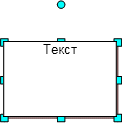
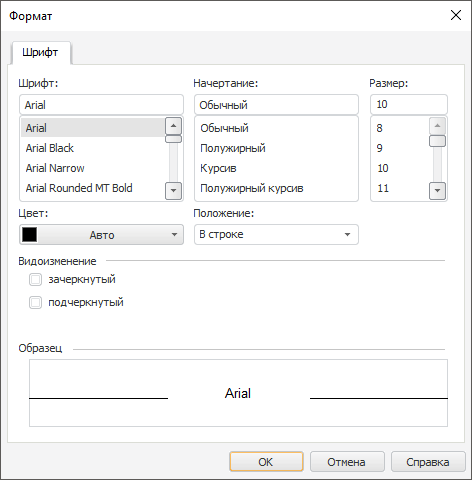
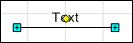

# Ввод и редактирование текста

Ввод и редактирование текста
-

# Ввод и редактирование текста

Для ввода и редактирования текста линии/фигуры/изображения:

	- дважды щёлкните по выбранному объекту;

	- выполните для него команду контекстного меню «Переименовать»;

	- в веб-приложении нажмите кнопку  «Добавить/Редактировать
	 текст» на всплывающей панели выделенного объекта.

Будет активирован редактор текста. Для завершения редактирования текста
 щёлкните за пределами редактора.

Примечание.
 Текст, созданный для линий, в веб-приложении всегда располагается под
 тем же углом, под которым расположена линия, а в настольном приложении
 всегда располагается горизонтально. Поворот объекта, содержащего текст,
 происходит вместе с текстом.

	 Веб-приложение Настольное приложение

		Для
		 настройки оформления текста выделенного объекта используйте всплывающую
		 панель:

		

		Задайте параметры текста:

		[Шрифт](javascript:TextPopup(this))

			Доступные настройки оформления шрифта:

				- Шрифт.
				 Выберите шрифт, установленный в операционной системе.
				 При необходимости можно загрузить [пользовательские
				 шрифты](Setup.chm::/UiWebSetup/03_Setup_Web/General_for_linux/Loading_Custom_Fonts.htm);

				- Размер
				 шрифта. Выберите размер шрифта от 6 до 36 пунктов;

				- Начертание
				 шрифта. Выберите один или несколько типов начертания
				 шрифта в раскрывающемся меню кнопки 
				 «Начертание»:

					- . Полужирное начертание;

					- . Курсивное
					 начертание;

					- . Подчёркивание
					 текста;

					- . Зачёркивание
					 текста линией;

				- Цвет
				 шрифта. Нажмите кнопку  «Цвет шрифта» и выберите
				 цвет шрифта в раскрывающейся палитре цветов.

Для выбора доступны стандартные и пользовательские цвета. По умолчанию
 палитра содержит только стандартные цвета.

Для создания пользовательского цвета:

	- Нажмите кнопку  «Добавить цвет». Откроется расширенная
	 палитра цветов.

	- Выберите цвет в расширенной палитре цветов, на странице браузера
	 с помощью пипетки или задайте код цвета в формате RGB/HEX.

После выполнения действий пользовательский цвет будет создан и добавлен
 в палитру.

Примечание.
 Максимально возможное количество пользовательских цветов в палитре равно
 23.

Для удаления пользовательского цвета из палитры выполните команду «Удалить» контекстного меню выбранного
 цвета.

Для изменения непрозрачности цвета используйте бегунок или введите значение
 в процентах при необходимости.

		[Выравнивание](javascript:TextPopup(this))

			Для определения способа расположения текста фигуры/изображения
			 используйте группу настроек «Выравнивание».

			Задайте способы расположения текста:

				- Выравнивание
				 текста по горизонтали. Доступно только для фигуры
				 и изображения. Выберите способ выравнивания текста в блоке
				 по горизонтали в раскрывающемся меню кнопки  «Выравнивание
				 текста по горизонтали»:

					- . По левому краю;

					- . По
					 центру. Используется по умолчанию;

					- . По
					 правому краю;

				- Выравнивание
				 текста по вертикали. Доступно только для фигуры
				 и изображения. Выберите способ выравнивания текста в блоке
				 по вертикали в раскрывающемся меню кнопки  «Выравнивание
				 текста по вертикали»:

					- .
					 По верхнему краю;

					- .
					 По середине. Используется по умолчанию;

					- .
					 По нижнему краю.

		Для задания смешанного форматирования текста измените [параметры
		 шрифта](UiWsp_ObjectsWork_AddEditText.htm#font) выделенной части текста.

		

		После перехода в режим редактирования становятся доступны команды
		 контекстного меню:

			- Формат.
			 Открывает диалог для настройки параметров выделенной части
			 текста автофигуры:

		

			- Отменить. Отменяет
			 последнее действие;

			- Повторить. Возвращает
			 отмененное действие;

			- Вырезать. Вырезает
			 выделенный текст автофигуры в буфер обмена;

			- Копировать.
			 Копирует выделенный текст автофигуры в буфер обмена;

			- Вставить. Вставляет
			 данные из буфера обмена;

			- Выделить все.
			 Выделяет весь текст автофигуры.

При необходимости можно загрузить [пользовательские
 шрифты](Setup.chm::/UiWebSetup/03_Setup_Web/General_for_linux/Loading_Custom_Fonts.htm).

## Перемещение текста

Изменение положения текста доступно только для линий в настольном приложении.

Для перемещения подписи линии относительно самой линии выделите линию
 и переместите текст, захватив желтый маркер, размещенный в центре подписи:

См. также:

[Настройка
 оформления рабочего пространства](../../3_Settings/UiWsp_WorkSpace_SettingsView.htm)

		Справочная
		 система на версию 10.9
		 от 18/08/2025,
		 © ООО «ФОРСАЙТ»,
