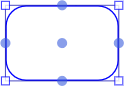
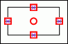
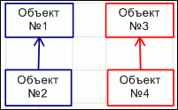
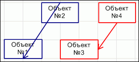
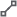
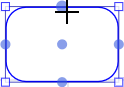
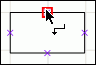
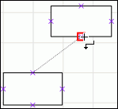
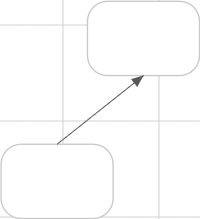
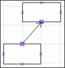

# Создание точек соединения и линий между объектами

Создание точек соединения и линий между объектами
-

# Создание точек соединения и линий между объектами

[Точка соединения](UiWsp_Objects_CreateLinks.htm#connection_points)
 - точка объекта, предназначенная для соединения с другим объектом.

Линия - объект рабочего пространства, определяющий соответствие между
 объектами по точкам соединения. Линии могут быть выполнены, как [со
 стрелками на концах, так и без](UiWsp_Object_Format.htm).

## Точки соединения

Для объектов рабочего пространства (за исключением линий и многоугольников)
 существуют 5 базовых точек соединения:

	Веб-приложениеНастольное приложение

		

		

Линия, привязанная к одной из таких точек, будет привязана к данной
 точке вне зависимости от места расположения объекта. Центральная точка
 соединения является плавающей, то есть связь будет привязана к одной из
 точек по периметру в зависимости от места положения объекта.

[Пример, который
 демонстрирует разницу между точками соединения по периметру и центральной
 точкой соединения](javascript:TextPopup(this))

	Начальное расположение объектов:

	

	«Объект №1» и «Объект №2» связаны через точки соединения по периметру,
	 а «Объект №3» и «Объект №4» связаны через центральные точки соединения.
	 Изменим место положение объектов:

	

	В первом случае (объект №1 и объект №2) линия осталась привязана
	 к тем точкам, через которые была установлена; во втором случае (объект
	 №3 и объект №4) линия изменила точки соединения, через которые она
	 установлена, что обеспечило лучший внешний вид.

В настольном приложении точки соединения могут быть отредактированы.
 Для редактирования:

	- Активируйте режим редактирования точек соединения, для этого:

		- нажмите кнопку  «Редактирование
		 точек соединения» на вкладке «Главная»
		 ленты инструментов;

		- нажмите сочетание клавиш ALT+7.

	- Выберите объект, точки соединения которого будут редактироваться,
	 с помощью мыши.

	- Выполните:

		- перемещение соединительных точек по контуру объекта. Для
		 этого выберите с помощью мыши точку и, не отпуская кнопку мыши,
		 переместите курсор по контуру объекта;

		- копирование соединительных точек. Для этого выполните перемещение
		 точки с зажатой клавишей CTRL. При этом на контуре объекта может
		 размещаться бесконечное количество точек соединения;

		- удаление соединительных точек. Для этого выберите с помощью
		 мыши точку с зажатой клавишей DELETE.

## Создание линий между объектами

Для создания линии между объектами выполните:

	- Активируйте режим создания линий.

	Веб-приложение Настольное приложение

		Выберите тип линии в раскрывающемся
		 меню кнопки, содержащей набор линий, на [панели
		 инструментов](../UiWsp_WorkSpace_Starting.htm):

			- .
			 Прямая линия;

			- .
			 Стрелка;

			- . Угловая линия;

			- . Изогнутая линия.

		Примечание.
		 Кнопка выбора линии имеет вид последней выбранной линии.

		Выберите тип линии:

			- Линия. Создает прямую линию
			 между объектами по точкам соединения. Для создания линии:

				- нажмите кнопку  «Линия» на вкладке «Главная» ленты инструментов
				 и в раскрывающемся списке выберите вариант «Линия»;

				- нажмите сочетание клавиш ALT+2;

			- Связь. Создает связь между
			 объектами по точкам соединения. Визуально представлена в виде
			 прямой линии со стрелкой без углов. Для создания связи:

				- нажмите кнопку  «Линия» на вкладке «Главная» ленты инструментов
				 и в раскрывающемся списке выберите вариант «Связь»;

				- нажмите сочетание клавиш ALT+3;

			- Соединительная линия. Создает
			 линию между объектами по точкам соединения, которая автоматически
			 перестраивается на прямую линию с прямыми углами. Для создания
			 соединительной линии:

				- нажмите кнопку  «Линия» на вкладке «Главная» ленты инструментов
				 и в раскрывающемся списке выберите вариант «Соединительная
				 линия»;

				- нажмите сочетание клавиш ALT+4;

			- Кривая линия. Создает кривую
			 линию между объектами по точкам соединения. Для создания кривой
			 линии:

				- нажмите кнопку  «Линия» на вкладке «Главная» ленты инструментов
				 и в раскрывающемся списке выберите вариант «Кривая
				 линия»;

				- нажмите сочетание клавиш ALT+5;

				- нажмите и удерживаете зажатой клавишу CTRL при перемещении
				 курсора от точки соединения одного объекта к точке соединения
				 другого.

	- После активации любого из режимов переместите курсор мыши к
	 одной из точек соединения на объекте. В веб-приложении точка будет
	 увеличена в размере, а в настольном приложении - подсвечена цветом.
	 Щёлкните и удерживайте кнопку мыши:

	 Веб-приложение Настольное приложение

		

		

	- Далее, не отпуская кнопку мыши, переместите курсор к точке соединения
	 другого объекта:

	 Веб-приложение Настольное приложение

		

		

Для создания кривой соединительной линии
 при перемещении курсора от точки соединения одного объекта к точке соединения
 другого удерживайте зажатой клавишу CTRL.

	- Отпустите кнопку мыши. Линия построена:

	 Веб-приложение Настольное приложение

		

		

В веб-приложении после создания прямой линии/стрелки в её центре отображается
 дополнительная точка, позволяющая создать ломаную линию. Для этого перетащите
 дополнительную точку, расположенную в центре линии, в другое место рабочей
 области при необходимости создания ломаной линии. Дополнительные точки
 отображаются на каждом новом линейном участке:

Для удаления дополнительной точки дважды щёлкните по ней.

Примечание.
 Линии могут быть построены в любом месте рабочего пространства без привязки
 к соединительным точкам.

См. также:

[Построение
 рабочего пространства](../UiWsp_WorkSpace_Create.htm)

		Справочная
		 система на версию 10.9
		 от 18/08/2025,
		 © ООО «ФОРСАЙТ»,
