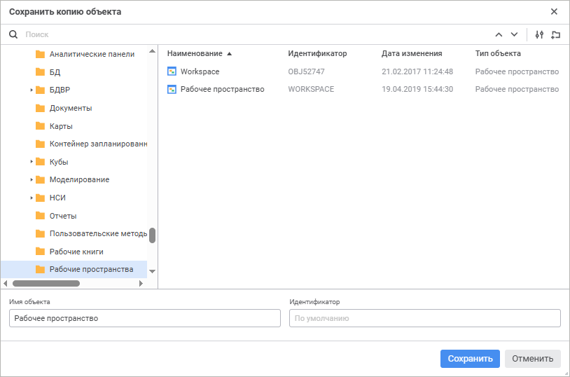

# Создание копии рабочего пространства

Создание копии рабочего пространства
-

# Создание копии рабочего пространства

Для создания копии рабочего пространства, открытого в [режиме
 редактирования](UiWsp_WorkSpace_Starting.htm#open):

	- Выполните одно из действий:

		- в веб-приложении выполните команду «Сохранить
		 как» в раскрывающемся меню кнопки «Сохранить»
		 [главного меню](UiWsp_WorkSpace_Starting.htm#elements).
		 Будет открыто окно «Сохранить
		 копию объекта»:

		- в настольном приложении команду «Документ
		 > Сохранить как» главного меню. Будет открыто стандартное
		 окно сохранения объекта в навигаторе объектов.

	- Выберите расположение сохраняемого рабочего пространства в дереве
	 объектов.

В веб-приложении доступны дополнительные
 возможности:

		- Создание новой папки. Для создания новой папки нажмите кнопку
		 
		 «Создать папку», появится
		 новый объект «Папка».
		 Задайте её наименование.

		- Поиск существующего рабочего пространства для выбора местоположения
		 сохранения копии или для использования его наименования. Для быстрого
		 выбора существующего рабочего пространства введите его название
		 в поле для поиска и нажмите клавишу ENTER. В строке поиска будут
		 отображены порядковый номер найденного соответствия и общее количество
		 найденных соответствий. Передвигайтесь между результатами поиска
		 с помощью кнопки  «Найти
		 предыдущее», кнопки  «Найти
		 далее» или клавиши ENTER для перемещения к следующему результату.

Для настройки поиска нажмите кнопку  «Параметры поиска» и выберите в раскрывающемся
 меню:

				- вариант поиска объекта:

					- Искать по наименованию. Вариант по умолчанию;

					- Искать по идентификаторам;

					- Искать по ключам;

				- учитывать регистр;

				- только слова целиком.

Примечание.
 При отсутствии соответствия заданной подстроки поиска и объектов репозитория
 будет отображено соответствующее сообщение.

	- Задайте имя объекта и идентификатор.

	- Нажмите кнопку «Сохранить».

При создании копии рабочего пространства в репозитории создаётся новое
 рабочее пространство, которое сразу же открывается на редактирование.
 Если объект с идентификатором, указанным в окне «Сохранить
 копию объекта», уже существует, то при попытке создания копии рабочего
 пространства:

	- в веб-приложении появится окно подтверждения действия. Подтвердите
	 действие для замены существующего объекта копией рабочего пространства;

	- в настольном приложении информационное окно о существовании
	 рабочего пространства с таким же идентификатором.

См. также:

[Построение рабочего пространства](UiWsp_WorkSpace_Create.htm)

		Справочная
		 система на версию 10.9
		 от 18/08/2025,
		 © ООО «ФОРСАЙТ»,
