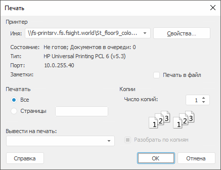

# Печать рабочего пространства

Печать рабочего пространства
-

# Печать рабочего пространства

Для печати рабочего пространства:

	- выполните команду «Документ
	 > Печать» главного меню;

	- нажмите сочетание клавиш CTRL+P.

Будет открыто окно:

Задайте следующие параметры печати:

	- Принтер. Выберите
	 принтер, который будет использоваться для печати рабочего пространства.
	 Для настройки параметров принтера нажмите кнопку «Свойства».
	 Будет отображен диалог, вид которого зависит от заданного принтера.
	 Для получения подробной информации о доступных настройках обратитесь
	 к документации принтера;

		- Печать в файл.
		 Печать в файл сохраняет информацию о структуре объекта, по которой
		 можно напечатать версию объекта без доступа к нему. Это может
		 использоваться для отложенной печати объекта. Если флажок установлен,
		 то объект будет напечатан в файл. По умолчанию флажок снят и печать
		 объекта выполняется на принтере;

	- Печать. Укажите
	 страницы, которые должны быть напечатаны:

		- Все. Будут
		 напечатаны все страницы объекта;

		- Страницы.
		 Укажите страницы, которые будут напечатаны. Водите номера или
		 диапазоны страниц, разделяя их запятыми. Диапазон порядка указывайте
		 через знак «-». Например: 1-3,5,7-9;

Примечание.
 Печать и нумерация страниц выполняются с учетом области печати, указанной
 в параметре «Вывести на печать».

	- Вывести на печать.
	 Выберите область печати объекта. При выборе «Все
	 пространство» к печати будет подготовлено все пространство
	 со сквозной нумерацией страниц;

	- Копии. В редакторе
	 чисел задайте число копий. Установите флажок «Разобрать
	 по копиям», если требуется напечатать несколько копий рабочего
	 пространства, одну за другой.

Примечание.
 При печати рабочего пространства может быть отображен штамп № 1 в соответствии
 с Инструкцией № 0126-87, если в качестве политики безопасности используется
 [мандатный
 доступ](Admin.chm::/04_SecurityPolicy/Admin_MandatAccess.htm) и для уровня безопасности данного объекта включена
 [маркировка
 при экспорте и печати](Admin.chm::/03_Admin/Admin_MandatAccessParam.htm).

См. также:

[Предварительный
 просмотр](UiWsp_Preview.htm)

		Справочная
		 система на версию 10.9
		 от 18/08/2025,
		 © ООО «ФОРСАЙТ»,
