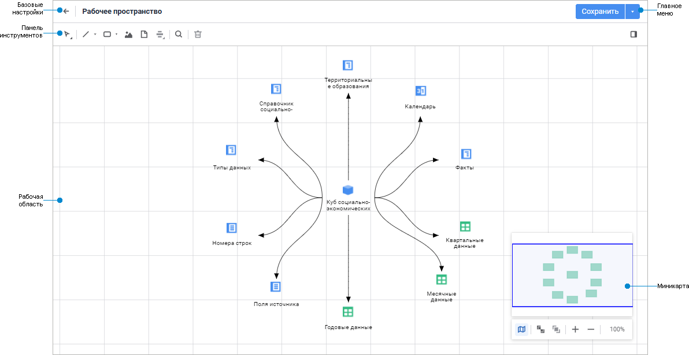
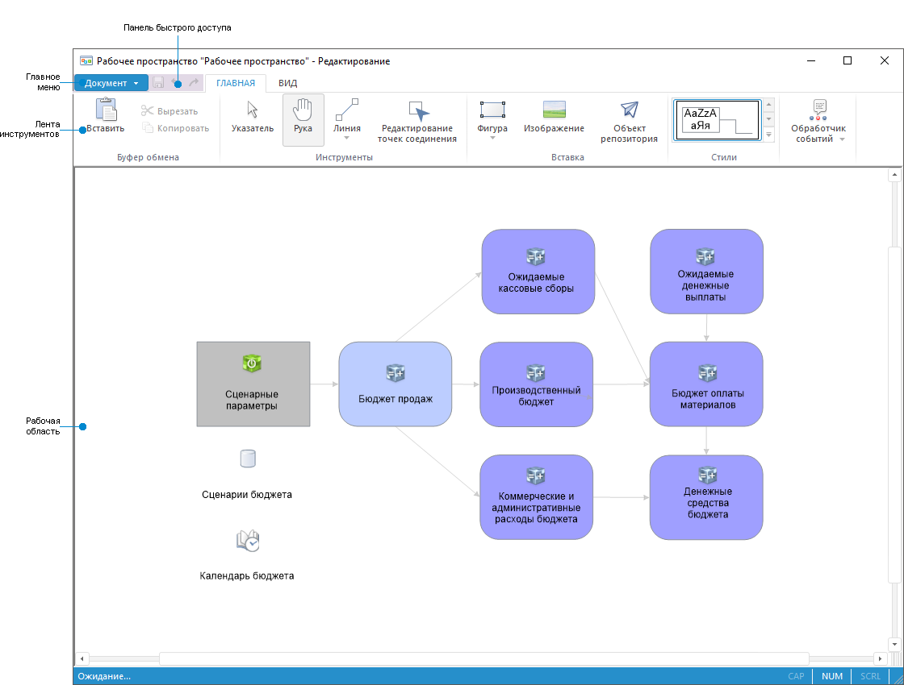

# Начало работы с инструментом «Рабочее пространство»

Начало работы с инструментом «Рабочее пространство»
-

# Начало работы с инструментом «Рабочее пространство»

Для начала работы с инструментом создайте новое или откройте готовое
 рабочее пространство.

[Создание
 нового рабочего пространства](javascript:TextPopup(this))

	Для создания нового рабочего пространства в навигаторе объектов:

		- в веб-приложении:

			- нажмите кнопку  «Создать»
			 в главном меню и в раскрывшейся панели выполните команду «Рабочее пространство».

		- в настольном приложении:

			- нажмите кнопку «Новый
			 объект >
			 Другие > Рабочее пространство»
			 в группе «Создать»
			 на вкладке «Главная»
			 ленты инструментов;

			- выполните команду «Создать
			 > Другие > Рабочее пространство» в контекстном
			 меню навигатора объектов.

[Открытие
 готового рабочего пространства](javascript:TextPopup(this))

	Для открытия на редактирование готового рабочего пространства в
	 [навигаторе
	 объектов](GetStarted.chm::/Interface/Interface_Navigator.htm) выполните одно из действий:

		- в веб-приложении:

			- выполните команду «Редактировать»
			 в контекстном меню рабочего пространства;

			- выполните команду «Редактировать
			 в новой вкладке» в контекстном меню рабочего пространства;

			- выполните команду «Редактировать
			 в новом окне» в контекстном меню рабочего пространства;

			- выделите рабочее пространство и нажмите клавишу F4;

		- в настольном приложении:

			- нажмите кнопку  «Редактировать»
			 в группе «Открыть»
			 на вкладке «Главная»
			 ленты инструментов;

			- выполните команду «Редактировать»
			 в контекстном меню рабочего пространства;

			- выделите рабочее пространство и нажмите клавишу F4.

	Для открытия на просмотр готового рабочего пространства в [навигаторе
	 объектов](GetStarted.chm::/Interface/Interface_Navigator.htm) выполните одно из действий:

		- в веб-приложении:

			- выполните команду «Открыть» в
			 контекстном меню рабочего пространства;

			- выполните команду «Открыть
			 в новой вкладке» в контекстном меню рабочего пространства;

			- выполните команду «Открыть
			 в новом окне» в контекстном меню рабочего пространства;

			- дважды щёлкните по рабочему пространству;

		- в настольном приложении:

			- нажмите кнопку  «Открыть»
			 в группе «Открыть»
			 на вкладке «Главная»
			 ленты инструментов;

			- нажмите кнопку  «Открыть
			 > В инструменте по умолчанию» в группе «Открыть»
			 на вкладке «Главная»
			 ленты инструментов;

			- выполните команду «Открыть»
			 в контекстном меню рабочего пространства;

			- дважды щёлкните по рабочему пространству.

Для построения рабочего пространства
 смотрите статью «[Построение
 рабочего пространства](UiWsp_WorkSpace_Create.htm)».

Для работы с готовым рабочим пространством
 смотрите статью «[Работа
 с готовым рабочим пространством](../3_Settings/Work_with_UiWsp.htm)».

Основное окно инструмента «Рабочее
 пространство»:

	 Веб-приложение Настольное приложение

		

		

[Элементы
 окна рабочего пространства](javascript:TextPopup(this))

		- Базовые настройки.
		 В режиме редактирования содержит поле для редактирования наименования
		 рабочего пространства, а также кнопку для возвращения в навигатор
		 объектов. В режиме просмотра доступно только возвращение в навигатор
		 объектов. Доступно только в веб-приложении.

		- [Главное меню](GetStarted.chm::/Interface/Interface_Description.htm#main_menu).
		 В веб-приложении содержит кнопку для сохранения изменений рабочего
		 пространства, открытого на редактирование. В настольном приложении
		 содержит список команд, предназначенных для выполнения различных
		 операций над объектами рабочего пространства.

		- Панель инструментов/[Лента
		 инструментов](GetStarted.chm::/Interface/Interface_Description.htm#customize_ribbon).
		 Содержит кнопки для настройки
		 объектов и рабочего пространства.

		- [Панель быстрого доступа](GetStarted.chm::/Interface/Interface_Description.htm#quick_access_toolbar).
		 Содержит набор часто используемых команд. Доступно только в настольном
		 приложении.

		- Рабочая область.
		 Предназначена для построения рабочего пространства.

		- Миникарта.
		 Краткое представление содержимого рабочего пространства с возможностью
		 быстрой навигации. Доступно только в веб-приложении.

См. также:

[Создание
 рабочего пространства](UiWsp_WorkSpace_Create.htm)

		Справочная
		 система на версию 10.9
		 от 18/08/2025,
		 © ООО «ФОРСАЙТ»,
