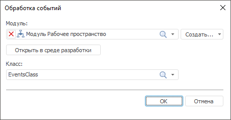

# Создание и настройка обработчика событий

Создание и настройка обработчика событий
-

# Создание и настройка обработчика событий

Обработчик событий - это модуль, созданный на языке Fore. Обработчик
 событий позволяет задавать действия при наступлении определенных событий,
 расширяя функциональные возможности рабочего пространства.

Примечание.
 Задание обработчика событий доступно только в настольном приложении.

## Автоматическое создание обработчика событий

Для создания обработчика событий выполните команду «Обработчик
 событий > Создать > Создать модуль Fore» на вкладке «Главная» ленты инструментов.

Обработчик событий так же может быть создан в окне «Обработка
 событий». Для этого выполните команду «Обработчик
 событий > Настроить» на вкладке «Главная»
 ленты инструментов. В открывшемся окне выполните команду «Создать
 > Создать модуль Fore».

После выполнения данных действий будет открыт стандартный диалог выбора
 объекта в навигаторе объектов.

Созданный модуль или сборка содержат в себе готовую структуру, в которой
 представлены все события для рабочего пространства.

[Пример модуля](javascript:TextPopup(this))

	Class EventsClass: WorkspaceEvents

	    Public Sub OnBeforeOpenWorkspace(WorkspaceArgs: IUiWorkspaceCancelEventArgs);

	    Begin

	    End Sub OnBeforeOpenWorkspace;

	    Public Sub OnBeforePrintWorkspace(WorkspaceArgs: IUiWorkspaceCancelEventArgs);

	    Begin

	    End Sub OnBeforePrintWorkspace;

	    Public Sub OnAfterPrintWorkspace(WorkspaceArgs: IUiWorkspaceEventArgs);

	    Begin

	    End Sub OnAfterPrintWorkspace;

	    Public Sub OnBeforeExportWorkspace(WorkspaceArgs: IUiWorkspaceExportCancelEventArgs);

	    Begin

	    End Sub OnBeforeExportWorkspace;

	    Public Sub OnAfterExportWorkspace(WorkspaceArgs: IUiWorkspaceExportEventArgs);

	    Begin

	    End Sub OnAfterExportWorkspace;

	    Public Sub OnBeforeSaveWorkspace(WorkspaceArgs: IUiWorkspaceCancelEventArgs);

	    Begin

	    End Sub OnBeforeSaveWorkspace;

	    Public Sub OnBeforeCreateShape(WorkspaceArgs: IUiWorkspaceShapeCancelEventArgs);

	    Begin

	    End Sub OnBeforeCreateShape;

	    Public Sub OnAfterCreateShape(WorkspaceArgs: IUiWorkspaceShapeEventArgs);

	    Begin

	    End Sub OnAfterCreateShape;

	    Public Sub OnBeforeDeleteShape(WorkspaceArgs: IUiWorkspaceShapeCancelEventArgs);

	    Begin

	    End Sub OnBeforeDeleteShape;

	    Public Sub OnAfterDeleteShape(WorkspaceArgs: IUiWorkspaceShapeEventArgs);

	    Begin

	    End Sub OnAfterDeleteShape;

	End Class EventsClass;

## Подключение обработчика событий

Для подключения обработчика событий выполните команду «Обработчик
 событий > Настроить» на вкладке «Главная»
 ленты инструментов:

В открывшемся окне выберите модуль и класс, в котором находится обработчик
 событий:

	- В поле «Модуль»
	 выберите модуль Fore, в котором находится класс с обработчиком событий.
	 Выбрать объект можно из раскрывающегося списка или нажать на значок
	 поиска  и ввести название объекта.
	 Для удаления объекта из поля нажмите кнопку .

	- В поле «Класс» выберите
	 класс, в котором располагается обработчик событий. Выбрать класс можно
	 из раскрывающегося списка или нажать на значок поиска  и ввести название
	 класса. Для удаления класса из поля нажмите кнопку .

Для настройки и редактирования событий в среде разработки нажмите кнопку
 «Открыть в среде разработки».

### Пример модуля

Для выполнения примера предполагается наличие в модуле класса EventsClass.

Добавьте ссылки на системные сборки: Ui, Workspace.

	Class EventsClass: WorkspaceEvents

	    Public Sub OnBeforeOpenWorkspace(Args: IUiWorkspaceCancelEventArgs);

	    Begin

	        Winapplication.InformationBox("Сообщение перед открытием рабочего пространства");

	        Args.Cancel := False;

	    End Sub OnBeforeOpenWorkspace;

	End Class EventsClass;

В результате работы обработчика событий перед открытием рабочего пространства
 будет выводиться указанное сообщение.

См. также:

[Построение рабочего
 пространства](../2_WorkSpace/UiWsp_WorkSpace_Create.htm)

		Справочная
		 система на версию 10.9
		 от 18/08/2025,
		 © ООО «ФОРСАЙТ»,
