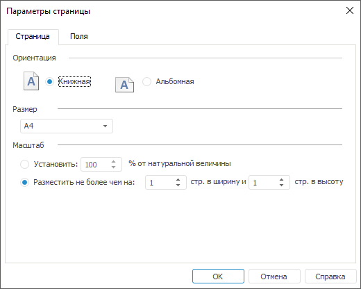
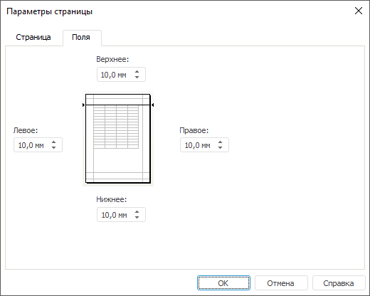

# Настройка параметров страницы

Настройка параметров страницы
-

# Настройка параметров страницы

Настройки параметров страницы рабочего пространства выполняются в настольном
 приложении в диалоге «Параметры страницы».
 Данные настройки используются при экспорте и печати рабочего пространства.
 Для открытия диалога выполните команду «Документ
 > Печать
 > Параметры страницы» главного меню.

## Страница

На вкладке «Страница» задайте
 параметры страницы:

Доступны параметры:

	- Ориентация.
	 Положение макета страницы: книжная - вверху страницы располагается
	 короткий край листа; альбомная - вверху страницы располагается длинный
	 край листа;

	- Размер. Определяет
	 размер бумаги при печати: А1, А2, А3, А4, А5;

	- Масштаб. Задайте
	 один из способов:

		- установите переключатель «Установить»
		 и в числовом поле задайте масштаб для печати в процентах от оригинального
		 размера;

		- установите переключатель «Разместить
		 не более чем на» и укажите количество страниц по горизонтали
		 и вертикали. Параметр задаёт количество листов при печати рабочего
		 пространства. Данные на листе будут уменьшены в соответствии с
		 заданными параметрами.

## Поля

На вкладке «Поля» задайте размеры
 полей в миллиметрах:

См. также:

[Предварительный просмотр](../2_WorkSpace/UiWsp_Preview.htm)

		Справочная
		 система на версию 10.9
		 от 18/08/2025,
		 © ООО «ФОРСАЙТ»,
