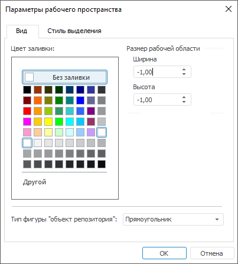
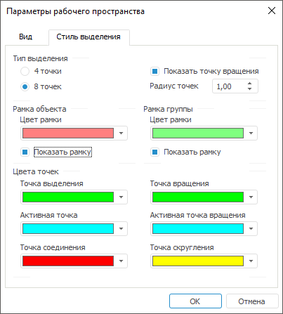

# Настройка оформления рабочего пространства

Настройка оформления рабочего пространства
-

# Настройка оформления рабочего пространства

При настройке оформления рабочего пространства:

	- [Настройте
	 оформление рабочей области](UiWsp_WorkSpace_SettingsView.htm#working_area_settings).

	- [Настройте
	 стиль выделения объектов](UiWsp_WorkSpace_SettingsView.htm#setting_up_workspace_selection_style). Доступно только в настольном приложении.

	- [Настройте
	 оформление объектов](../2_WorkSpace/Objects_Work/UiWsp_Object_Format.htm).

## Настройка оформления рабочей области

Для настройки оформления рабочей области:

	 Веб-приложение

	 Настольное
	 приложение

		Нажмите
		 кнопку  «Параметры»
		 на [панели
		 инструментов](../../CalculationAlgorithm/Web/Work/Beginning_of_work.htm). После чего будет открыта боковая панель «Настройки рабочей области»:

		

		Задайте параметры:

			- Отображать сетку.
			 Снимите флажок для скрытия сетки на рабочей области. По умолчанию
			 флажок установлен, сетка отображается;

			- Отображать пересечения.
			 Установите флажок для отображения перегиба линий при пересечении
			 прямых/угловых линий и стрелок на рабочей области:

		

		По умолчанию флажок снят, пересечения
		 прямых/угловых линий и стрелок отображаются без перегиба линий.
		 Состояние флажка не сохраняется, при открытии рабочего пространства
		 флажок всегда будет снят;

			- Цвет фона/Цвет сетки. Выберите цвет
			 фона/сетки в раскрывающейся палитре цветов.

Для выбора доступны стандартные и пользовательские цвета. По умолчанию
 палитра содержит только стандартные цвета.

Для создания пользовательского цвета:

	- Нажмите кнопку  «Добавить цвет». Откроется расширенная
	 палитра цветов.

	- Выберите цвет в расширенной палитре цветов, на странице браузера
	 с помощью пипетки или задайте код цвета в формате RGB/HEX.

После выполнения действий пользовательский цвет будет создан и добавлен
 в палитру.

Примечание.
 Максимально возможное количество пользовательских цветов в палитре равно
 23.

Для удаления пользовательского цвета из палитры выполните команду «Удалить» контекстного меню выбранного
 цвета.

Для изменения непрозрачности цвета используйте бегунок или введите значение
 в процентах при необходимости.

Для сброса настроек цвета нажмите кнопку  «Цвет
 по умолчанию».

		Для скрытия/отображения сетки на рабочей области используйте
		 клавишу G.

			- на вкладке «Вид»:

				- нажмите/отожмите кнопку «Сетка»
				 для отображения/скрытия сетки в рабочей области. По умолчанию
				 кнопка нажата, сетка отображается;

				- установите/снимите флажок
				 «Точки пересечения»
				 для отображения/скрытия точек пересечения линий в рабочей
				 области. По умолчанию флажок установлен, точки пересечения
				 отображаются;

				- установите/снимите флажок «Точки
				 соединения» для отображения/скрытия точек соединения
				 линий и объектов в рабочей области. По умолчанию флажок
				 установлен, точки соединения отображаются;

			- выполните команду «Параметры рабочего
			 пространства» в контекстном меню рабочей области. Откроется
			 окно «Параметры рабочего
			 пространства»:

		

		Определите параметры
		 отображения фона рабочего пространства:

				- На вкладке «Вид»:

					- Цвет
					 заливки. В стандартной палитре цветов выберите
					 цвет заливки. При выборе элемента «Без
					 заливки» будет установлен прозрачный цвет фона.
					 Для вызова расширенной палитры нажмите кнопку «Другой»;

					- Размер
					 рабочей области. Задайте ширину и высоту рабочего
					 пространства. Если в качестве значений ширины и высоты
					 проставлены значения «-1,00», то рабочее пространство
					 считается неограниченным. При задании границ для перемещения
					 по рабочему пространству можно использовать горячие
					 клавиши;

					- Тип фигуры
					 «объект репозитория». В раскрывающемся списке
					 выберите тип фигуры, который будет использоваться
					 для объектов репозитория: прямоугольник, стрелка,
					 двойная стрелка, выноска со стрелкой, выноска с двумя
					 стрелками, эллипс, прямоугольник со скругленными углами,
					 многоугольник, прямоугольная выноска, эллиптическая
					 выноска, выноска со скругленным прямоугольником. По
					 умолчанию используется прямоугольник;

				- На
				 вкладке «Стиль выделения»:

					- Тип
					 выделения. Задает количество отображаемых точек
					 при выделении объекта: 4 или 8. При снятии флажка
					 «Показывать точку
					 вращения» у выделенного объекта на рабочей
					 области не отображается точка вращения;

					- Рамка
					 объекта. Задает цвет рамки. При снятии флажка
					 «Показывать рамку»
					 у выделенного объекта рамка не отображается;

					- Рамка
					 группы. Задает цвет рамки группы. При снятии
					 флажка «Показывать
					 рамку» у выделенной группы рамка не отображается;

					- Цвета
					 точек. Задает цвет точек выделенного объекта.
					 Цвета точек выделения являются глобальными для всех
					 рабочих пространств в рамках одного профиля пользователя,
					 то есть настройки во всех рабочих пространствах будут
					 соответствовать последним измененным. Цвет можно определить
					 для следующих точек:

						- Точка выделения.
						 Точки всех выделенных объектов при множественной
						 отметке объектов, кроме точек активного объекта;

						- Активная
						 точка. Точки последнего выделенного объекта;

						- Точка соединения.
						 Точки соединения объектов;

						- Точка вращения.
						 Точки вращения всех предпоследних выделенных объектов;

						- Активная
						 точка вращения. Точка вращения последнего
						 (активного) выделенного объекта;

						- Точка скругления.
						 Точки скругления выделенного объекта:

		

См. также:

[Работа
 с готовым рабочим пространством](Work_with_UiWsp.htm)

		Справочная
		 система на версию 10.9
		 от 18/08/2025,
		 © ООО «ФОРСАЙТ»,
