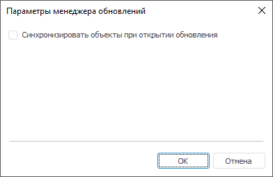

# Синхронизация с репозиторием

Синхронизация с репозиторием
-

# Синхронизация с репозиторием

При изменении объектов репозитория, находящихся в обновлении, выполните
 синхронизацию объектов обновления с репозиторием для замены всех объектов
 в структуре обновления на те же объекты из текущего репозитория.

Для начала синхронизации объектов:

	- в веб-приложении нажмите кнопку  «Произвести
	 синхронизацию объектов обновления» на панели инструментов;

	- в настольном приложении:

		- выполните команду «Обновление
		 > Синхронизация с репозиторием» в главном меню;

		- нажмите кнопку 
		 «Произвести синхронизацию объектов
		 обновления» на панели инструментов.

После окончания синхронизации появится информационное окно с результатом.

## Настройка синхронизации объектов при открытии обновления

Для настройки синхронизации объектов при открытии обновления в настольном
 приложении выполните команду главного меню «Обновление
 > Параметры менеджера
 обновлений». Будет открыто окно
 «Параметры менеджера обновлений»:

Установите флажок «Синхронизировать
 объекты при открытии обновления» для автоматического запуска синхронизации
 объектов обновления с репозиторием при последующем открытии обновления.

См. также:

[Добавление
 объектов репозитория](CreateUpdate/Admin_CreateUpdate_AddObjects.htm)

		Справочная
		 система на версию 10.9
		 от 18/08/2025,
		 © ООО «ФОРСАЙТ»,
