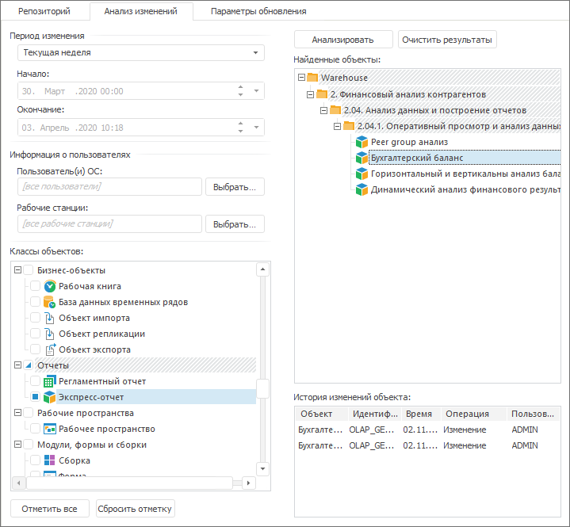

# Анализ изменений объектов

Анализ изменений объектов
-

# Анализ изменений объектов

Анализ изменений объектов предназначен для получения информации об изменении
 объектов репозитория в зависимости от заданных параметров. Для анализа
 изменений объектов должно быть [настроено](Admin.chm::/04_SecurityPolicy/Admin_PermSep_AuditPermission.htm)
 ведение аудита действий субъектов безопасности и истории изменений объектов
 по выбранным операциям в [менеджере
 безопасности](Admin.chm::/04_SecurityPolicy/Admin_Object_Classes.htm).

Примечание.
 Анализ изменений объектов доступен только в настольном приложении.

Анализ изменений объектов выполняется на вкладке «Анализ
 изменений» [менеджера обновлений](Admin_UpMBObj_RunManager.htm):

Для оценки изменений задайте ряд параметров:

[Период
 изменения](javascript:TextPopup(this))

	В группе параметров «Период
	 изменения» из раскрывающегося списка выберите период поиска
	 изменений:

		- Сегодня. Изменения,
		 произведенные за текущий день;

		- Вчера. Изменения,
		 произведенные вчера;

		- Текущая неделя.
		 Изменения, произведенные за текущую неделю;

		- Прошлая неделя.
		 Изменения, произведенные за прошлую неделю;

		- Текущий месяц. Изменения,
		 произведенные за текущий месяц;

		- Прошлый месяц. Изменения,
		 произведенные за прошлый месяц;

		- Фиксированный период.
		 Изменения, произведенные за период, заданный в редакторах дат
		 «Начало» и «Окончание».
		 Данные редакторы доступны только для фиксированного периода просмотра
		 изменений.

[Информация
 о пользователях](javascript:TextPopup(this))

	В группе параметров «Информация
	 о пользователях» выберите пользователей и рабочие станции:

		- Пользователь(и) ОС.
		 В поле через точку с запятой указываются имена пользователей,
		 которые были авторами изменений. Также можно использовать диалог
		 «[Выбор
		 пользователей и групп](Admin.chm::/03_Admin/Admin_UsersGroups.htm)», который вызывается
		 нажатием на кнопку «Выбрать»,
		 расположенную справа от поля ввода имен пользователей;

		- Рабочие станции.
		 В поле через точку с запятой указываются наименования рабочих
		 станций, с которых происходили изменения. При нажатии на кнопку
		 «Выбрать», расположенную
		 рядом с полем ввода, открывается диалог «[Выбор
		 рабочих станций](Admin.chm::/04_SecurityPolicy/Security_chooseWKS.htm)». Кнопка «OK» доступна,
		 если флажком отмечена одна и более рабочая станция.

	Примечание.
	 Если поля «Пользователь(и) ОС»
	 и «Рабочие станции» оставить
	 пустыми, то в результате анализа будут отображены изменения, внесенные
	 всеми пользователями со всех рабочих станций.

[Классы
 объектов](javascript:TextPopup(this))

	В группе параметров «Классы объектов»
	 выберите анализируемые классы объектов:

		- установите соответствующие флажки в списке классов объектов;

		- нажмите кнопку «Отметить
		 все» для установки флажков на все классы объектов;

		- нажмите кнопку «Сбросить
		 отметку» для снятия всех установленных флажков.

	Для работы со списком классов объектов доступно контекстное меню:

		- Развернуть всю иерархию.
		 Разворачивает иерархию списка;

		- Свернуть всю иерархию.
		 Сворачивает иерархию списка.

После установки параметров выполните анализ изменений.

## Выполнение анализа изменений

Для выполнения анализа изменений:

	- выполните команду главного меню «Анализ
	 изменений > Запустить анализ изменений»;

	- нажмите кнопку 
	 «Анализ изменений», расположенную
	 на панели инструментов;

	- нажмите кнопку «Анализировать»,
	 расположенную на вкладке «Анализ
	 изменений».

Результаты анализа будут отражены в списке «Найденные
 объекты». При выборе объекта в списке найденных в таблице «История изменений объекта» будет
 отображена информация об изменениях объекта: наименование и идентификатор,
 дата и время, операция, пользователь.

Примечание.
 Объекты, выделенные полужирным начертанием, уже добавлены в обновление.

Для очистки списка «Найденные объекты»
 нажмите кнопку «Очистить результаты».

## Добавление объектов в обновление с вкладки «Анализ изменений»

Добавление объектов из списка «Найденные
 объекты» в обновление можно несколькими способами:

	- с помощью одной из команд контекстного меню объекта:

	-

		- Добавить в обновление.
		 Выбранные объекты будут добавлены в обновление;

		- Добавить все объекты этого
		 типа. В обновление будут добавлены все объекты типа соответствующего
		 типу выбранного объекта;

		- Добавить все в обновление.
		 В обновление будут добавлены все объекты;

		- Добавить в обновление c
		 вложенными элементами. Добавляет объект вместе со всеми
		 его дочерними объектами. Данная команда отсутствует для объектов,
		 которые не содержат вложенные объекты;

	- при двойном щелчке левой кнопкой мыши на объекте в
	 списке;

	- с помощью перетаскивания объекта (Drag&Drop) из
	 списка в [структуру обновления](Admin_UpMBObj_RunManager.htm).
	 Если перетаскивается папка с объектами, то в обновление попадут только
	 те объекты данной папки, которые отображаются в списке «Найденные
	 объекты», а не все объекты репозитория, находящиеся в данной
	 папке.

Объекты репозитория будут добавлены в структуру обновления после выделенного
 объекта, в выделенную папку или в конец иерархического списка.

Объекты, добавленные в обновление, будут выделены полужирным начертанием
 в списке «Найденные объекты».

См. также:

[Создание
 обновления](CreateUpdate/Admin_CreateUpdate.htm) | [Параметры
 обновления объекта](Admin_UpMBObj_OBJUpdateParameters.htm)

		Справочная
		 система на версию 10.9
		 от 18/08/2025,
		 © ООО «ФОРСАЙТ»,
