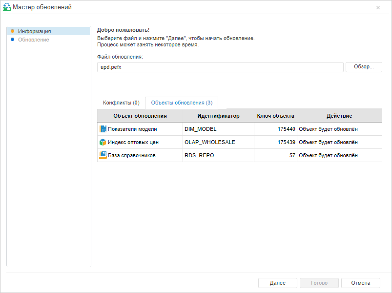
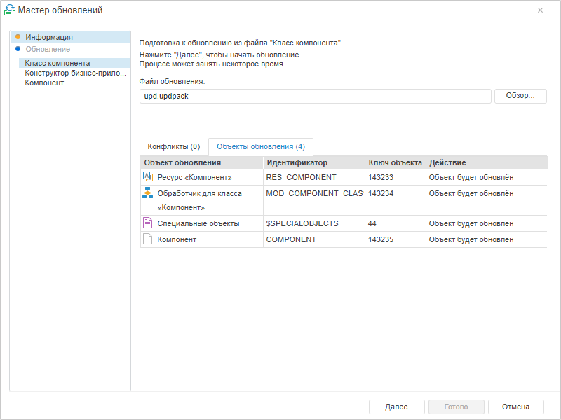
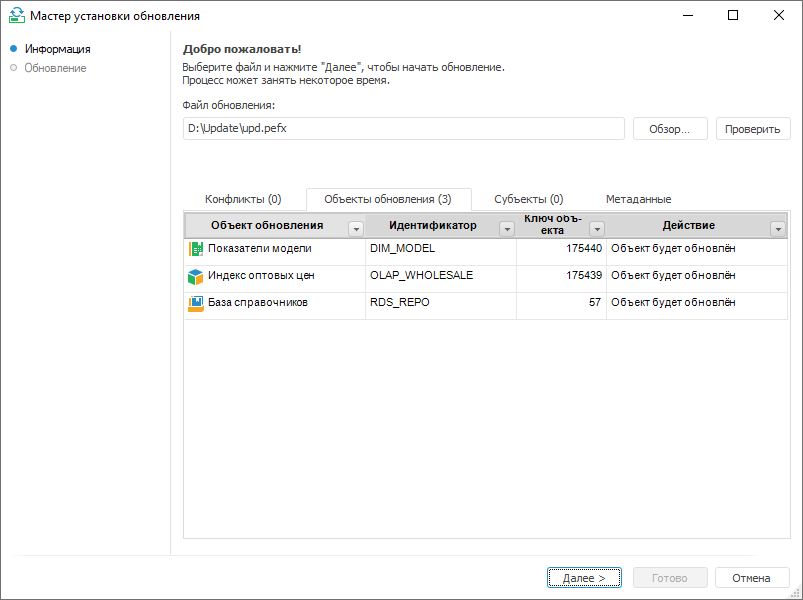
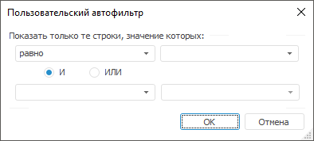

# Процесс обновления

Процесс обновления
-

# Процесс обновления

Для запуска процесса обновления используйте мастер обновлений/мастер
 установки обновлений после выбора файла обновления при выполнении команды
 [установки обновления](Admin_UpMBObj_DoUpdate.htm).

Страница мастера «Информация»
 будет отображена после выбора файла обновления при выполнении команды
 [установки обновления](Admin_UpMBObj_DoUpdate.htm).

	 Веб-приложение. Установка обновления *.pefx Веб-приложение. Установка обновления *.updpack Настольное приложение

		

		Установка обновления с расширением *.updpack в веб-приложении
		 состоит из установки обновлений из отдельных файлов, перечисленных
		 на боковой панели мастера обновлений. Перед установкой каждого
		 из обновлений на вкладке «Объекты
		 обновления» отображаются объекты, которые будут обновлены
		 на текущем этапе.

		

		Примечание.
		 Страница «Информация»
		 показана на этапе подготовки обновления из первого файла.

		

На странице мастера «Информация»
 в поле «Файл обновления» отображается
 путь к выбранному файлу. Можно произвести замену файла обновления. Путь
 можно ввести вручную или воспользоваться стандартным диалогом выбора файлов,
 нажав кнопку «Обзор».

Кнопка «Проверить» предназначена
 для проверки обновления на ошибки. В зависимости от состава обновления
 данная процедура может занимать длительное время. В случае обнаружения
 конфликтов активируется вкладка «[Конфликты](Conflicts.htm)».
 Если конфликтов нет, то активируется вкладка «Объекты
 обновления».

Примечание.
 Проверка обновления на ошибки доступна только в настольном приложении.

На странице отображаются несколько вкладок, в зависимости от [настроек
 менеджера безопасности](Admin.chm::/04_SecurityPolicy/Admin_SecPolicy.htm#access_control):

	- [Конфликты](Conflicts.htm). На
	 вкладке отображаются различные конфликты (кроме конфликтов мандатного
	 доступа), возникшие в процессе проверки обновления;

	- [Объекты обновления](Update_Objects.htm).
	 На вкладке «Объекты обновления»
	 отображается список элементов обновления;

	- Информация. На вкладке отображается
	 [сопроводительный текст](Admin_UpMBObj_OBJUpdateParameters.htm).
	 Если при создании обновления сопроводительный текст не был задан,
	 вкладка будет отсутствовать;

	- [Субъекты](Update_subjects.htm).
	 На вкладке отображается список субъектов безопасности из обновления,
	 для которых обновляются права доступа, но при проверке субъекты из
	 обновления не были сопоставлены с субъектами безопасности репозитория.
	 На вкладке содержится информация о наименовании субъекта безопасности,
	 SID, описание субъекта и действие над субъектом;

	- [Мандатный
	 доступ](Mandatory_access_conflicts.htm). На вкладке отображаются конфликты мандатного доступа,
	 возникшие в процессе проверки обновления. Вкладка отображается, если
	 мандатный доступ используется в обоих репозиториях (разработчиков
	 и заказчика).

	- Метаданные. На вкладке отображаются
	 данные о файле обновления: автор, дата и время создания, имя рабочей
	 станции, версия платформы.

Примечание.
 В веб-приложении отображаются только вкладки «Конфликты»
 и «Объекты обновления».

При нажатии кнопки «Далее» будет
 запущено [обновление](Admin_UpdateVersion.htm). При попытке
 запустить процесс обновления с неразрешенными конфликтами будет выдано
 подтверждение о начале установки.

## Работа с таблицами на вкладках «Конфликты», «Объекты обновления» и
 «Субъекты обновления»

Для работы с таблицами в настольном приложении доступны следующие действия:

	- Изменение размера
	 столбца. Для изменения размера столбца следует навести стрелку
	 мыши на границу между столбцами ,
	 а затем переместить границу.

	- Сортировка столбца.
	 Сортировка используется для наглядного представления списка и не влияет
	 на порядок обновления объектов. Для применения сортировки следует
	 нажать кнопку 
	 в заголовке столбца и выбрать тип сортировки:

	-

		- Сортировка по возрастанию;

		- Сортировка по убыванию.

	- Фильтрация.
	 Применяется для сокращения таблицы и исключения из рассмотрения некоторой
	 информации. Для настройки фильтрации используется кнопка 
	 в заголовке столбца. При нажатии кнопки выводится список, сформированный
	 из элементов данного столбца и зарезервированных пунктов:

	-

		- Снять фильтр. Операция
		 предназначена для отмены ранее настроенного фильтра. Будут отображены
		 все элементы столбца;

		- Первые
		 N. При выборе пункта будет открыт диалог для задания N,
		 после чего будут отображены первые N элементов столбца (количество
		 задается явно либо в процентах от количества элементов). Данное
		 условие фильтрации можно использовать, только если в столбце содержатся
		 числовые данные;

		- Настроить
		 фильтр. Открывает диалог для настройки условия:

В первом раскрывающемся списке выбирается
 оператор сравнения, а во втором необходимо указать конкретное значение.
 Выбор значения можно произвести из раскрывающегося списка, который содержит
 элементы фильтруемого столбца. Установив переключатели «И» и «ИЛИ», можно
 задать второе условие аналогично первому. При формировании автофильтра
 регистр символов, используемых в значениях, не учитывается;

		- Список
		 элементов столбца. При выборе элемента все остальные элементы
		 столбца будут скрыты. Список также может содержать элементы:

			- Пустые. Будут
			 отображены все элементы, у которых в данном столбце содержится
			 пустое значение. Данный пункт будет присутствовать, только
			 если в столбце имеются пустые значения;

			- Непустые. Будут
			 отображены все элементы, у которых в данном столбце содержится
			 непустое значение. Данный пункт будет присутствовать, только
			 если в столбце имеются пустые значения.

При использовании фильтрации кнопка в заголовке изменена: .

См. также:

[Установка
 обновления](Admin_UpMBObj_DoUpdate.htm) | [Особенности установки обновления](UPD_features.htm)

		Справочная
		 система на версию 10.9
		 от 18/08/2025,
		 © ООО «ФОРСАЙТ»,
