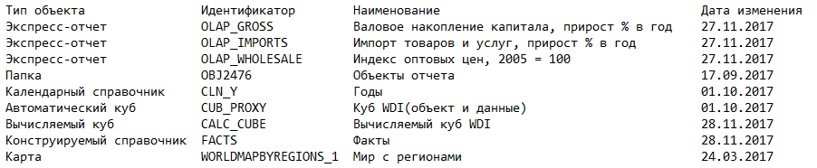

# Экспорт списка обновления

Экспорт списка обновления
-

# Экспорт списка обновления

Для экспорта списка обновления в настольном приложении:

	- Выполните команду главного меню «Обновление
	 > Экспортировать список».

	- Выберите расположение сохраняемого файла. По умолчанию файл
	 сохраняется с наименованием «Состав
	 обновления от <дата и время сохранения>».

Список обновления содержит тип объекта, идентификатор, наименование,
 текст SQL-запроса.

Экспорт производится в текстовый файл:

	- в качестве разделителя полей используется табуляция;

	- в качестве разделителя строк используется возврат каретки и
	 перевод строки.

Пример текстового файла экспортированного списка обновления:

См. также:

[Создание
 обновления](CreateUpdate/Admin_CreateUpdate.htm) | [Сохранение
 обновления](SaveUpdate/Admin_SaveUpdate.htm)

		Справочная
		 система на версию 10.9
		 от 18/08/2025,
		 © ООО «ФОРСАЙТ»,
