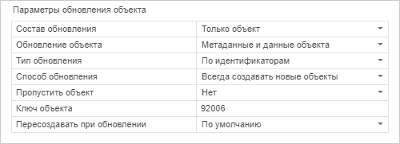
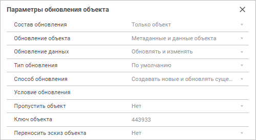
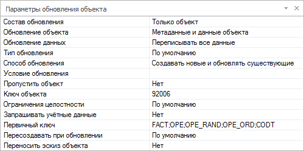
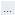
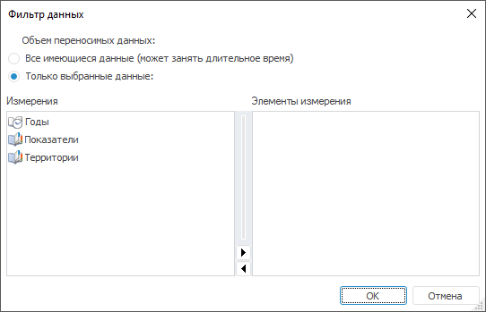

# Настройка параметров обновления выбранного объекта

Настройка параметров обновления выбранного объекта
-

# Настройка параметров обновления выбранного объекта

Для настройки параметров обновления выбранного объекта используйте [панель параметров обновления объекта](Admin_UpMBObj_RunManager.htm).
 При открытии готового обновления в веб-приложении доступен только просмотр
 параметров обновления выбранного объекта.

	 Мастер обновлений Менеджер обновлений в веб-приложении Менеджер обновлений в настольном приложении

		

		

		

При выборе корневого элемента «Объекты
 обновления» на панели параметров обновления объекта будут отображены
 общие параметры для всех объектов обновления:

[Состав
 обновления](javascript:TextPopup(this))

	Параметр «Состав обновления»
	 применяется к [объектам
	 репозитория](CreateUpdate/Admin_CreateUpdate_AddObjects.htm), [специальным
	 объектам репозитория](CreateUpdate/Admin_CreateUpdate_SpecialObjects.htm) и [правам
	 доступа](CreateUpdate/AddAccessPermissions.htm) к ним.

	В раскрывающемся списке выберите состав обновления:

		- Только объект. Переносится
		 только объект. Установлен по умолчанию;

		- Только права доступа.
		 Переносятся права доступа к объектам репозитория и специальным
		 объектам;

		- Объект с правами доступа.
		 Переносятся права доступа к объектам репозитория, специальным
		 объектам и сами объекты.

	Примечание.
	 Если при переносе прав доступа потребуется обновление прав доступа
	 на уровне СУБД, установите флажок «Раздавать
	 права доступа на уровне СУБД» в параметрах обновления.

	Для корневого элемента установка значения влияет на все объекты
	 в обновлении. Если для объектов обновления установлены различные значения
	 параметра «Состав обновления»,
	 то для корневого элемента «Объекты
	 обновления» значение этого параметра не отображается.

[Тип
 обновления](javascript:TextPopup(this))

	В раскрывающемся списке выберите тип обновления:

		- По ключам. По умолчанию.
		 Обновление объектов производится по ключам;

		- По идентификаторам.
		 Обновление объектов производится по идентификаторам в зависимости
		 от их расположения в исходном репозитории. Разные объекты с одинаковыми
		 идентификаторами могут содержаться:

			- в [бизнес-приложении](Constructor.chm::/Intro/Component_interface.htm);

			- в [контейнерах](UiNavObj.chm::/Container/Container.htm);

			- в объектах-контейнерах ([сборка](uidevenv.chm::/01_Development_Environment/02_Work_in_Development_Environment/DevEnv_Object/DevEnv_Assembly.htm),
			 объект [пользовательского
			 класса](uidevenv.chm::/04_NavigatorSetting/Classes_Object/UiNav_Classes_Object.htm), [репозиторий
			 НСИ](UiNavObj.chm::/repository_RDS/RepositoryRDS.htm), [база
			 данных временных рядов](UiNavObj.chm::/TimeSeriesDatabase/CreateTimeSeriesDatabase.htm), [контейнер
			 моделирования](UiModelling.chm::/UiModelling_Purpose.htm)).

	При выборе типа обновления учитывайте следующие особенности:

		- соответствие зависимых объектов, не включённых в файл обновления,
		 в целевом репозитории всегда ведётся «По
		 ключам», даже если файл обновления сохранён с типом обновления
		 «По идентификаторам».
		 Поэтому перед сохранением файла обновления рекомендуется
		 включить в обновление все зависимые объекты. Для этого выполните
		 команду контекстного меню «[Состоит
		 из](CreateUpdate/Admin_CreateUpdate_AddObjects.htm#consists_of_or_included_in)» в дереве обновления объекта и в открывшемся окне
		 выделите все объекты;

		- eсли задан тип обновления «По
		 идентификаторам» и у компонентов формы изменился объект,
		 на который они ссылались, то при обновлении формы компоненты будут
		 обновлены и перенастроены на другой объект.

[Способ
 обновления](javascript:TextPopup(this))

	В раскрывающемся списке выберите способ обновления:

		- Всегда создавать новые
		 объекты;

		- Создавать новые и обновлять
		 существующие. Установлен по умолчанию;

		- Только обновлять объекты.

[Предварительная
 очистка объектов, зависимых по содержимому](javascript:TextPopup(this))

	Определите, будут ли при обновлении очищаться зависимые объекты.

	Очищать зависимые объекты следует в случае, когда производится обновление
	 объектов, которые ссылаются друг на друга.

	Примечание.
	 При включенной опции для связанных объектов не будет доступно обновление
	 отдельно только данных или метаданных объекта.

Для различных типов объектов будет отображен разный набор параметров:

[Обновление
 объекта](javascript:TextPopup(this))

	Параметр «Обновление объекта»
	 отображается только для объектов, позволяющих обновлять данные и метаданные
	 объекта раздельно ([таблица](UiNavObj.chm::/Table/UiDb_relational_table.htm),
	 [присоединенная
	 таблица](UiNavObj.chm::/Attach_table/UiDb_relational_AttachTable.htm), [журнал](UiNavObj.chm::/journal/UiDb_relational_journal.htm),
	 [справочник
	 НСИ](UiNavObj.chm::/reference_book/Master_RDS_reference_book/Master_RDS.htm), [автоматический
	 куба](UiNavObj.chm::/Cube/CreateCube/Master_Auto/UiMd_Cube_CreateCube_Master_Auto.htm), [база
	 данных временных рядов](UiNavObj.chm::/TimeSeriesDatabase/CreateTimeSeriesDatabase.htm)).

	Выберите вариант обновления объекта:

		- Данные объекта.
		 Будут обновлены только данные объекта;

		- Метаданные и данные объекта.
		 Будут обновлены структура и данные объекта;

		- Метаданные объекта.
		 Будет обновлена только структура объекта.

	Вариант обновления объекта совпадает со способом обновления данных,
	 заданным в диалоге «[Добавление
	 в обновление](CreateUpdate/Features/Admin_CreateUpdate_Features_Tables.htm)». Данная настройка влияет на опции «[Способ
	 обновления](#updat_method_objects)» и «[Пересоздавать
	 при обновлении](#re-create_at_update)».

[Обновление
 данных](javascript:TextPopup(this))

	Настройка актуальна для:

		- таблиц, справочников НСИ и автоматических кубов, если для
		 параметра «[Обновление
		 объекта](#object_update)» выбрано «Данные
		 объекта» или «Метаданные
		 и данные объекта»;

		- баз данных временных рядов.

	Определите способ обновления данных объекта.

		- По умолчанию. Данные
		 объекта будут переписаны;

		- Переписывать все данные.
		 Будут переписаны все данные объекта. Перед обновлением осуществляется
		 очистка обновляемого объекта;

		- Только дополнять.
		 Данные объекта будут только дополнены новыми записями, имеющиеся
		 записи обновлены не будут;

		- Только изменять.
		 Данные объекта будут только обновлены без добавления новых записей;

		- Обновлять и изменять.
		 Данные объекта будут обновлены и дополнены новыми записями. В
		 обновляемом объекте будут оставлены записи/элементы, отсутствующие
		 в исходном объекте.

	При настройке данного параметра следует обратить внимание на значение,
	 которое задано для [первичного ключа](#primary_key).

[Тип
 обновления](javascript:TextPopup(this))

	Определите тип обновления. Варианты аналогичны приведенным для [корневого элемента](#update_type), и присутствует дополнительный
	 вариант:

		- По умолчанию. Обновление
		 объекта производится способом, указанным для корневого элемента
		 «Объекты обновления».
		 Пункт выбран по умолчанию.

[Способ
 обновления](javascript:TextPopup(this))

	Определите способ обновления объекта. Варианты аналогичны приведенным
	 для [корневого элемента](#update_method). По умолчанию
	 установлен способ «Только обновлять
	 объекты».

	Примечание.
	 Определение способа обновления объекта доступно, если для параметра
	 «[Обновление
	 объекта](#object_update)» выбрано «Метаданные
	 объекта» или «Метаданные и
	 данные объекта».

[Условие
 обновления](javascript:TextPopup(this))

	Определите условие обновления объекта, по значению которого объект
	 может быть исключен из процесса установки обновления.

	Для задания условия:

		- нажмите кнопку ;

		- дважды щёлкните по полю.

	Будет открыто окно «[Редактор
	 формул](UiNavObj.chm::/equation_editor/UiMd_Equation_editor.htm)». В редакторе формул будут отображены
	 имеющиеся [флаги обновления](Admin_UpdateFlags.htm), которые
	 можно использовать для формирования условия. При изменении условия
	 для объекта, имеющего дочерние объекты, будет выдан запрос на установку
	 условия обновления для всех вложенных объектов.

	Примечание.
	 Запрос выдается независимо от наличия условий обновления у вложенных
	 объектов.

[Пропустить
 объект](javascript:TextPopup(this))

	Определите, будут ли при обновлении пропускаться объекты:

		- Да. Объект остается
		 в структуре обновления и выделяется дополнительной пиктограммой
		 . При этом при установке обновления такой
		 объект не обновляется. При установке значения «Да»
		 для папки будет выдано подтверждение на изменение значения свойства
		 для дочерних объектов;

		- Нет. Установлено
		 по умолчанию. Отрицательный ответ не меняет значение свойства
		 для дочерних объектов, но и устанавливает для самой папки значение
		 «Нет».

[Ключ
 объекта](javascript:TextPopup(this))

	В поле отображается ключ объекта. Доступно только для чтения.

[Фильтр
 данных](javascript:TextPopup(this))

	Настройка «Фильтр данных»
	 актуальна только для автоматических кубов, если для параметра «Обновление объекта» выбрано «Данные» или «Данные
	 и метаданные».

	Настройте отображение отметки по измерениям. Для задания объема
	 переносимых данных нажмите кнопку 
	 или дважды щёлкните по полю. Откроется окно «Фильтр
	 данных»:

	

	Выберите вариант фильтрации:

		- Только выбранные данные.
		 Установите отметку по тем элементам измерений, данные по которым
		 необходимо перенести;

		- Все имеющиеся данные.

[Замещать
 атрибуты доступа](javascript:TextPopup(this))

	Настройка доступна только для справочников НСИ.

	Определите, будут ли при обновлении замещаться атрибуты доступа:

		- Да. Установлено
		 по умолчанию. Значения атрибутов, отвечающих за права доступа
		 к элементам справочника НСИ, будут обновлены;

		- Нет. Значения атрибутов
		 не будут обновляться.

	Следует помнить, что атрибуты доступа будут обновляться, только
	 если пользователь имеет [привилегию](Admin.chm::/04_SecurityPolicy/Admin_Priv.htm)
	 на изменение прав, в противном случае при обновлении выдается сообщение
	 об ошибке.

[Значения
 параметров](javascript:TextPopup(this))

	Задайте значения параметров.

	Настройка актуальна только для параметрических автоматических кубов.

[Запрашивать
 учетные данные](javascript:TextPopup(this))

	Определите, будут ли запрашиваться учетные данные пользователя,
	 если при установке обновления для вставки данных в таблицы недостаточно
	 прав под текущим пользователем:

		- Нет. Установлено
		 по умолчанию. При отсутствии прав на вставку данных запрос учетных
		 данных не выдается, будет сгенерирована ошибка;

		- Да. Будут запрошены
		 учетные данные пользователя, обладающего правами на создание таблиц
		 и вставку данных в соответствующей базе данных. Настройка актуальна
		 только для вставки данных в таблицы.

[Первичный
 ключ](javascript:TextPopup(this))

	В поле «Первичный ключ»
	 укажите поля таблицы, в которых хранятся данные. По указанным полям
	 будет проверяться, отличаются ли данные таблицы-приёмника от данных
	 таблицы-источника, и выполняться заданное действие по обновлению (например,
	 только добавление записей, которых нет по первичному ключу).

	Данный параметр присутствует только для таблиц. Если у таблицы есть
	 первичный ключ, то в поле автоматически будут отображены идентификаторы
	 полей, являющихся первичным ключом.

	Поля указываются через точку с запятой (;).

[Пересоздавать
 при обновлении](javascript:TextPopup(this))

	Настройка доступна для [таблицы](UiNavObj.chm::/Table/UiDb_relational_table.htm)
	 и [присоединенной
	 таблицы](UiNavObj.chm::/Attach_table/UiDb_relational_AttachTable.htm), если для параметра «[Обновление объекта](#object_update)» выбрано «Метаданные объекта» или «Метаданные
	 и данные объекта», а также для [представления](UiNavObj.chm::/conception/UiDb_relational_conception.htm)
	 и [процедуры](UiNavObj.chm::/procedure/UiDb_relationa_procedure.htm).

	Определите, в каком случае при обновлении
	 будет пересоздаваться объект на уровне СУБД:

		- По умолчанию. Установлено
		 по умолчанию. Пересоздание объекта выполняется только при изменении
		 его структуры;

		- Всегда. Пересоздание
		 объекта выполняется всегда;

		- Не пересоздавать.
		 Пересоздание объекта не выполняется.

	Примечание.
	 Если в [параметрах
	 процесса обновления](UpdateProcess_Parameters.htm#when_creating_update) установлен флажок «Пересоздавать
	 таблицы»/«Пересоздавать хранимые
	 процедуры»/«Пересоздавать
	 представления» и для соответствующего объекта выбран способ
	 пересоздания объекта «Не пересоздавать»,
	 то при установке обновления объект не будет пересоздаваться.

[Переносить
 членство в группах](javascript:TextPopup(this))

	Параметр доступен для [субъектов
	 безопасности](CreateUpdate/Admin_CreateUpdate_AddUser.htm).

	Определите, будет ли сохраняться [членство в группах
	 пользователей](Admin.chm::/03_Admin/Groups/Group_Members.htm) при переносе субъектов безопасности
	 между репозиториями:

		- Нет. Установлено
		 по умолчанию. Группа и пользователи будут перенесены между репозиториями
		 без сохранения членства в группах;

		- Да. Группа и пользователи
		 будут перенесены с сохранением членства в группе.

	В целевом репозитории могут очищаться
	 списки групп, в которые входят субъекты безопасности, в процессе обновления.
	 Например, если в исходном репозитории субъект входит в группу А, а
	 в целевом репозитории - в группу Б, то после применения обновления
	 в целевом репозитории субъект будет входить только в группу А. Для
	 очистки списков групп установите флажок «[Очищать списки
	 групп, в которые входят субъекты безопасности](UpdateProcess_Parameters.htm#when_creating_update)» при настройке
	 [параметров процесса обновления](UpdateProcess_Parameters.htm).

	Для получения подробной информации о переносе субъектов безопасности
	 с сохранением членства в группах обратитесь к разделу «[Перенос
	 субъектов безопасности с сохранением членства в группах](CreateUpdate/Admin_CreateUpdate_AddUser.htm#transferring)».

[Переносить
 эскиз объекта](javascript:TextPopup(this))

	Параметр определяет, будет ли при обновлении переноситься [заданный
	 эскиз](Constructor.chm::/Desktop/Setting_web_application_structure.htm#load_sketch) объекта и изображение предварительного просмотра,
	 установленное с помощью свойства [IMetabaseObjectDescriptor.Screenshot](KeSom.chm::/Interface/IMetabaseObjectDescriptor/IMetabaseObjectDescriptor.Screenshot.htm).
	 Допустимые значения:

		- Нет. Установлено
		 по умолчанию. Заданный эскиз объекта не переносится при обновлении;

		- Да. Заданный эскиз
		 объекта переносится при обновлении.

	Параметр доступен, если в менеджере безопасности установлен флажок
	«[Разрешить отображение объектов в виде значков
	 без учета прав доступа на объекты](Admin.chm::/03_Admin/Access_control_settings.htm#extralargeicons)». При
	 установке обновления для назначения эскиза объекту этот же флажок
	 должен быть установлен в менеджере безопасности обновляемого репозитория.

	Параметр устанавливается отдельно для каждого объекта в обновлении.

Примечание.
 При создании обновления в веб-приложении доступны все параметры, кроме
 «Обновление данных», «Условие
 обновления», «Фильтр данных»,
 «Замещать атрибуты доступа», «Значения параметров», «Запрашивать
 учетные данные», «Первичный ключ»
 и «Переносить эскиз объекта».

Особенности настройки параметров обновления объектов:

	- При [разделении
	 ролей администраторов](Admin.chm::/04_SecurityPolicy/Editor_of_Politicy/Security_EditorPoliticy_Adm.htm) и в зависимости от выбранного
	 метода [разграничения
	 доступа](Admin.chm::/04_SecurityPolicy/Admin_SecPolicy.htm) у пользователей могут отличаться доступные
	 наборы параметров объектов.

	- Если в дереве объектов выделено несколько объектов, то на панели
	 параметров обновления объекта отображаются только общие параметры.

	- При изменении значения параметра у объекта, имеющего дочерние
	 объекты, будет выдан запрос на изменение значения для всех дочерних
	 объектов. В частном случае, если изменение свойства осуществляется
	 для корневого элемента «Объекты
	 обновления», положительный
	 ответ изменит значение этого свойства для всех объектов обновления.

См. также:

[Создание
 обновления](CreateUpdate/Admin_CreateUpdate.htm) | [Анализ изменений
 объектов](Admin_UpMBObj_ChangeAnalysis.htm)

		Справочная
		 система на версию 10.9
		 от 18/08/2025,
		 © ООО «ФОРСАЙТ»,
