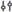
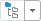
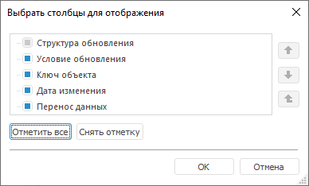

# Настройка отображения объектов

Настройка отображения объектов
-

# Настройка отображения объектов

В менеджере обновлений можно менять вид, режим и порядок отображения
 объектов обновления:

	- [настройка отображения объектов](#type);

	- [смена режима отображения объектов](#mode). Доступна
	 только в настольном приложении;

	- [изменение порядка расположения объектов](#order);

	- [отображение/скрытие столбцов](#column_display).

## Настройка отображения объектов

Для настройки отображения объектов в структуре обновления:

	- в веб-приложении нажмите кнопку  «Отображение
	 объекта» и выберите вариант отображения в раскрывающемся меню.
	 Настройка отображения объектов в структуре обновления доступна только
	 при открытии готового обновления на просмотр;

	- в настольном приложении выполните команду «Вид»
	 в контекстном меню структуры обновления и установите флажок напротив
	 одного из вариантов отображения.

Варианты отображения:

	- Наименование. По умолчанию.
	 Объекты отображаются под своими наименованиями;

	- Идентификатор. Объекты
	 отображаются под своими идентификаторами;

	- Наименование и идентификатор.
	 Объекты отображаются под своими наименованиями, в скобках указываются
	 их идентификаторы.

В настольном приложении для смены вида отображения объектов репозитория
 на вкладке «[Репозиторий](Admin_UpMBObj_RunManager.htm)»
 в контекстном меню установите необходимый переключатель и флажки:

	- Отображать наименования.
	 При установленном переключателе в дереве объектов будут отображены
	 только наименования объектов;

	- Отображать идентификаторы.
	 При установленном переключателе в дереве объектов будут отображены
	 только идентификаторы объектов;

	- Отображать наименования и идентификаторы.
	 При установленном переключателе в дереве объектов будут отображены
	 наименования и идентификаторы объектов.

	- Отображать всплывающую подсказку.
	 При установленном флажке отображается всплывающая подсказка при наведении
	 курсора на объект, содержащая информацию: наименование, идентификатор,
	 дата изменения и тип объекта;

	- Отображать пустые папки.
	 При установленном флажке в списке объектов отображаются папки, не
	 содержащие объектов.

## Смена режима отображения объектов

Для смены режима отображения объектов используйте кнопку  на панели инструментов
 в настольном приложении. При нажатии на кнопку происходит смена режима,
 при нажатии на стрелку кнопки будет открыто меню для выбора режима:

	- В порядке обновления.
	 Порядок будет соответствовать порядку добавления объектов в обновление.
	 В данном режиме отображается корневой элемент «Объекты
	 обновления»;

	- Как в репозитории. Объекты
	 обновления будут отображены со своими владельцами-контейнерами такими,
	 как папка, репозиторий НСИ. Отображение будет соответствовать дереву
	 на вкладке «[Репозиторий](CreateUpdate/Admin_CreateUpdate_AddObjects.htm#repository)».

Примечание.
 При использовании режима «Как в репозитории»
 для элемента «Объекты обновления»
 не выводится количество объектов.

## Изменение порядка расположения объектов

При создании обновления очень важен порядок объектов. [Добавьте](CreateUpdate/Admin_CreateUpdate_AddObjects.htm)
 или расположите добавленные объекты в структуре обновления, начиная со
 старших объектов (родительских объектов, источников), которых нет в целевом
 репозитория, заканчивая объектами, которые были созданы на их основе.

Перед [сохранением обновления](SaveUpdate/Admin_SaveUpdate.htm)
 будет выдан диалог подтверждения выполнения сортировки объектов. При положительном
 ответе объекты будут автоматически отсортированы, в противном случае порядок
 объектов останется неизменным.

Для смены порядка расположения объектов:

	- используйте кнопки ,
	  или 
	 на панели инструментов. Кнопки 
	 и  перемещают объект в рамках
	 одного уровня;

	- выполните соответствующие команды
	 контекстного меню;

	- используйте механизм перетаскивания
	 Drag&Drop;

	- выполните команду контекстного меню
	 «Выстроить объекты» или нажмите
	 кнопку  «Выстроить
	 объекты в порядке зависимости».

Примечание.
 Команда контекстного меню «Выстроить
 объекты» доступна только в настольном приложении.

	- выполните одну из команд в раскрывающемся
	 меню кнопки  «Выстроить объекты в порядке зависимости»:

	-

		- По типу. Объекты
		 будут сгруппированы по типу;

		- В порядке зависимости.
		 Команда выстраивает объекты на панели в порядке их зависимости
		 без нарушения состава (содержания) папок. В построении участвуют
		 объекты репозитория и [удаление
		 объектов](CreateUpdate/Admin_CreateUpdate_AddDel.htm). Объекты репозитория выстраиваются в порядке: сначала
		 базовые объекты, затем объекты, построенные на их основании (например:
		 таблицы, измерения, куб). Объекты удаления выстраиваются в обратном
		 порядке: сначала независимые объекты, построенные на других объектах,
		 затем объекты, которые входят в состав впереди идущих объектов
		 (например: удаление куба, удаление измерения, удаление таблицы).
		 В упорядочивании не участвуют комментарии, SQL-операторы, субъекты
		 безопасности, специальные объекты;

		- С нарушением структуры.
		 Выстраивает объекты на панели обновления в порядке их зависимости
		 с нарушением структуры. Упорядочивание осуществляется аналогично
		 варианту «В порядке зависимости»
		 с тем отличием, что при необходимости объекты могут быть вынесены
		 за пределы папок, в которых они были расположены. Исключением являются объекты-контейнеры,
		 например, контейнер моделирования, их дочерние объекты выноситься
		 за их пределы не будут.

Примечание.
 Данные команды доступны только в случае отображения объектов по порядку
 добавления в обновление.

## Отображение/скрытие столбцов

Для отображения/скрытия столбцов в структуре обновления:

	- Выполните одно из действий:

		- в веб-приложении нажмите кнопку  «Отображение объекта». Управление
		 отображением столбцов доступно только при открытии готового обновления
		 на просмотр;

		- в настольном приложении:

			- вызовите контекстное меню заголовков столбцов в структуре
			 обновления;

			- выполните команду «Выбрать
			 столбцы» в контекстном меню заголовков столбцов в структуре
			 обновления. После чего будет открыто окно «Выбрать
			 столбцы для отображения»:

	- Отметьте или снимите отметку со столбцов:

		- Тип объекта обновления.
		 Допустимые значения: «Папка», «Объект репозитория», «SQL-оператор»,
		 «Удаление объекта репозитория», «Комментарий», «Субъект безопасности»,
		 «Специальный объект», «Атрибуты доступа». Тип объекта обновления
		 определяется автоматически. Доступен только в веб-приложении;

		- Класс объекта. Доступен
		 только в веб-приложении;

		- Ключ объекта;

		- Идентификатор объекта.
		 Доступен только в веб-приложении;

		- Версия объекта.
		 Доступна только в веб-приложении;

		- Дата изменения;

		- Перенос данных.
		 Допустимое значение: «Частичный». Значение столбца отображается
		 для определения признака [частичного
		 обновления объекта](CreateUpdate/Features/Admin_CreateUpdate_Features_Tables.htm#partial_update);

		- Условие обновления.
		 Допустимое значение: формула [условия
		 обновления](Admin_UpMBObj_OBJUpdateParameters.htm#update_condition), заданная на [панели
		 параметров обновления объекта](Admin_UpMBObj_RunManager.htm).

Значения, указанные в столбцах «Класс
 объекта», «Ключ объекта»,
 «Идентификатор объекта», «Версия объекта», «Дата
 изменения», соответствуют [свойствам объекта](uinav.chm::/03_objects/uinav_obj_basicprop.htm).

После выполнения действий в структуре обновления будут отображаться
 отмеченные столбцы.

Для изменения порядка расположения столбцов в настольном приложении
 выберите столбец в окне «Выбрать столбцы
 для отображения» и используйте кнопки , .

См. также:

[Создание обновления](CreateUpdate/Admin_CreateUpdate.htm)

		Справочная
		 система на версию 10.9
		 от 18/08/2025,
		 © ООО «ФОРСАЙТ»,
