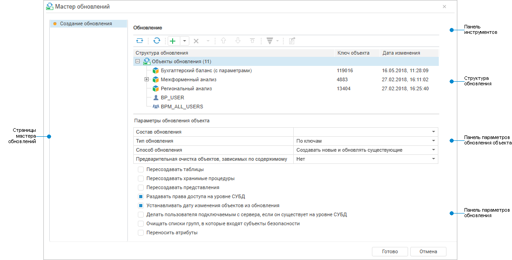
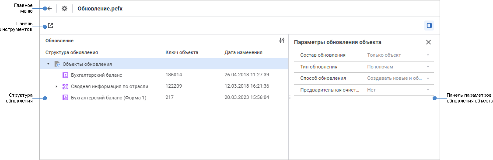
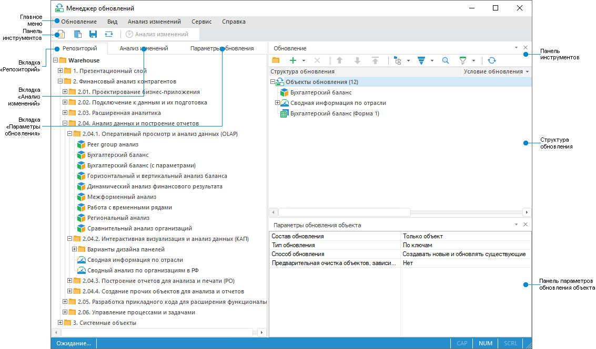

# Начало работы с менеджером обновлений

Начало работы с менеджером обновлений
-

# Начало работы с менеджером обновлений

Работа с менеджером обновлений доступна администратору ADMIN (владельцу
 схемы), члену группы «[Администраторы](Admin.chm::/03_Admin/Groups/Admin_Groups.htm)»
 или пользователю/члену группы пользователей, обладающей привилегией «[Доступ
 к менеджеру обновлений](admin.chm::/04_SecurityPolicy/Admin_Priv.htm#upd_manager)».

Для начала работы с менеджером обновлений создайте новое или откройте
 готовое обновление:

[Создание
 нового обновления](javascript:TextPopup(this))

	Для создания нового обновления:

		- в веб-приложении выполните команду «Создать
		 обновление» в разделе  «Менеджер
		 обновлений» на боковой панели [навигатора
		 объектов](GetStarted.chm::/interface/interface_navigator.htm);

		- в настольном приложении:

			- в [навигаторе
			 объектов](GetStarted.chm::/interface/interface_navigator.htm) выполните команду «Сервис
			 > Менеджер обновлений > Создать» в главном меню;

			- в менеджере обновлений:

				- выполните команду «Обновление
				 > Создать» в главном меню;

				- нажмите кнопку  «Создать
				 обновление» на панели инструментов;

			- в [менеджере
			 безопасности](Admin.chm::/01_RunSecManager/Admin_Organizational_Starting.htm) выполните команду «Репозиторий
			 > Обновление версии > Создать» в главном меню.

[Открытие
 готового обновления](javascript:TextPopup(this))

	Для открытия готового обновления:

		- из файла:

			- в веб-приложении:

				- в [навигаторе
				 объектов](GetStarted.chm::/interface/interface_navigator.htm) выполните команду «Открыть
				 обновление» в разделе  «Менеджер обновлений»
				 на боковой панели;

				- в менеджере обновлений нажмите кнопку  «Открыть
				 из файла» на панели инструментов. После чего будет
				 открыто окно «[Загрузка
				 объектов](OpenUpdate/Admin_OpenUpdate.htm)»;

			- в настольном приложении:

				- в навигаторе объектов выполните команду «Сервис
				 > Менеджер обновлений > Открыть» в главном
				 меню;

				- в менеджере обновлений выполните команду «Обновление > Открыть из
				 файла» в главном меню или нажмите кнопку  «Открыть
				 файл с обновлением» на панели инструментов;

				- в [менеджере
				 безопасности](Admin.chm::/01_RunSecManager/Admin_Organizational_Starting.htm) выполните команду «Репозиторий > Обновление
				 версии > Открыть» в главном меню.

	После выполнения одного из действий будет
	 открыто стандартное окно выбора файла. Выберите файл обновления с
	 расширением *.pefx;

		- из репозитория:

			- в [навигаторе
			 объектов](GetStarted.chm::/interface/interface_navigator.htm) выберите объект типа «Обновление»
			 и выполните команду «Открыть»
			 в контекстном меню объекта;

			- в менеджере обновлений выполните команду «Обновление
			 > Открыть из репозитория» в главном меню. В открывшемся
			 окне из объектов репозитория выберите объект обновления.

	Примечание.
	 Открытие готового обновления из репозитория доступно только в настольном
	 приложении.

	При открытии готового обновления ознакомьтесь с рядом [особенностей](OpenUpdate/Admin_OpenUpdate.htm).

Для создания обновления смотрите
 статью «[Создание
 обновления](CreateUpdate/Admin_CreateUpdate.htm)».

Для работы с готовым обновлением
 смотрите статью «[Работа
 с готовым обновлением](Working_with_update.htm)».

Если остались вопросы, смотрите
 статью «[Вопросы
 и ответы](FAQ/FAQ.htm)».

Основные окна инструмента «Менеджер
 обновлений»:

	- Мастер обновлений. Позволяет
	 создавать и устанавливать обновление в веб-приложении;

	- Менеджер обновлений.
	 В веб-приложении позволяет открывать обновление из файла на просмотр.
	 В настольном приложении позволяет создавать и открывать обновление
	 из файла/репозитория.

	Мастер
	 обновлений Менеджер обновлений в веб-приложении Менеджер обновлений в настольном приложении

		

		

		

[Элементы окон
 мастера обновлений и менеджера обновлений](javascript:TextPopup(this))

		- Страницы мастера обновлений.
		 Область предназначена для отображения страниц мастера обновлений
		 при [создании обновления](CreateUpdate/Admin_CreateUpdate.htm)
		 и для навигации между страницами мастера при [установке
		 обновления](Admin_UpMBObj_DoUpdate.htm). Доступна только в веб-приложении.

		- Главное меню. Содержит
		 список команд, предназначенных для выполнения различных операций
		 с обновлением в настольном приложении. При открытии готового обновления
		 в веб-приложении содержит наименование открытого обновления и
		 кнопку для открытия [мастера
		 менеджера обновлений](UpdateProcess_Parameters.htm), в котором содержатся [параметры
		 обновления](UpdateProcess_Parameters.htm).

		- Панель инструментов.
		 Содержит кнопки для [создания
		 обновления](CreateUpdate/Admin_CreateUpdate.htm) в мастере обновлений в веб-приложении и в менеджере
		 обновлений в настольном приложении. При открытии готового обновления
		 в веб-приложении на панели инструментов содержится кнопка для
		 открытия другого готового обновления из файла.

		- Структура обновления.
		 Предназначена для [добавления](CreateUpdate/Admin_CreateUpdate_AddObjects.htm)/[удаления](CreateUpdate/Admin_CreateUpdate_DelObjects.htm)
		 объектов обновления и [изменения
		 их порядка расположения](Admin_UpMBObj_ObjView.htm#order) в обновлении. При открытии готового
		 обновления в веб-приложении доступен только просмотр структуры
		 обновления.

		- Панель параметров обновления
		 объекта. Предназначена для [настройки
		 параметров обновления объекта](Admin_UpMBObj_OBJUpdateParameters.htm), выбранного в структуре обновления.
		 При открытии готового обновления в веб-приложении доступен только
		 просмотр настроенных параметров обновления объекта. Для отображения/скрытия
		 панели параметров обновления объекта используйте кнопку  «Параметры
		 обновления объекта» на панели инструментов.

		- Панель параметров обновления/Вкладка
		 «Параметры обновления». Предназначена для [настройки
		 параметров процесса обновления](UpdateProcess_Parameters.htm) в мастере обновлений в веб-приложении
		 и в менеджере обновлений в настольном приложении. При открытии
		 готового обновления в веб-приложении доступен только просмотр
		 настроенных параметров обновления в [мастере
		 менеджера обновлений](UpdateProcess_Parameters.htm).

		- Вкладка «Репозиторий».
		 Содержит дерево объектов репозитория и объектов, находящихся внутри
		 объектов-контейнеров: контейнер моделирования, репозиторий НСИ
		 и других. Предназначена для [добавления
		 объектов репозитория](CreateUpdate/Admin_CreateUpdate_AddObjects.htm#repository) в обновление. Доступна только в настольном
		 приложении.

		- Вкладка «Анализ изменений».
		 Предназначена для [получения
		 информации об изменении объектов](Admin_UpMBObj_ChangeAnalysis.htm) репозитория по заданным параметрам.
		 Доступна только в настольном приложении.

См. также:

[Создание
 обновления](CreateUpdate/Admin_CreateUpdate.htm) | [Работа с готовым обновлением](Working_with_update.htm)
 | [Вопросы и ответы](FAQ/FAQ.htm)

		Справочная
		 система на версию 10.9
		 от 18/08/2025,
		 © ООО «ФОРСАЙТ»,
