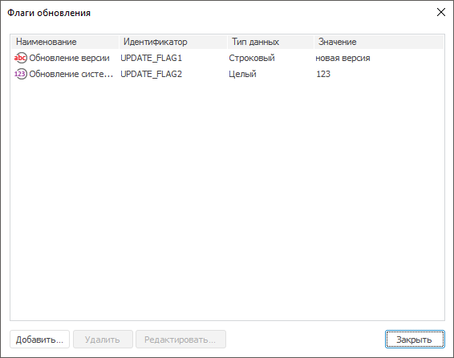
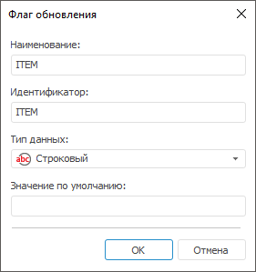

# Добавление флагов обновления

Добавление флагов обновления
-

# Добавление флагов обновления

Флаги обновления представляют собой переменные, которые можно использовать:

	- для хранения версии системы в файле обновления;

	- для формирования условия выполнения определенного
	 действия, заданного в [модуле
	 обновления](CreateUpdate/Features/Admin_CreateUpdate_Features_Module.htm);

	- для задания [условия
	 обновления](Admin_UpMBObj_OBJUpdateParameters.htm) для объекта.

Примечание.
 Использование флагов обновления доступно только в настольном приложении.

Для работы с флагами обновления выполните пункт главного меню «Обновление > Флаги обновления»:

Для добавления
 флага:

	- нажмите на кнопку «Добавить»;

	- выполните команду контекстного меню «Добавить
	 флаг»;

	- нажмите клавишу INSERT;

	- дважды щёлкните на свободной области списка.

После выполнения одного из действий будет
 открыто окно «Флаг обновления»:

Задайте свойства флага: наименование, идентификатор,
 тип данных, значение по умолчанию.

Для редактирования выбранного флага:

	- нажмите на кнопку «Редактировать»;

	- выполните команду контекстного меню «Редактировать
	 флаг»;

	- дважды щёлкните по флагу.

После выполнения одного из действий будет
 открыто окно, аналогичное окну при создании флага.

Для удаления выбранных флагов:

	- нажмите на кнопку «Удалить»;

	- выполните команду контекстного меню «Удалить
	 флаг».

После выполнения одного из действий будет
 выдан диалог подтверждения выполняемого действия.

См. также:

[Создание обновления](CreateUpdate/Admin_CreateUpdate.htm)

		Справочная
		 система на версию 10.9
		 от 18/08/2025,
		 © ООО «ФОРСАЙТ»,
