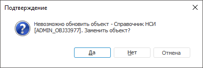
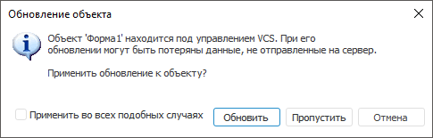

# Сообщения в процессе обновления

Сообщения в процессе обновления
-

# Сообщения в процессе обновления

Ниже приведены сообщения, которые могут выдаваться в процессе обновления:

	- в веб-приложении и настольном приложении:

		- если в процессе обновления объекта не был найден
		 родительский объект, из которого состоит обновляемый объект, то
		 будет выдано сообщение о его замене. Допустим, производится обновление
		 таблицы, и в схеме-приёмнике нет базы данных, необходимой для
		 её обновления, то возникнет ошибка о невозможности обновления
		 объекта:

При нажатии кнопки «Да»
 будет открыт стандартный диалог выбора объекта. В данном случае базы данных.
 После ее выбора и нажатия кнопки «ОК» будет выдан запрос на дальнейшее
 использование данного объекта, в случае возникновения подобной ошибки
 при установке текущего обновления.

При нажатии кнопки «Нет»
 будет отменено обновление объекта.

При нажатии кнопки «Отмена»
 будет отменено обновление объекта.

	- в настольном приложении:

		- если в [параметрах
		 обновления](UpdateProcess_Parameters.htm) был установлен флажок «Раздавать
		 права доступа на уровне СУБД», то в процессе обновления
		 будет выдан запрос на обновление прав на уровне СУБД. При отрицательном
		 ответе права будут применены только на уровне платформы, для применения
		 прав доступа на уровне СУБД необходимо будет произвести [обновление
		 пользователей](admin.chm::/03_admin/users/admin_user_update.htm);

		- в процессе обновления может произойти ошибка при
		 восстановлении данных объекта из обновления. Это может быть вызвано
		 отсутствием в обновлении объектов, из которых состоит обновляемый
		 объект. Проверьте, из каких объектов состоит обновляемый объект
		 и их наличие в репозитории или в обновлении;

		- если существуют неразрешенные конфликты, связанные
		 с объектами, добавленными в систему управления версиями (VCS),
		 то в процессе обновления будет выдан следующий диалог:

Обновление объекта можно пропустить, либо
 применить. Установка флажка «Применить
 во всех подобных случаях» позволяет применить выбранное действие
 для всех последующих объектов, для которых имеется аналогичный конфликт.
 Нажатие кнопки «Отмена» приведет
 к остановке всего обновления.

См. также:

[Установка
 обновления](Admin_UpMBObj_DoUpdate.htm) | [Процесс обновления](Admin_UpMBObj_DoUpdateFile.htm)

		Справочная
		 система на версию 10.9
		 от 18/08/2025,
		 © ООО «ФОРСАЙТ»,
