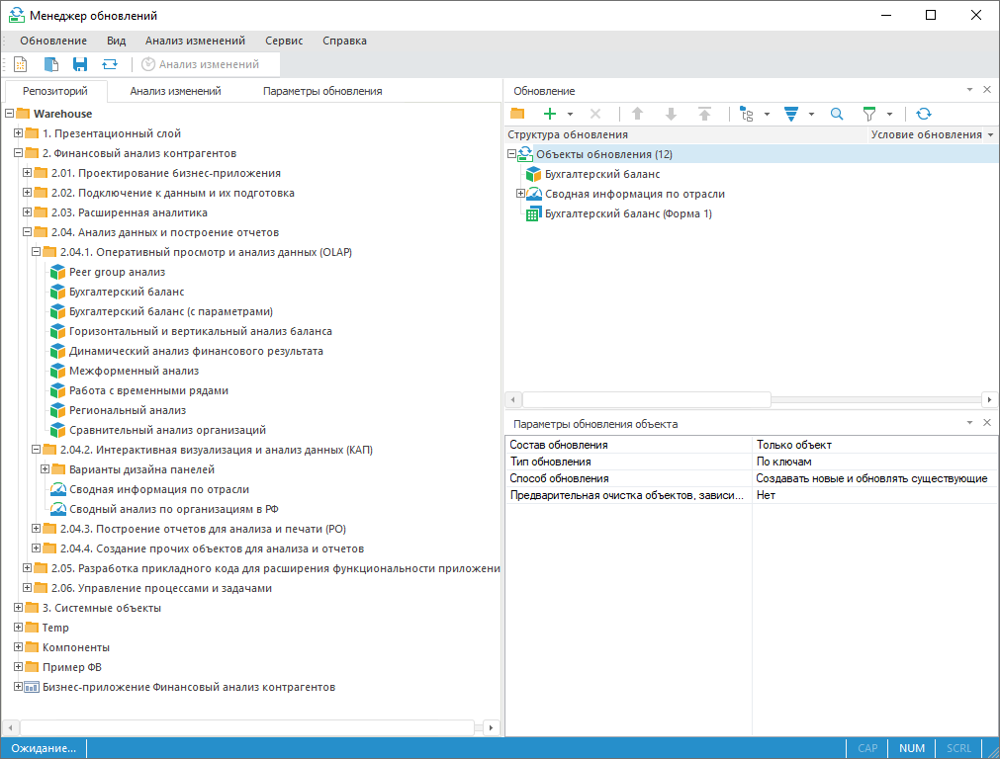

# Перенос объектов между репозиториями и их обновление

Перенос объектов между репозиториями и их обновление
-

# Перенос объектов между репозиториями и их обновление

Для синхронизации объектов между репозиториями и их обновления используйте
 инструмент «Менеджер обновлений»:

Ключевые возможности:

	- синхронизация объектов между репозиториями;

	- анализ изменений объектов;

	- расчёт и проверка контрольных сумм обновляемых объектов;

	- разрешение конфликтов версий объектов при обновлении.

Для начала работы с менеджером обновлений
 смотрите статью «[Начало
 работы с менеджером обновлений](Admin_UpMBObj_RunManager.htm)».

Для создания обновления смотрите
 статью «[Создание
 обновления](CreateUpdate/Admin_CreateUpdate.htm)».

Для работы с готовым обновлением
 смотрите статью «[Работа
 с готовым обновлением](Working_with_update.htm)».

Если остались вопросы, смотрите
 статью «[Вопросы
 и ответы](FAQ/FAQ.htm)».

См. также:

[Начало
 работы с менеджером обновлений](Admin_UpMBObj_RunManager.htm)

		Справочная
		 система на версию 10.9
		 от 18/08/2025,
		 © ООО «ФОРСАЙТ»,
