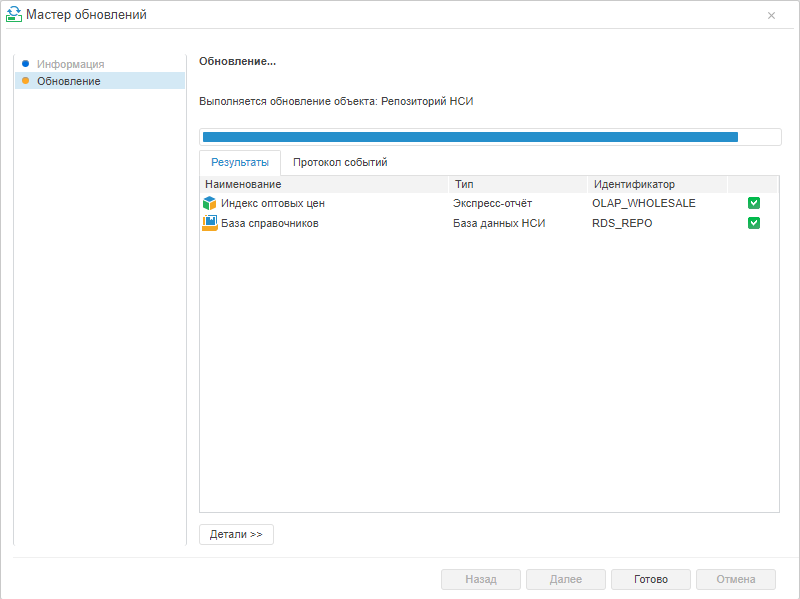
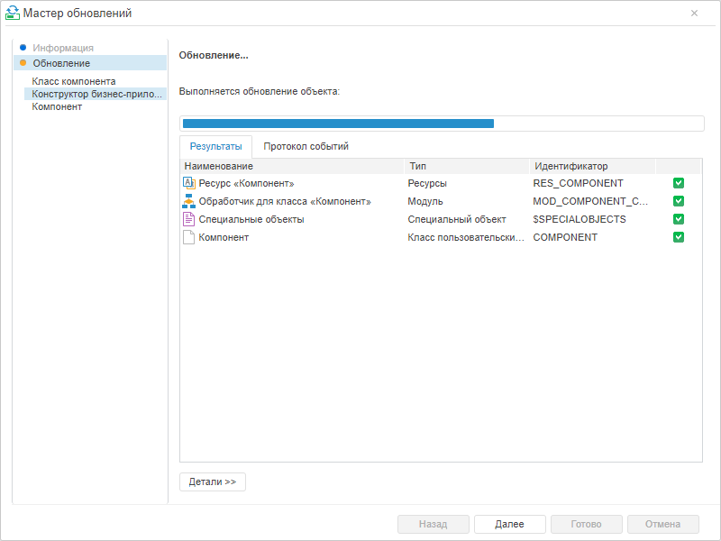
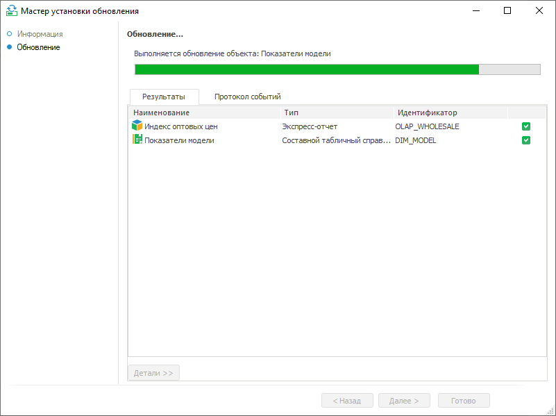
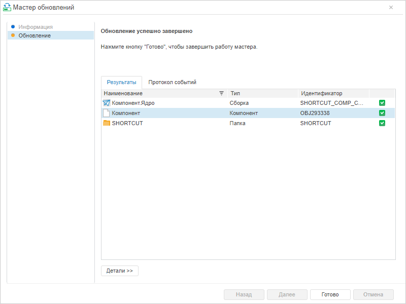
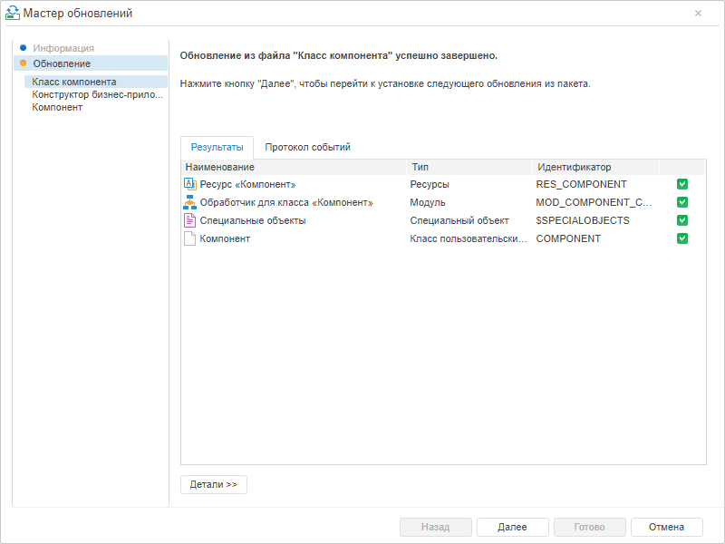
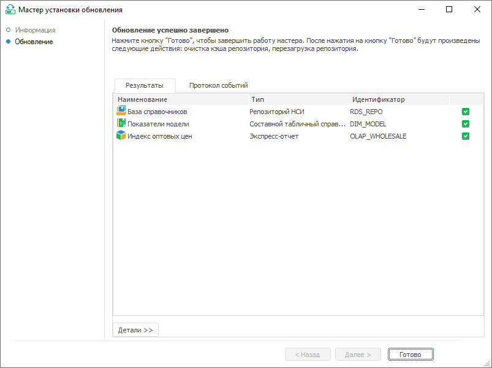
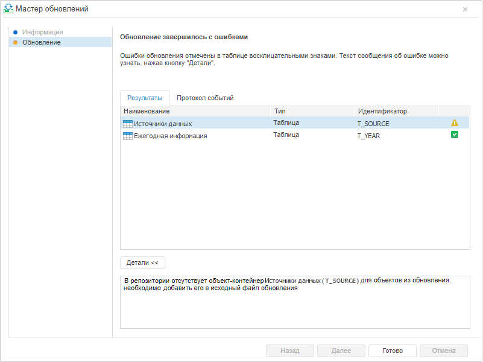
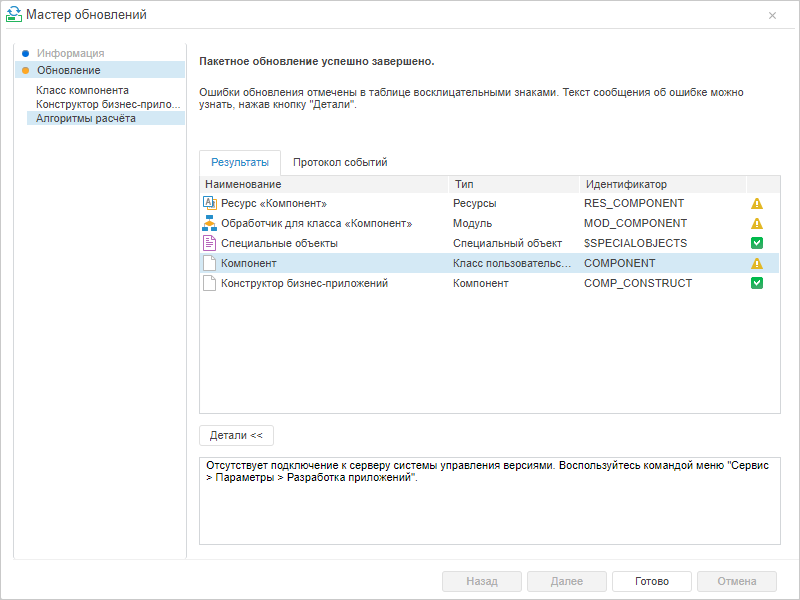
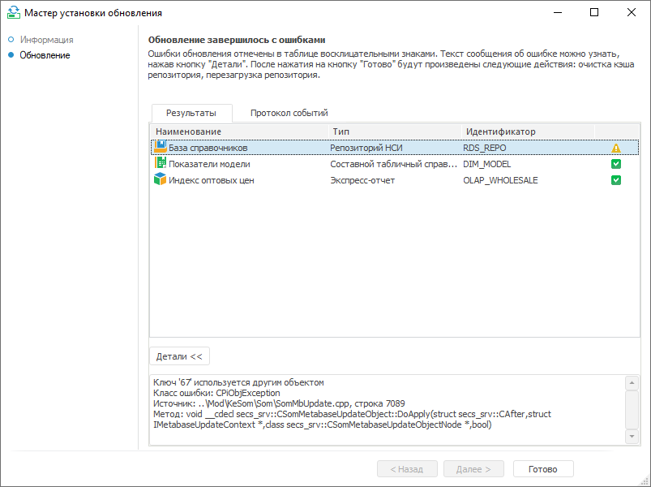

# Обновление

Обновление
-

# Обновление

После нажатия кнопки «Далее»
 на странице «[Информация](Admin_UpMBObj_DoUpdateFile.htm)»
 будет запущен процесс обновления. Происходит переход на страницу «Обновление».

На странице будет отображено текущее состояние процесса обновления:

	- наименование текущего обновляемого объекта;

	- индикатор хода выполнения обновления.

	 Веб-приложение. Установка обновления *.pefx
	  Веб-приложение. Установка обновления *.updpack
	  Настольное приложение

		

		

		

Ниже расположены следующие вкладки:

	- Результаты. На вкладке отображаются
	 список объектов с результатами обновления;

	- Протокол событий. На вкладке
	 располагается текстовое поле, содержащее информацию об обновлении,
	 и кнопка «Копировать в буфер
	 обмена». В протоколе событий
	 о каждом объекте указывается:

	-

		- тип
		 объекта;

		- ключ
		 объекта;

		- идентификатор
		 объекта;

		- наименование
		 объекта;

		- данные
		 о субъектах безопасности с правами доступа на этот объект до обновления:
		 субъект безопасности (уровень доступа);

		- данные
		 о субъектах безопасности с правами доступа на этот объект после
		 обновления: субъект безопасности (уровень доступа).

Если обновление содержит [комментарии](CreateUpdate/Admin_CreateUpdate_AddComent.htm),
 то на странице будет отображено поле «Подробности»,
 в которое последовательно будет добавлен текст каждого комментария.

Каждое выполненное действие добавляется в конец лога. В зависимости
 от [настроек параметров обновления](UpdateProcess_Parameters.htm)
 при возникновении ошибок в процессе обновления могут быть выданы соответствующие
 [сообщения и подтверждения](Admin_UpdateResult.htm).

По завершении обновления в заголовке страницы выводится сообщение о
 статусе обновления.

	Веб-приложение. Установка обновления *.pefx Веб-приложение. Установка обновления *.updpack Настольное приложение

		

		При установке обновления с расширением *.updpack в веб-приложении
		 выполняется последовательная установка обновлений из отдельных
		 файлов, перечисленных на боковой панели мастера обновлений. После
		 установки каждого из обновлений список объектов на вкладке «Результаты» дополняется объектами,
		 обновлёнными на текущем этапе.

		

		Примечание.
		 Страница «Обновление»
		 показана на этапе завершения установки обновления из первого файла.

		

При обновлении отдельных объектов могут возникнуть ошибки.

	 Веб-приложение. Установка обновления *.pefx
	  Веб-приложение. Установка обновления *.updpack
	  Настольное приложение

		

		При установке обновления с расширением *.updpack в веб-приложении
		 выполняется последовательная установка обновлений из отдельных
		 файлов, перечисленных на боковой панели мастера обновлений. После
		 установки каждого из обновлений список объектов на вкладке «Результаты» дополняется объектами,
		 обновлёнными на текущем этапе.

		

		Примечание.
		 Страница «Обновление»
		 показана на этапе завершения установки обновления из третьего
		 файла.

		

Для каждого объекта с помощью пиктограммы будет отображен результат
 обновления:

	-  - обновление объекта завершилось успешно;

	-  - обновление объекта завершилось с ошибками.

Для просмотра деталей обновления объектов нажмите кнопку «Детали».
 В поле ниже будут отображены детали выбранного в списке объекта.

Если при формировании обновления были выбраны [параметры](UpdateProcess_Parameters.htm)
 в группе «После обновления»,
 то в информационном сообщении будут перечислены действия, выполнение которых
 начнется после нажатия кнопки «Готово».
 Список действий не будет отображен, если в процессе обновления произошли
 ошибки и в [параметрах обновления](UpdateProcess_Parameters.htm)
 было установлено «Прервать обновление
 сообщением об ошибке».

## Работа со списком объектов на вкладке «Результаты»

	- Сортировка столбцов.
	 Для установки/изменения сортировки щелкните по заголовку столбца.
	 В заголовке столбца будет отображена стрелка, показывающая направление
	 сортировки:

	-

		- . По возрастанию
		 или в алфавитном порядке в зависимости от типа данных, содержащихся
		 в столбце;

		- . По убыванию
		 или в обратном алфавитном порядке в зависимости от типа данных,
		 содержащихся в столбце;

		- Нет стрелки. Сортировка не используется.

Для столбца с пиктограммами также возможна
 сортировка: при первом щелчке по заголовку столбца – в списке сначала идут
 успешно обновленные, затем с ошибками; при втором щелчке – наоборот.

	- Для списка объектов доступно контекстное меню:

	-

		- Копировать идентификатор.
		 Команда копирует через запятую в буфер обмена идентификаторы выделенных
		 объектов. Например: S_X_D, CALENDAR, OBJ375. Копирование идентификаторов
		 доступно только для объектов репозитория и недоступно для других
		 объектов обновления (удаление объекта, субъект безопасности, SQL-оператор,
		 специальные объекты);

		- Копировать таблицу.
		 Команда копирует список в буфер обмена целиком в виде таблицы
		 независимо от выделения в списке. При копировании таблицы столбец
		 с идентификаторами будет заполнен только для объектов репозитория.
		 Значение ячейки столбца будет пустым для других объектов обновления
		 (удаление объекта, субъект безопасности, SQL-оператор, специальные
		 объекты);

		- Показать в навигаторе объектов.
		 Команда показывает выбранный объект в навигаторе объектов репозитория.
		 При попытке перейти к объекту, который отсутствует в репозитории,
		 будет выдано сообщение о том, что объект не найден.

См. также:

[Процесс
 обновления](Admin_UpMBObj_DoUpdateFile.htm) | [Сообщения в процессе
 обновления](Admin_UpdateResult.htm)

		Справочная
		 система на версию 10.9
		 от 18/08/2025,
		 © ООО «ФОРСАЙТ»,
