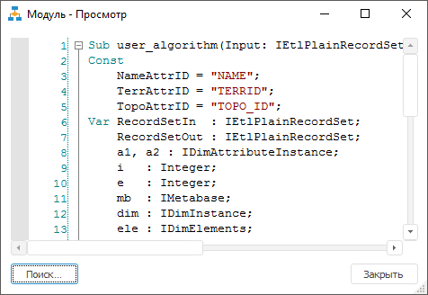
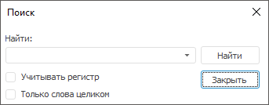

# Просмотр текста объекта

Просмотр текста объекта
-

# Просмотр текста объекта

Для объектов класса «Форма»,
 «Модуль», «Запрос»,
 «Процедура» и «Команда
 СУБД» возможен просмотр текста
 в настольном приложении.

Просмотр текста объекта осуществляется в окне:

Текст объекта недоступен для редактирования. Размеры и положение окна,
 установленные пользователем, сохраняются для последующих открытий.

Операции, доступные для просмотра текста объекта:

[Открытие
 окна просмотра текста объекта](javascript:TextPopup(this))

	Для открытия окна выделите объект на панели «[Обновление](Admin_UpMBObj_RunManager.htm)»:

		- выполните команду контекстного меню «Открыть»;

		- нажмите клавишу ENTER;

		- дважды щёлкните по объекту.

[Закрытые
 окна просмотра текста объекта](javascript:TextPopup(this))

	Для закрытия окна:

		- нажмите кнопку «Закрыть»;

		- нажмите клавишу ESC.

[Выделение
 всего текста](javascript:TextPopup(this))

	Для выделения всего текста:

		- нажмите сочетание клавиш CTRL+A;

		- выполните команду контекстного меню «Выделить
		 все».

[Копирование
 выделенного в буфер обмена](javascript:TextPopup(this))

	Для копирования выделенного текста в буфер обмена:

		- нажмите сочетание клавиш CTRL+C или CTRL+INSERT;

		- выполните команду контекстного меню «Копировать».

[Поиск
 по тексту](javascript:TextPopup(this))

	Для поиска по тексту:

		- нажмите кнопку «Поиск»;

		- нажмите сочетание клавиш CTRL+F.

	После выполнения одного из действий будет открыт диалог «Поиск»:

	

	В поле «Найти» определяется
	 текст, поиск которого будет осуществляться. Также в этом окне задаются
	 следующие условия поиска:

		- Учитывать регистр.
		 Установка флажка определяет, будет ли учитываться регистр введенного
		 в поле «Найти» текста;

		- Только слова целиком.
		 Установка флажка приводит к поиску текста, не входящего составляющей
		 частью в другие слова.

	При нажатии на кнопку «Найти»
	 осуществляется поиск текста, введенного в поле «Найти».
	 Если введенный текст найден, то он будет выделен в окне просмотра.

Примечание.
 При [разделении
 ролей администраторов](Admin.chm::/04_SecurityPolicy/Editor_of_Politicy/Security_EditorPoliticy_Adm.htm) просмотр текста [модуля
 обновления](CreateUpdate/Features/Admin_CreateUpdate_Features_Module.htm) недоступен администратору информационной безопасности (АИБ).

См. также:

[Добавление объектов
 репозитория](CreateUpdate/Admin_CreateUpdate_AddObjects.htm) | [Создание
 модуля обновления](CreateUpdate/Features/Admin_CreateUpdate_Features_Module.htm)

		Справочная
		 система на версию 10.9
		 от 18/08/2025,
		 © ООО «ФОРСАЙТ»,
