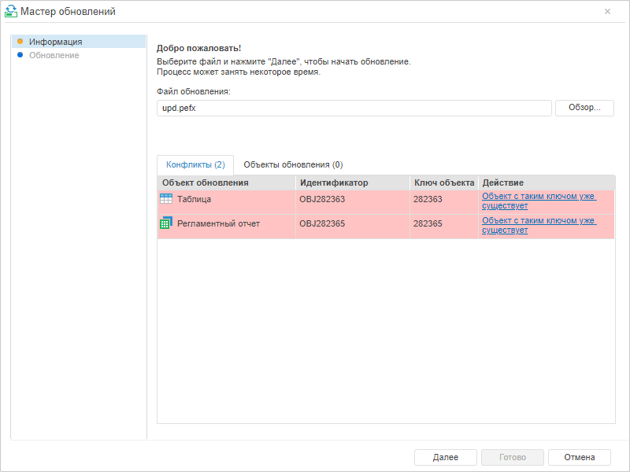
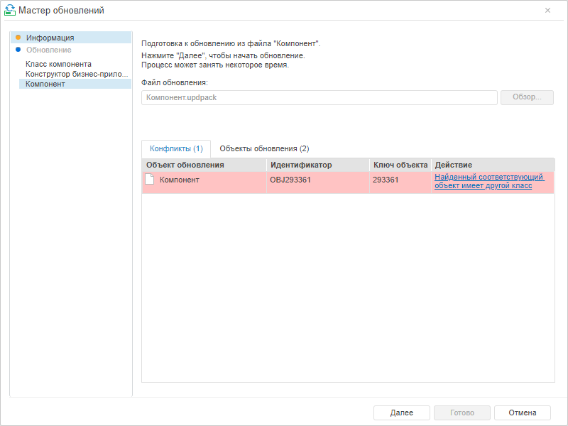
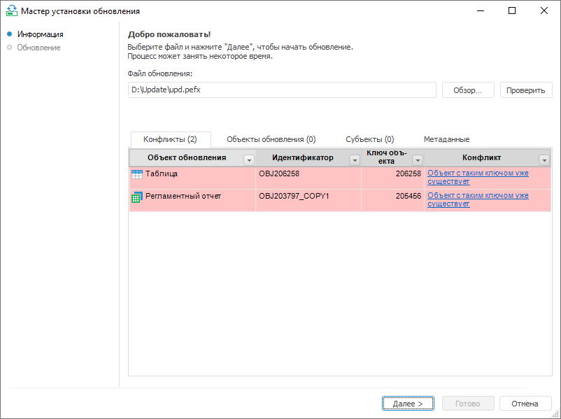
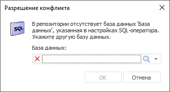
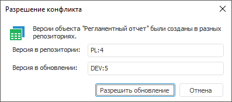
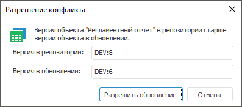
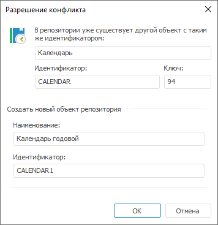
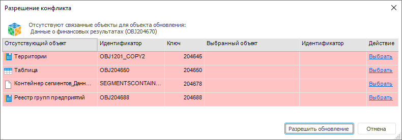

# Конфликты

Конфликты
-

# Конфликты

На вкладке «Конфликты» страницы
 «[Информация](Admin_UpMBObj_DoUpdateFile.htm)»
 отображаются конфликты, возникшие в процессе проверки обновления, кроме
 [конфликтов мандатного доступа](Mandatory_access_conflicts.htm).

	Веб-приложение. Установка обновления *.pefx Веб-приложение. Установка обновления *.updpack Настольное приложение

		

		

		

В заголовке вкладки отображено количество возникших конфликтов. Возможны
 следующие конфликты:

[База
 данных <наименование> не найдена](javascript:TextPopup(this))

	Конфликт возникает, если в репозитории отсутствует БД, указанная
	 в соединении [SQL-оператора](CreateUpdate/Admin_CreateUpdate_AddSQL.htm).
	 Для разрешения конфликта следует нажать на гиперссылку в поле «Конфликт» и выбрать базу данных:

	

[Версии
 объекта были созданы в разных репозиториях](javascript:TextPopup(this))

	Доступно только в настольном приложении.

	Для разрешения конфликта нажмите на гиперссылку в поле «Конфликт».
	 Откроется окно «Разрешение конфликта»:

	

	Поля заполнены по умолчанию:

		- Версия в репозитории.
		 Текущая версия обновляемого объекта в репозитории;

		- Версия
		 в обновлении. Текущая версия объекта в файле обновления.

	После нажатия на кнопку «Разрешить
	 обновление» содержимое объекта и текущая версия изменится на
	 версию в обновлении.

[Конфликт
 версий объектов](javascript:TextPopup(this))

	Доступно только в настольном приложении.

	Для разрешения конфликта нажмите на гиперссылку в поле «Конфликт».
	 Откроется окно «Разрешение конфликта»:

	

	Поля заполнены по умолчанию:

		- Версия в репозитории.
		 Текущая версия обновляемого объекта в репозитории;

		- Версия
		 в обновлении. Текущая версия объекта в файле обновления.

	После нажатия на кнопку «Разрешить
	 обновление» содержимое объекта и текущая версия изменится на
	 версию в обновлении.

[Найденный соответствующий объект имеет
 другой класс](javascript:TextPopup(this))

	Объект обновления и соответствующий ему объект репозитория по ключу
	 или идентификатору относятся к разным типам объектов, например, таблица
	 и модуль. Для разрешения конфликта будет предложено создать новый
	 объект.

[Не найден объект для обновления](javascript:TextPopup(this))

	Данный конфликт невозможно разрешить. Рекомендуется [открыть
	 файл](Admin_UpMBObj_RunManager.htm#open_update) в менеджере обновления и проверить [параметры
	 обновления объекта](Admin_UpMBObj_OBJUpdateParameters.htm). Возможно, для объекта выбран способ обновления
	 «Только обновлять объекты»,
	 а соответствующий объект в репозитории не найден.

[Объект
 с таким идентификатором/ключом уже существует](javascript:TextPopup(this))

	Совпадение ключа или идентификатора зависит от выбранного [типа
	 обновления](Admin_UpMBObj_OBJUpdateParameters.htm#update_type). Для разрешения конфликта следует нажать на гиперссылку
	 в поле «Конфликт»:

	

	Для разрешения конфликта предлагается создать новый объект репозитория,
	 изменив наименование и идентификатор. По умолчанию поля заполнены:

		- Имя объекта берется из обновления;

		- Идентификатор генерируется с учётом [формата
		 идентификаторов](Admin.chm::/04_SecurityPolicy/Editor_of_Politicy/Security_EditorPoliticy_General.htm), заданного в менеджере безопасности.

[Отсутствуют
 метаданные объекта](javascript:TextPopup(this))

	Данный конфликт невозможно разрешить. Рекомендуется [открыть
	 файл](Admin_UpMBObj_RunManager.htm#open_update) в менеджере обновления и проверить [параметры
	 обновления объекта](Admin_UpMBObj_OBJUpdateParameters.htm). Возможно, в параметрах обновления определено
	 пересоздание объекта, а файл обновления не содержит метаданных для
	 осуществления этой операции.

[Отсутствует
 связанный объект](javascript:TextPopup(this))

	Для разрешения конфликта нажмите на гиперссылку в поле «Конфликт».
	 Откроется окно «Разрешение конфликта»:

	

	В таблице содержатся отсутствующие и выбранные объекты. Отсутствующие
	 объекты необходимо заменить объектами из репозитория с помощью нажатия
	 на гиперссылку «Выбрать».

	Для сброса выбранного объекта нажмите на гиперссылку «Очистить».

	После замены всех отсутствующих объектов и нажатия на кнопку «Разрешить обновление» обновляемый
	 объект будет содержать выбранные объекты.

	Примечание.
	 Если в обновлении содержатся объекты пользовательских классов и конфликт
	 вызван отсутствием в репозитории пользовательских классов с соответствующими
	 идентификаторами, то данный конфликт можно разрешить только в настольном
	 приложении.

	Если в обновлении содержатся объекты пользовательских классов и конфликт
	 вызван полным отсутствием пользовательских классов в репозитории,
	 то разрешение данного конфликта в рамках менеджера обновлений не представляется
	 возможным. Для разрешения конфликта требуется [создать](UiDevEnv.chm::/04_NavigatorSetting/Classes_Object/UiNav_Classes_Object.htm)
	 необходимые пользовательские классы в репозитории и повторить установку
	 обновления.

На вкладке «Конфликты» для объектов
 репозитория доступно контекстное меню:

	- Показать в навигаторе объектов.
	 Команда показывает выбранный объект в навигаторе объектов репозитория.
	 При попытке перейти к объекту, который отсутствует в репозитории,
	 будет выдано сообщение о том, что объект не найден.

Примечание.
 Команда контекстного меню «Показать в
 навигаторе объектов» доступна только в настольном приложении.

См. также:

[Процесс
 обновления](Admin_UpMBObj_DoUpdateFile.htm) | [Конфликты мандатного
 доступа](Mandatory_access_conflicts.htm)

		Справочная
		 система на версию 10.9
		 от 18/08/2025,
		 © ООО «ФОРСАЙТ»,
