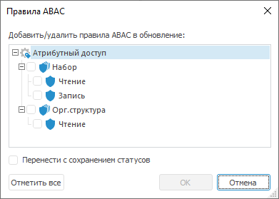
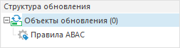

# Добавление правил атрибутного доступа

Добавление правил атрибутного доступа
-

# Добавление правил атрибутного доступа

Для добавления правил [атрибутного
 доступа](Admin.chm::/04_SecurityPolicy/Admin_ABAC.htm)
 в обновление:

	- выполните команду «Добавить
	 правила ABAC» в контекстном меню [структуры
	 обновления](../Admin_UpMBObj_RunManager.htm);

	- выберите тип объекта обновления «Правила
	 ABAC» в раскрывающемся меню кнопки 
	 «Добавить объект в обновление»
	 на панели инструментов.

Примечание.
 Добавление правил атрибутного доступа доступно только в настольном приложении.

После выполнения одного из действий будет открыт диалог «Правила
 ABAC»:

В окне «Правила ABAC» содержится
 структура атрибутного доступа, состоящая из иерархии элементов:

	- на первом уровне «Атрибутный
	 доступ», определяющий всю структуру наборов политик, политик
	 и правил;

	- на втором уровне наборы политик;

	- на третьем уровне политики.

Примечание.
 Правила не отображаются в структуре атрибутного доступа. Все правила,
 находящиеся в отмеченной политике, автоматически включаются в обновление.

В структуре атрибутного доступа установите флажки напротив наборов политик
 и политик, которые должны быть добавлены в обновление. Для отметки всех
 элементов нажмите кнопку «Отметить все».

Для сохранения в обновлении статусов элементов атрибутного доступа установите
 флажок «Перенести с сохранением статусов».
 Статус определяет разрешение на выполнение проверки доступа существующим
 элементом и задается с помощью флажков напротив элементов [структуры
 атрибутного доступа](Admin.chm::/04_SecurityPolicy/Admin_AttributeAccess.htm) в менеджере безопасности. При обновлении
 структуры атрибутного доступа будут обновлены статусы элементов структуры.
 Статусы правил будут перенесены вместе с соответствующей политикой.

Для обновления [атрибутов
 объектов](Admin.chm::/04_SecurityPolicy/Admin_PermSep_Attributes.htm) добавьте в обновление [объект
 репозитория](Admin_CreateUpdate_AddObjects.htm), которому принадлежат атрибуты. Атрибуты буду перенесены
 вместе с объектом.

Для переноса или обновления [атрибутов
 пользователя](Admin.chm::/03_Admin/Users/Admin_UserProp_Attributes.htm), которые используются вместе с элементами
 структуры атрибутного доступа, добавьте в обновление [субъект
 безопасности](Admin_CreateUpdate_AddUser.htm), которому принадлежат эти атрибуты.

После добавления «Правила ABAC»
 в структуре обновления появится правило атрибутного доступа:

Примечание.
 При повторном добавлении правил атрибутного доступа созданный объект будет
 обновляться.

См. также:

[Создание обновления](Admin_CreateUpdate.htm) |
 [Добавление объектов репозитория](Admin_CreateUpdate_AddObjects.htm)

		Справочная
		 система на версию 10.9
		 от 18/08/2025,
		 © ООО «ФОРСАЙТ»,
