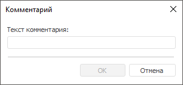

# Добавление комментария к обновлению

Добавление комментария к обновлению
-

# Добавление комментария к обновлению

При добавлении комментария к обновлению будет содержаться текстовое
 пояснение в создаваемом обновлении. Текст комментариев во время выполнения
 обновления будет отображаться на странице «[Обновление](../Admin_UpdateVersion.htm)».

Примечание.
 Добавление комментария к обновлению доступно только в настольном приложении.

Для добавления комментария:

	- выполните команду «Добавить
	 комментарий» в контекстном меню [структуры
	 обновления](../Admin_UpMBObj_RunManager.htm);

	- выберите тип объекта обновления «Комментарий»
	 в раскрывающемся меню кнопки  «Добавить
	 объект в обновление» на панели инструментов.

В открывшемся окне введите текст комментария:

В качестве наименования комментария выводятся его первые 40 символов.

См. также:

[Создание обновления](Admin_CreateUpdate.htm) |
 [Добавление объектов репозитория](Admin_CreateUpdate_AddObjects.htm)

		Справочная
		 система на версию 10.9
		 от 18/08/2025,
		 © ООО «ФОРСАЙТ»,
