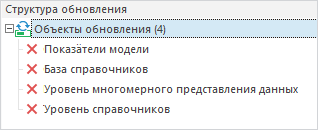

# Добавление удаления объекта

Добавление удаления объекта
-

# Добавление удаления объекта

Для добавления удаления объекта в обновление:

	- в веб-приложении выберите тип объекта обновления «Удаление
	 объекта» в раскрывающемся меню кнопки 
	 «Добавить объект в обновление»
	 на панели инструментов;

	- в настольном приложении выполните одно из действий:

		- выполните команду «Добавить
		 удаление объекта в обновление» в контекстном меню объекта
		 на вкладке «[Репозиторий](Admin_CreateUpdate_AddObjects.htm#repository)»;

		- выполните команду «Добавить
		 удаление объекта» в контекстном меню [структуры
		 обновления](../Admin_UpMBObj_RunManager.htm);

		- выберите тип объекта обновления «Удаление
		 объекта» в раскрывающемся меню кнопки 
		 «Добавить объект в обновление»
		 на панели инструментов.

После выполнения одного из действий выберите объект для удаления в окне
 «Выбор объекта». Объект будет
 добавлен в структуру обновления в следующем виде:

Примечание.
 При разделении [ролей
 администраторов](Admin.chm::/04_SecurityPolicy/Editor_of_Politicy/Security_EditorPoliticy_Adm.htm) добавление удаления объекта под администратором
 информационной безопасности невозможно.

При установке обновления в целевом репозитории выполняется поиск удаляемого
 объекта в зависимости от заданного параметра «[Тип обновления](../Admin_UpMBObj_OBJUpdateParameters.htm#update_type)»:
 по ключам или идентификаторам. Если задан тип обновления «По
 умолчанию», то удаление объекта будет зависеть от типа, заданного
 для всех объектов обновления.

Параметр «Тип обновления» доступен
 для конкретного удаляемого объекта только в веб-приложении. В настольном
 приложении используется значение параметра, установленного для всех объектов
 обновления.

См. также:

[Создание обновления](Admin_CreateUpdate.htm) |
 [Добавление комментария к обновлению](Admin_CreateUpdate_AddComent.htm)

		Справочная
		 система на версию 10.9
		 от 18/08/2025,
		 © ООО «ФОРСАЙТ»,
