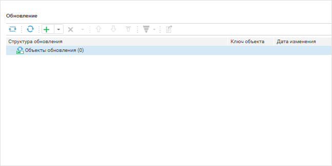
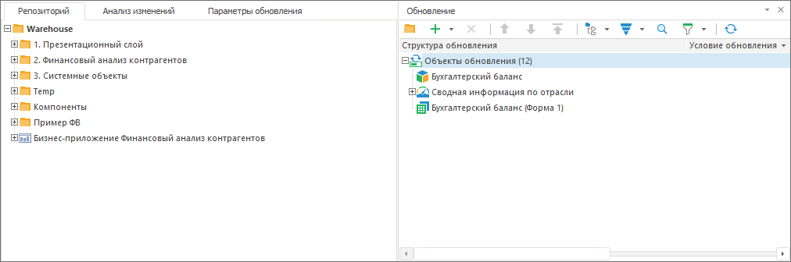
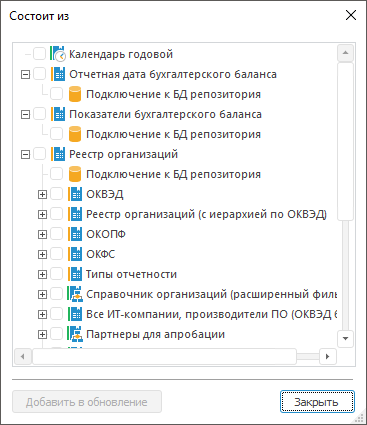
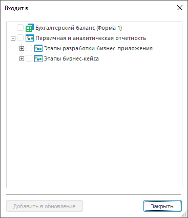

# Добавление объектов репозитория

Добавление объектов репозитория
-

# Добавление объектов репозитория

При создании обновления очень важен [порядок
 объектов](../Admin_UpMBObj_ObjView.htm#order). Добавьте или расположите добавленные объекты в [структуре
 обновления](../Admin_UpMBObj_RunManager.htm), начиная со старших объектов (родительских объектов, источников),
 которых нет в целевом репозитория, заканчивая объектами, которые были
 созданы на их основе.

Примечание.
 При [разделении
 ролей администраторов](Admin.chm::/04_SecurityPolicy/Editor_of_Politicy/Security_EditorPoliticy_Adm.htm) и в зависимости от выбранного
 метода [разграничения
 доступа](Admin.chm::/04_SecurityPolicy/Admin_SecPolicy.htm) возможно добавление [доступных
 пользователю элементов](../FAQ/Administrator_role_separation.htm) обновления, а также [различия](../FAQ/Access_control_methods.htm)
 в работе с элементами обновления и в управлении параметрами обновления
 объекта.

При создании обновления добавленный объект может использоваться при
 создании других объектов или сам использовать объекты, которые необходимо
 включить в обновление. Для определения содержания объектов используйте
 команды [«Состоит из»/«Входит
 в»](Admin_CreateUpdate_AddObjects.htm#consists_of_or_included_in) в контекстном меню объекта.

Примечание.
 Команда «[Входит в](Admin_CreateUpdate_AddObjects.htm#consists_of_or_included_in)» доступна только в
 настольном приложении.

Если в репозитории разрешена возможность [предварительного
 просмотра отчётов](Admin.chm::/03_Admin/Access_control_settings.htm#extralargeicons), то при добавлении отчётов в обновление
 их изображения предварительного просмотра в обновление не добавляются,
 так как не являются частью метаданных. Для добавления изображений в обновление
 установите значение «Да» параметру
 «Переносить эскиз объекта» при
 [настройке обновления](../Admin_UpMBObj_OBJUpdateParameters.htm).
 После применения обновления изображения предварительного просмотра будут
 назначены объектам, если в менеджере безопасности целевого репозитория
 установлен флажок «[Разрешить
 отображение объектов в виде значков без учета прав доступа на объекты](Admin.chm::/03_Admin/Access_control_settings.htm#extralargeicons)».

## Добавление объектов из навигатора

Для добавления объекта в обновление из [навигатора](GetStarted.chm::/Interface/Interface_Navigator.htm)
 выполните команду «Добавить в обновление»
 в контекстном меню объекта. После выполнения действия объект будет добавлен
 в обновление. В веб-приложении на пиктограмму объекта, добавленного в
 обновление, в навигаторе объектов накладывается красный индикатор.

Если объект содержит вложенные объекты, то выберите один из вариантов
 его добавления в обновление:

	- выполните команду «Добавить
	 в обновление > Без вложенных объектов» в контекстном меню
	 для добавления объекта без его дочерних объектов;

	- выполните команду «Добавить
	 в обновление > С вложенными объектами» в контекстном меню
	 для добавления объекта со всеми его дочерними объектами.

Для обновления структуры обновления в мастере обновлений/менеджере обновлений
 нажмите кнопку  «Обновить»
 на панели инструментов. Добавленные объекты репозитория будут отображаться
 в структуре обновления.

## Добавление объектов из
 менеджера обновлений

Для добавления объектов репозитория используйте [панель
 инструментов](../Admin_UpMBObj_RunManager.htm) или вкладку «[Репозиторий](../Admin_UpMBObj_RunManager.htm)».

Примечание.
 В веб-приложении доступна только панель инструментов.

[Добавление
 объектов репозитория через панель инструментов](javascript:TextPopup(this))

	Для добавления объектов репозитория через панель инструментов:

		- выполните одно из действий:

			- нажмите кнопку  «Добавить
			 объект в обновление»:

	

	Будет открыто стандартное окно «Выбор объекта»;

			- выберите тип объекта обновления «Объект»
			 в раскрывающемся меню кнопки  «Добавить объект в обновление».

	После выполнения одного из действий будет
	 открыто окно выбора объектов. Выберите объект, который необходимо
	 обновить.

	Совет.
	 Для добавления в обновление нескольких объектов в веб-приложении выделите
	 эти объекты, удерживая клавишу CTRL.

		- выполните команду «Добавить
		 объект» в контекстном меню. Доступно только в настольном приложении;

		- перетащите объект из списка «[Найденные объекты](../Admin_UpMBObj_ChangeAnalysis.htm)»
		 в структуру обновления с помощью механизма Drag&Drop. Доступно
		 только в настольном приложении.

	После выполнения одного из действий выбранный объект будет добавлен
	 в обновление. Если выбранный объект содержит вложенные объекты, то
	 добавляется объект без вложений.

	Объекты, доступные для добавления только в веб-приложении:

		- Информационная панель;

		- Модель данных;

		- Веб-форма.

	Объекты, доступные для добавления только в настольном приложении:

		- Автоматический куб;

		- Куб ADOMD;

		- Репозиторий НСИ;

		- Рабочая книга;

		- База данных временных рядов.

[Добавление
 объектов репозитория с вкладки «Репозиторий»](javascript:TextPopup(this))

	Вкладка «[Репозиторий](../Admin_UpMBObj_RunManager.htm)»
	 содержит дерево всех существующих объектов репозитория и объектов,
	 находящихся внутри объектов-контейнеров:

	

	Для добавления объектов репозитория с вкладки «Репозиторий»:

		- перетащите объект из дерева объектов в структуру обновления
		 с помощью механизма Drag&Drop;

		- дважды щёлкните по выбранному объекту в дереве объектов
		 репозитория. Если данное действие произведено для папки, то будет
		 выдано подтверждение на добавление папки в обновление со вложенными
		 объектами;

		- выполните команду в контекстном меню выбранного объекта:

			- Добавить в обновление
			 с вложенными объектами. Добавляет объект вместе со
			 всеми его дочерними объектами. Данная команда отсутствует
			 для объектов, которые не содержат вложенные объекты;

			- Добавить в обновление.
			 Добавляет только сам объект.

	После выполнения одного из действий выбранный объект будет добавлен
	 в структуру обновления после выделенного объекта, в выделенную папку
	 или в конец иерархического списка.

Если для добавленных в обновление [справочников](UiNavObj.chm::/reference_book/Create.htm)
 (в том числе, справочников НСИ) были настроены дочерние объекты, такие
 как [схемы
 отметки](UiNavObj.chm::/reference_book/look-and-feel_Reference_book/UiMd_reference_book_look-and-feel_Scheme.htm), [группы
 элементов](UiNavObj.chm::/reference_book/look-and-feel_Reference_book/UiMd_reference_book_look-and-feel_Group.htm) или [схемы
 импорта/экспорта](UiNavObj.chm::/reference_book/Master_RDS_reference_book/Import.htm) справочников НСИ, то дочерние объекты
 будут отображаться в [структуре
 обновления](../Admin_UpMBObj_RunManager.htm) как вложенные.

Примечание.
 При [разделении ролей администраторов](Admin.chm::/04_SecurityPolicy/Editor_of_Politicy/Security_EditorPoliticy_Adm.htm)
 и в зависимости от выбранного метода [разграничения
 доступа](Admin.chm::/04_SecurityPolicy/Admin_SecPolicy.htm) возможны [различия](../FAQ/FAQ.htm)
 в работе с элементами обновления, а также в управлении параметрами обновления
 объекта.

Если в обновление добавлен тип объектов «Рабочая
 книга», то на целевом репозитории должен содержаться справочник
 мер с идентификатором «MEASURES» или справочник единиц измерения с идентификатором
 «UNITS» для корректного обновления объектов.

Для некоторых типов объектов репозитория существуют особенности добавления
 в обновление:

	- [табличные
	 наборы данных, справочники НСИ, автоматические кубы и базы данных
	 временных рядов](Features/Admin_CreateUpdate_Features_Tables.htm);

	- [стандартные
	 кубы](Features/Admin_CreateUpdate_Features_Cubes.htm);

	- [схемы
	 отметки](Features/Admin_CreateUpdate_Features_Selections.htm);

	- [модули](Features/Admin_CreateUpdate_Features_Module.htm);

	- [алгоритмы
	 расчёта показателей](Features/Calculation_Algorithm.htm);

	- [объекты
	 полномочий и бизнес-процессы](Features/AuthorizationObject_and_BusinessProcesses.htm).

Для обновления [атрибутов
 объектов](Admin.chm::/04_SecurityPolicy/Admin_PermSep_Attributes.htm) при использовании [атрибутного метода
 разграничения доступа](Admin.chm::/04_SecurityPolicy/Admin_ABAC.htm) добавьте в обновление [объект
 репозитория](Admin_CreateUpdate_AddObjects.htm), которому принадлежат атрибуты. Атрибуты будут перенесены
 вместе с объектом.

Для объектов класса «Форма»,
 «Модуль», «Запрос»,
 «Процедура» и «Команда
 СУБД» в настольном приложении
 возможен [просмотр текста объекта](../Admin_Update_ViewText.htm).

Для поиска объекта репозитория на вкладке «[Репозиторий](../Admin_UpMBObj_RunManager.htm)» выполните
 команду «Поиск» в контекстном
 меню выбранного объекта. Будет открыт [диалог поиска
 объекта](UiNav.chm::/02_Navigator/UiNav_FindObject.htm).

### Просмотр свойств и изменений объекта

Для просмотра свойств и изменений объекта на вкладке «[Репозиторий](../Admin_UpMBObj_RunManager.htm)» выполните
 команду в контекстном меню выбранного объекта:

	- Свойства. Открывает
	 диалог просмотра [стандартных
	 свойств объекта](UiNav.chm::/03_Objects/UiNav_Obj_BasicProp.htm);

	- Журнал изменений. Открывает
	 диалог «[Журнал
	 изменений](UiNav.chm::/02_Navigator/UiNav_ObjVer.htm)», который позволяет получить информацию
	 о том, кто изменял объект за определенный промежуток времени. Пункт
	 будет отсутствовать, если у пользователя нет [привилегии](Admin.chm::/04_SecurityPolicy/Admin_Priv.htm)
	 просмотра протокола доступа.

Примечание.
 Просмотр свойств и изменений объекта доступен только в настольном приложении.

### Состав объекта и содержание
 в объектах

Состав объекта и содержание в объектах определяется с помощью команды
 контекстного меню выбранного объекта:

	- Состоит из. Отображает
	 иерархический список объектов, которые используются при создании выбранного
	 объекта.

Примечание.
 Для справочников НСИ всех видов в списке не отображаются документы, на
 которые ссылаются заимствованные атрибуты или атрибуты, используемые для
 создания связей с другими справочниками.

	- Входит в. Отображает
	 иерархический список объектов, которые содержат выбранный объект.

Примечание.
 Команда «Входит в»
 доступна только в настольном приложении.

После выполнения действий будет открыто соответствующее окно «Состоит из»/«Входит
 в»:

 

Для добавления объектов в обновление:

	- Установите флажки напротив объектов, или с помощью команды контекстного
	 меню:

		- Отметить все. Будут
		 отмечены все объекты, отсутствующие в обновлении;

		- Снять отметку.
		 Вся отметка будет снята.

	- Нажмите кнопку «Добавить в
	 обновление».

После выполнения действий выбранные объекты будут добавлены в обновление.

При попытке отметить объект, который уже присутствует в обновлении,
 будет отображено соответствующее сообщение.

Примечание.
 Команды «Состоит из» и «Входит в» доступны только при создании
 обновления и недоступны при открытии уже созданного обновления.

См. также:

[Создание
 обновления](Admin_CreateUpdate.htm) | [Анализ
 изменений объектов](../Admin_UpMBObj_ChangeAnalysis.htm)

		Справочная
		 система на версию 10.9
		 от 18/08/2025,
		 © ООО «ФОРСАЙТ»,
