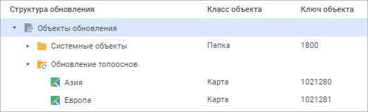

# Создание и добавление папки в обновление

Создание и добавление папки в обновление
-

# Создание и добавление папки в обновление

Для упорядочивания структуры обновления [создайте](#create_folder)
 или [добавьте](#add_folder) папку в качестве объекта обновления
 из репозитория. Папка, созданная в обновлении, не создаётся в целевом
 репозитории при [установке обновления](../Admin_UpMBObj_DoUpdate.htm).

Примечание.
 Создание папки в обновлении доступно только в настольном приложении.

Пиктограммы папок отличаются:

	- . Папка, созданная в обновлении;

	- . Папка, добавленная в обновление из репозитория.

Пример отображения папок в обновлении:

## Создание папки в обновлении

Для создания папки в обновлении:

	- выполните команду «Создать
	 папку» в контекстном меню
	 [структуры обновления](../Admin_UpMBObj_RunManager.htm);

	- нажмите кнопку 
	 «Создать папку»
	 на панели инструментов.

После выполнения одного из действий в обновлении будет создана папка
 с наименованием «Папка».

Для изменения наименования папки выполните команду «Переименовать»
 в контекстном меню папки или нажмите клавишу F2.

## Добавление папки в обновление

Добавление папки в обновление доступно из навигатора и менеджера обновлений
 аналогично добавлению [объектов
 репозитория](Admin_CreateUpdate_AddObjects.htm).

Если в обновление добавляется папка, содержащая таблицы или справочники
 НСИ, то при добавлении каждого такого дочернего объекта будет открываться
 окно «[Добавление
 в обновление](Features/Admin_CreateUpdate_Features_Tables.htm)».

Примечание.
 В случае раздачи прав по иерархии необходимо перенести только права на
 папки, без вложенных объектов.

См. также:

[Создание обновления](Admin_CreateUpdate.htm) |
 [Добавление объектов репозитория](Admin_CreateUpdate_AddObjects.htm)

		Справочная
		 система на версию 10.9
		 от 18/08/2025,
		 © ООО «ФОРСАЙТ»,
