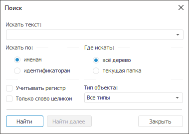

# Поиск объекта в обновлении

Поиск объекта в обновлении
-

# Поиск объекта в обновлении

Для осуществления поиска объекта в структуре обновления в настольном
 приложении:

	- выполните команду «Найти»
	 в контекстном меню [структуры
	 обновления](../Admin_UpMBObj_RunManager.htm);

	- нажмите кнопку 
	 «Поиск» на панели инструментов;

	- нажмите сочетание клавиш CTRL+F.

После выполнения одного из действий будет открыто окно «Поиск»:

Примечание.
 При [разделении
 ролей администраторов](Admin.chm::/04_SecurityPolicy/Editor_of_Politicy/Security_EditorPoliticy_Adm.htm) и в зависимости от выбранного
 метода [разграничения
 доступа](Admin.chm::/04_SecurityPolicy/Admin_SecPolicy.htm)возможен
 поиск только [доступных
 пользователю элементов](../FAQ/Administrator_role_separation.htm) обновления. Остальные элементы не отображаются
 в структуре обновления.

См. также:

[Добавление объектов репозитория](Admin_CreateUpdate_AddObjects.htm)

		Справочная
		 система на версию 10.9
		 от 18/08/2025,
		 © ООО «ФОРСАЙТ»,
